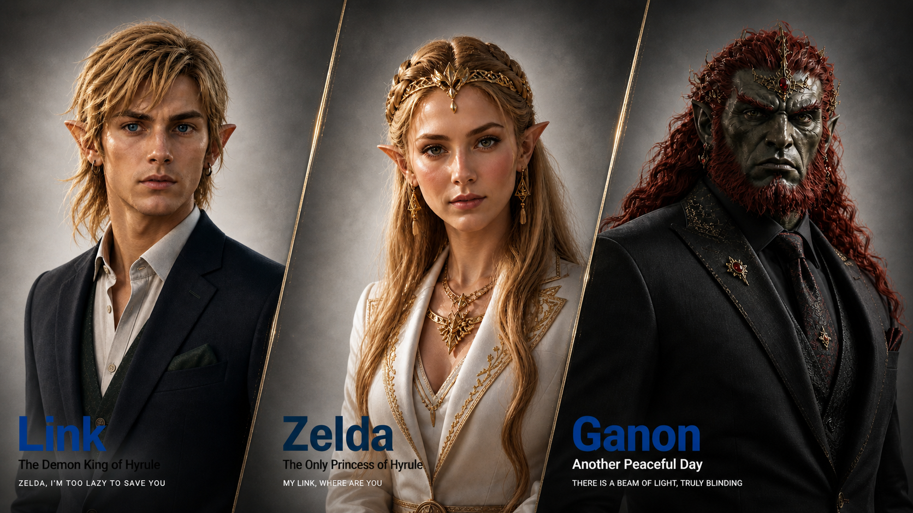
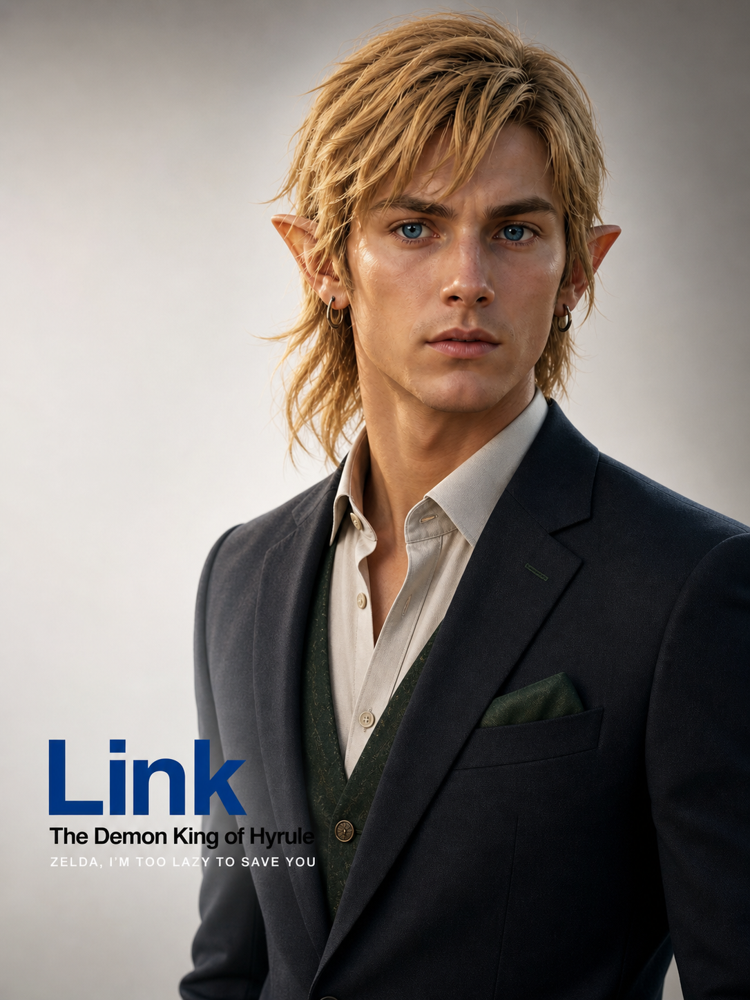
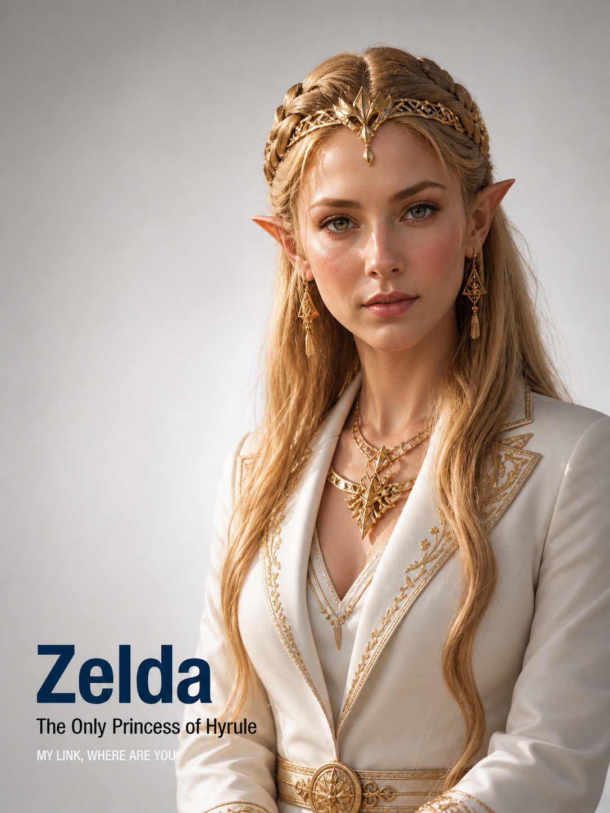
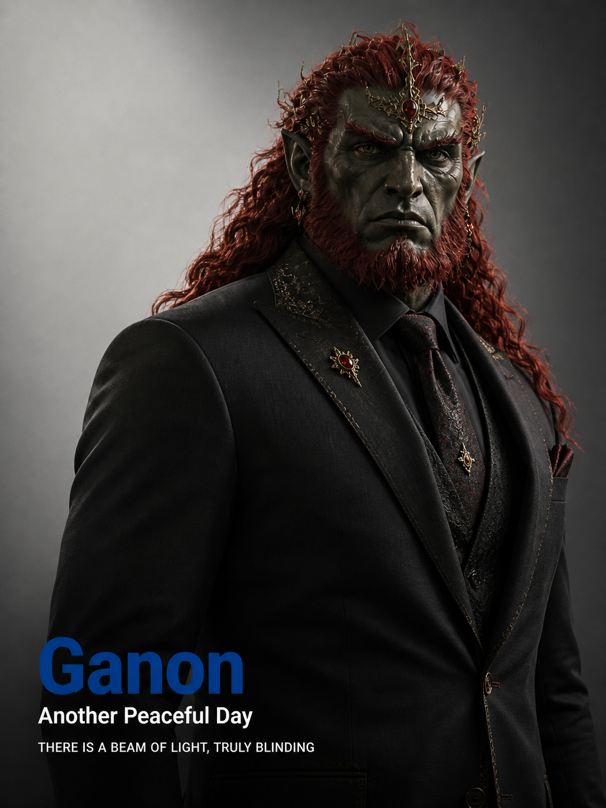

# 🏢 商务人像海报 / Business Portrait Poster

> 基于真实人像照片，生成专业摄影级极简商务人像海报。保留人物真实身份特征，呈现高端棚拍质感，适用于企业高管肖像、品牌形象、LinkedIn 封面、个人品牌海报等场景。

**所属分类**: [人物肖像](README.md)  
**Prompt 数量**: 1 条  
**难度等级**: ⭐⭐⭐ 进阶（需上传参考人像）

---

## 目录

- [Prompt 1: 高级极简商务人像海报](#prompt-1-高级极简商务人像海报)

---

## Prompt 1: 高级极简商务人像海报

> 基于上传的人像照片，生成 3:4 竖版高级极简商务人像海报，保留人物真实外貌，呈现专业棚拍摄影质感，左下角配有三行英文文字排版。

**使用方式**: 上传一张人像照片，将以下 Prompt 发送给支持图像输入的 AI（如 GPT-4o、Claude 3.5 等），并替换 `{}` 中的占位内容。

**Prompt:**

```text
Based on the uploaded portrait photo, generate a 3:4 vertical high-end minimalist business portrait poster.

IDENTITY PRESERVATION (strictly required):
Preserve all real identity features of the subject, including facial structure, face shape, hairstyle, hair color, apparent age, gender, ethnicity, pose, clothing, jewelry, and overall temperament. No face swapping. No altering identity or core appearance. Minor enhancements are allowed: skin texture, lighting, sharpness, clothing details, and overall refinement to achieve a professional studio portrait effect.

COMPOSITION:
Half-body or head-and-shoulders portrait. Subject centered or slightly right-aligned. Adequate negative space. Background replaced with a clean gray-white gradient studio backdrop — simple, soft, premium.

LIGHTING & QUALITY:
Commercial photography soft lighting. Even and natural, low contrast but layered. Sharp focus on face. True-to-life skin tones. Fine, crisp, professional overall texture.

STYLING:
Formal business attire. Dark suit jacket, white or light shirt, tie or minimal accessories. Modern, elegant, professional, trustworthy. Relaxed yet confident. Bright, expressive eyes.

STYLE REFERENCE:
High-end corporate ID photo, executive portrait, fashion magazine cover, Portrait ID style, minimalist brand poster. Clean, restrained, modern, premium. Brand-level commercial photography quality.

TEXT OVERLAY (bottom-left, left-aligned, must not cover subject's face):
Line 1 — Name / Nickname / Title: {Name}
Line 2 — Subtitle / Role / Tagline: {Title or Tagline}
Line 3 — Series label: {Series No. + Style Theme}

TEXT RULES:
- If input is Chinese or another language, translate to natural, concise, formal, premium English before displaying. Do not show Chinese unless explicitly requested.
- Line 1: Deep blue bold sans-serif, large font size
- Line 2: White or black medium sans-serif
- Line 3: White uppercase sans-serif, medium-small font size
- Three lines vertically stacked, reasonable line spacing, clear hierarchy
- No center alignment. No overflow. No garbled text. No covering the subject.

STYLE TYPE: {Corporate Executive / Tech Elite / Fashion Editorial / Artistic Minimalist}

OUTPUT: 3:4 vertical high-resolution poster. Realistic photographic quality. Premium minimalist style. Commercial studio lighting. Clean background. Fashion business portrait poster effect.
```

**示例效果：**

封面预览（三联版）：



单图示例 — Link（商务高管风）：



单图示例 — Zelda（时尚杂志风）：



单图示例 — Ganon（科技精英风）：



**参数说明：**

| 参数 | 推荐值 | 说明 |
|------|--------|------|
| 尺寸 | 768×1024 / 1024×1365 | 3:4 竖版比例 |
| 风格 | Photorealistic | 写实摄影质感 |
| 模型 | GPT-4o / Claude 3.5 Sonnet | 支持图像输入的多模态模型 |
| 质量 | High | 面部细节需要最高质量 |
| 输入 | 需上传参考人像照片 | 用于保留人物真实身份特征 |

**占位符说明：**

| 占位符 | 示例 | 说明 |
|--------|------|------|
| `{Name}` | `Zelda` / `张伟` → `Zhang Wei` | 姓名或昵称，中文自动翻译为英文 |
| `{Title or Tagline}` | `The Only Princess of Hyrule` | 职位、身份或气质短句 |
| `{Series No. + Style Theme}` | `MY LINK, WHERE ARE YOU` | 系列编号或风格主题，全大写 |
| `{Style Type}` | `Corporate Executive` | 风格类型，影响整体气质调性 |

**风格类型对照：**

| 英文 | 中文 | 适用场景 |
|------|------|----------|
| Corporate Executive | 商务高管风 | 企业高管、律师、金融从业者 |
| Tech Elite | 科技精英风 | 互联网、AI、工程师、创业者 |
| Fashion Editorial | 时尚杂志风 | 设计师、创意总监、时尚从业者 |
| Artistic Minimalist | 艺术极简风 | 艺术家、摄影师、文化创意人 |

**变体建议：**

- 调整背景色：`gray-white gradient` → `deep navy gradient` 获得更沉稳高级感
- 调整文字颜色：`Deep blue` → `Gold` 适配奢华品牌风格
- 去掉文字叠加，获得纯净棚拍人像海报
- 多人版本：同一系列多张拼接为三联海报，统一风格标识

**标签**: `#photorealistic` `#portrait` `#business` `#executive` `#minimalist` `#poster` `#studio` `#id-photo` `#editorial`

---

## 🔗 相关推荐

- [证件照 / 职业头像](headshot.md) — 标准商务头像，无海报文字排版
- [时尚人像](fashion-portrait.md) — 更具视觉冲击力的时尚风格人像
- [全身人像](full-body.md) — 展示完整造型与肢体语言
