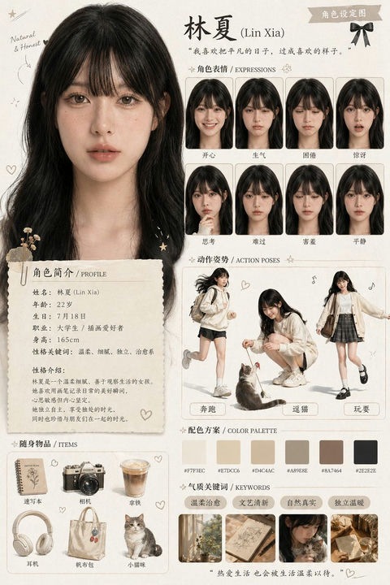

# 🎮 角色设计

> 游戏、动画、IP 形象的角色概念设计 Prompt，包含角色设定图、多视角展示等。

**所属分类**: [人物肖像](README.md)  
**Prompt 数量**: 5 条  
**难度等级**: ⭐⭐⭐ 高级

---

## Prompt 1: 游戏角色设定图

> RPG 游戏风格的角色多视角设定

**Prompt:**

```text
Character design sheet for a [fantasy warrior/mage/rogue] character, 
front view, side view, and back view on the same image, 
detailed armor/costume design with [material descriptions], 
color callouts and design notes in margins, 
T-pose or neutral standing pose for each view, 
clean white background with light grid, 
anime/game concept art style, 
proportions: [heroic 8-head/stylized 6-head], 
weapon and accessory details shown separately, 
professional game industry quality concept art
```

**示例效果：**



**参数说明：**

| 参数 | 推荐值 | 说明 |
|------|--------|------|
| 尺寸 | 1536×1024 | 横版宽幅展示多视角 |
| 风格 | Concept Art | 游戏概念设计 |
| 模型 | GPT-Image-2 | 推荐 |

**标签**: `#character-design` `#concept-art` `#game` `#turnaround`

---

## Prompt 2: 可爱 IP 吉祥物

> 品牌 IP 形象/吉祥物设计

**Prompt:**

```text
A cute mascot character design for a [tech/food/education] brand, 
[animal type: cat/bear/robot/fox] character with [brand color] color scheme, 
simple rounded shapes for easy recognition, 
large head-to-body ratio (chibi proportions), 
expressive eyes and cheerful expression, 
shown in 4-6 different poses and expressions on one sheet: 
happy, thinking, waving, thumbs up, surprised, 
clean vector-like rendering suitable for merchandise, 
minimal details for scalability, 
white background
```

**参数说明：**

| 参数 | 推荐值 | 说明 |
|------|--------|------|
| 尺寸 | 1536×1024 | 横版展示多个表情 |
| 风格 | Illustration | 可爱插画风 |
| 模型 | GPT-Image-2 | 推荐 |

**标签**: `#character-design` `#mascot` `#cute` `#brand-ip`

---

## Prompt 3: 科幻角色概念

**Prompt:**

```text
Sci-fi character concept art of a [space marine/android/alien diplomat], 
full body standing pose with detailed futuristic suit/armor, 
glowing energy elements in [blue/orange/green], 
hard surface details mixed with organic elements, 
dramatic lighting from below highlighting the helmet/visor, 
cinematic concept art quality, 
detailed material callouts: carbon fiber, titanium, energy shields, 
dark atmospheric background with subtle environment hints, 
industry-standard character concept for AAA game production
```

**参数说明：**

| 参数 | 推荐值 | 说明 |
|------|--------|------|
| 尺寸 | 768×1024 | 竖版全身 |
| 风格 | Concept Art | 科幻概念 |
| 模型 | GPT-Image-2 | 推荐 |

**标签**: `#character-design` `#sci-fi` `#concept-art` `#game`

---

## Prompt 4: 古风仙侠角色

**Prompt:**

```text
Chinese Xianxia (仙侠) character design, 
an elegant [immortal cultivator/sword master/celestial being], 
flowing traditional Chinese robes with [jade/gold/silver] ornaments, 
long flowing hair with decorative hairpin, 
holding a [glowing sword/jade flute/ancient scroll], 
ethereal misty background with floating petals, 
Chinese fantasy game art style (similar to 原神/天刀), 
rich fabric textures with embroidered dragon/phoenix patterns, 
dynamic pose suggesting martial arts grace, 
detailed full-body design with color harmony
```

**示例效果：**


**参数说明：**

| 参数 | 推荐值 | 说明 |
|------|--------|------|
| 尺寸 | 768×1024 | 竖版 |
| 风格 | Digital Painting | 国风数字绘画 |
| 模型 | GPT-Image-2 | 推荐 |

**标签**: `#character-design` `#xianxia` `#chinese-fantasy` `#game`

---

## Prompt 5: 表情包角色设计

**Prompt:**

```text
Emoji/sticker character expression sheet, 
a cute [round/blob/animal] character shown in 9 different emotions: 
happy, sad, angry, surprised, love-struck, sleepy, confused, excited, cool, 
arranged in a 3x3 grid layout, 
bold simple lines, bright saturated colors, 
exaggerated facial expressions for readability at small sizes, 
consistent character proportions across all frames, 
suitable for messaging app sticker pack, 
white background, clean vector style
```

**参数说明：**

| 参数 | 推荐值 | 说明 |
|------|--------|------|
| 尺寸 | 1024×1024 | 方形网格 |
| 风格 | Illustration | 贴纸/表情包风 |
| 模型 | GPT-Image-2 | 推荐 |

**标签**: `#character-design` `#emoji` `#sticker` `#expression-sheet`

---

## 🔗 相关推荐

- [社交头像](profile-avatar.md) - 简化版角色头像
- [日式漫画](../09-comic-storyboard/manga-style.md) - 日漫风角色
- [像素艺术](../05-poster-illustration/pixel-art.md) - 像素风角色
