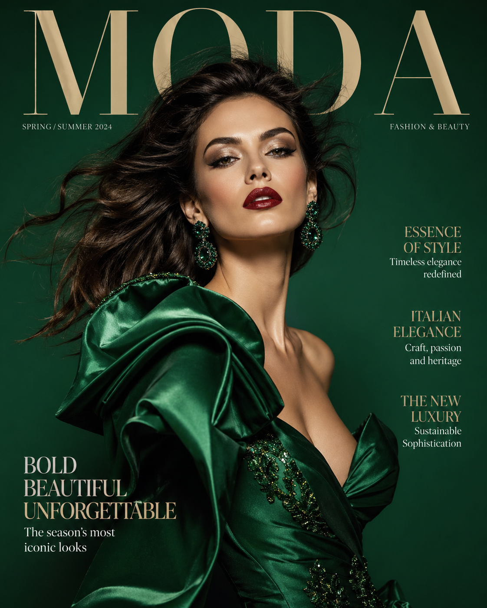
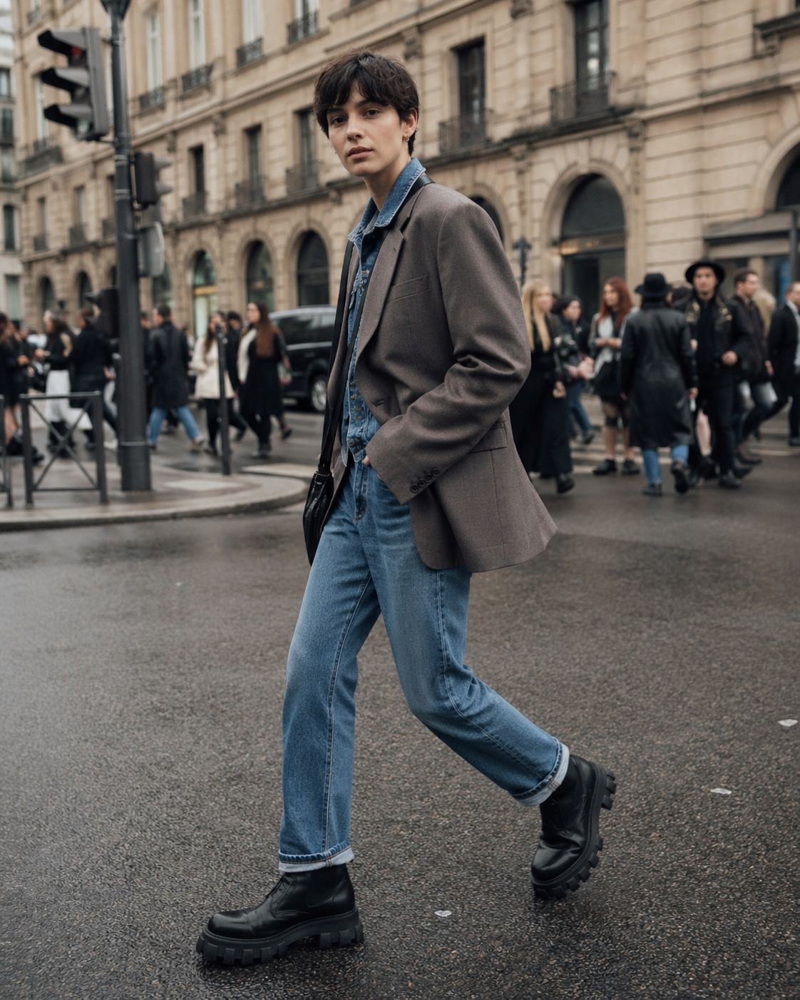
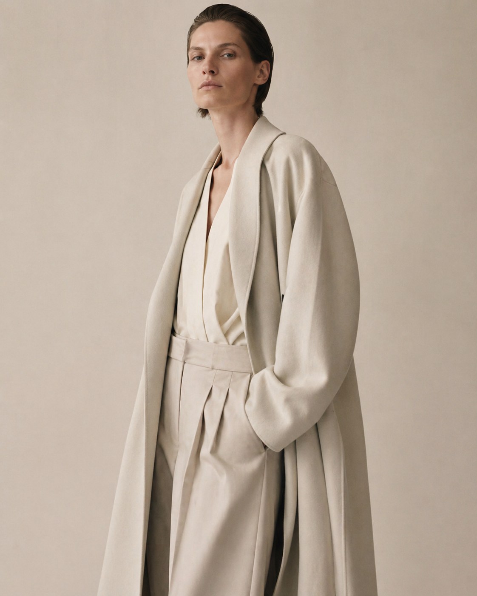

# 👗 时尚人像

> 杂志级时尚摄影风格的人像 Prompt，适用于品牌 Lookbook、时尚编辑、社交展示。

**所属分类**: [人物肖像](README.md)  
**Prompt 数量**: 5 条  
**难度等级**: ⭐⭐ 进阶

---

## Prompt 1: 高定杂志封面

**Prompt:**

```text
A high-fashion editorial portrait for a luxury magazine cover, 
a striking [gender] model with sculpted cheekbones and flawless skin, 
wearing a haute couture [designer garment description], 
dramatic butterfly lighting with beauty dish from above, 
rich jewel-tone background [deep emerald/sapphire/burgundy], 
wind-blown hair creating dynamic movement, 
bold makeup with [defined brows/red lip/metallic eyeshadow], 
shot on Hasselblad H6D with 100mm lens, 
ultra-sharp with magazine-quality retouching, 
Vogue Italia aesthetic
```

**示例效果：**



**参数说明：**

| 参数 | 推荐值 | 说明 |
|------|--------|------|
| 尺寸 | 768×1024 | 杂志封面竖版 |
| 风格 | Photorealistic | 高端时尚摄影 |
| 模型 | GPT-Image-2 | 推荐 |

**标签**: `#fashion` `#editorial` `#magazine` `#haute-couture`

---

## Prompt 2: 街拍时尚

**Prompt:**

```text
A street style fashion portrait during fashion week, 
a stylish [gender] walking confidently on a city sidewalk, 
wearing [trendy layered outfit: oversized blazer, vintage denim, chunky boots], 
natural outdoor lighting with urban bokeh background, 
candid mid-stride pose looking slightly at camera, 
shot from slightly low angle, 
autumn/spring color palette, 
grain and texture reminiscent of film photography, 
35mm lens wide enough to show outfit and environment context, 
The Sartorialist style street fashion photography
```

**示例效果：**



**参数说明：**

| 参数 | 推荐值 | 说明 |
|------|--------|------|
| 尺寸 | 768×1024 | 竖版全身 |
| 风格 | Photorealistic | 街拍纪实风 |
| 模型 | GPT-Image-2 | 推荐 |

**标签**: `#fashion` `#street-style` `#candid` `#urban`

---

## Prompt 3: 极简高级灰

**Prompt:**

```text
A minimalist high-fashion portrait with muted tonal palette, 
model wearing all-[beige/gray/cream] monochromatic outfit, 
clean studio with matching neutral background, 
soft diffused lighting creating barely-there shadows, 
elegant understated pose, quiet confidence, 
desaturated color grading, 
focus on fabric texture and draping, 
negative space as design element, 
Celine/The Row brand aesthetic, 
medium format film quality
```

**示例效果：**



**参数说明：**

| 参数 | 推荐值 | 说明 |
|------|--------|------|
| 尺寸 | 1024×1024 | 方形 |
| 风格 | Photorealistic | 极简高级感 |
| 模型 | GPT-Image-2 | 推荐 |

**标签**: `#fashion` `#minimal` `#neutral` `#luxury`

---

## Prompt 4: 复古时尚

**Prompt:**

```text
A vintage-inspired fashion portrait in [1960s mod/1970s bohemian/1980s power] style, 
model wearing authentic period-appropriate [outfit description], 
set design and props matching the era, 
lighting style of the period [Avedon/Newton/Bailey], 
film grain and color science of [Kodachrome/Ektachrome], 
hairstyle and makeup era-appropriate, 
editorial storytelling composition, 
nostalgic yet fresh interpretation of retro fashion
```

**参数说明：**

| 参数 | 推荐值 | 说明 |
|------|--------|------|
| 尺寸 | 768×1024 | 竖版 |
| 风格 | Photorealistic | 复古胶片风 |
| 模型 | GPT-Image-2 | 推荐 |

**标签**: `#fashion` `#vintage` `#retro` `#editorial`

---

## Prompt 5: 运动时尚

**Prompt:**

```text
An athleisure fashion portrait of a fit [gender] model, 
wearing designer sportswear [matching set/technical jacket/sneakers], 
dynamic pose suggesting movement and energy, 
urban rooftop or concrete architectural background, 
golden hour side lighting creating warm highlights, 
slight motion blur on extremities suggesting action, 
high saturation vivid color palette, 
Nike/Adidas campaign aesthetic, 
wide angle showing full outfit with environmental context
```

**参数说明：**

| 参数 | 推荐值 | 说明 |
|------|--------|------|
| 尺寸 | 1024×1024 | 方形 |
| 风格 | Photorealistic | 运动品牌广告 |
| 模型 | GPT-Image-2 | 推荐 |

**标签**: `#fashion` `#athleisure` `#sporty` `#dynamic`

---

## 🔗 相关推荐

- [电商模特穿搭](../03-ecommerce/model-wearing.md) - 电商场景穿搭
- [全身人像](full-body.md) - 基础全身构图
- [Instagram 帖文](../06-social-media/instagram-post.md) - 时尚内容发布
