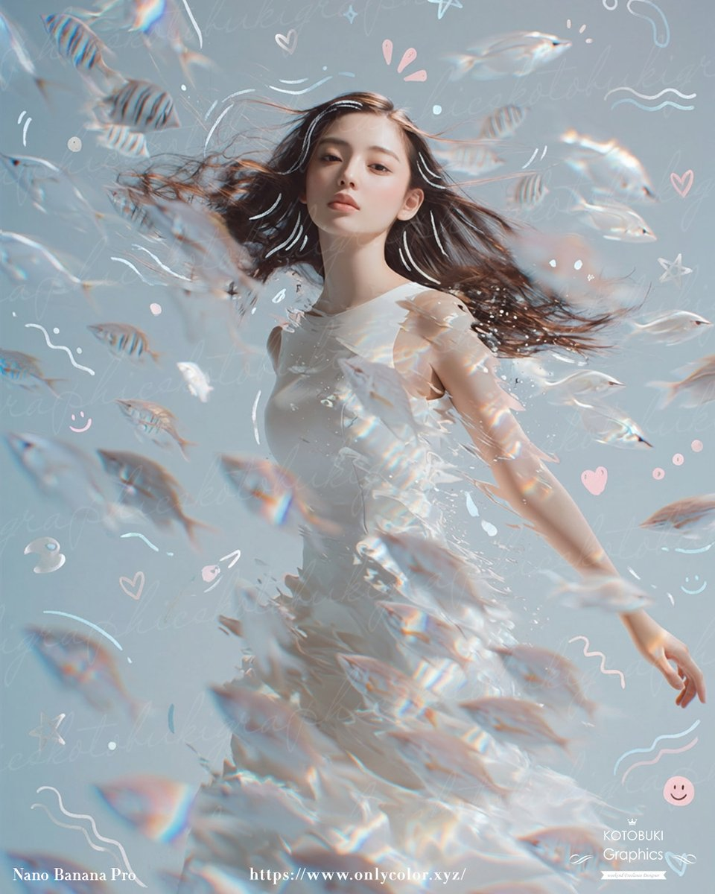

# 🧍 全身人像

> 展示完整身体姿态的人物肖像，适用于品牌形象、时尚摄影、角色参考等场景。

**所属分类**: [人物肖像](README.md)  
**Prompt 数量**: 5 条  
**难度等级**: ⭐⭐ 进阶

---

## Prompt 1: 商务站姿全身

> 企业宣传、团队页面的标准商务全身照

**Prompt:**

```text
A full-body professional portrait of a [gender] business executive standing confidently, 
arms crossed or one hand in pocket, wearing a tailored [navy/charcoal] suit, 
full length from head to shoes visible, 
clean white studio background, 
even studio lighting with subtle shadows for depth, 
natural standing pose with weight on one leg, 
polished leather shoes, 
shot on medium format camera with 50mm equivalent lens, 
full body in frame with some breathing room around the subject
```

**示例效果：**



**参数说明：**

| 参数 | 推荐值 | 说明 |
|------|--------|------|
| 尺寸 | 768×1024 | 竖版 3:4 |
| 风格 | Photorealistic | 写实 |
| 模型 | GPT-Image-2 | 推荐 |

**标签**: `#full-body` `#corporate` `#standing`

---

## Prompt 2: 动态运动姿态

> 运动品牌、健身内容的动态人像

**Prompt:**

```text
A dynamic full-body action shot of an athletic [gender] runner mid-stride, 
wearing [brand-style] performance sportswear, 
urban environment with motion blur background, 
frozen moment with one foot off the ground, 
dramatic side lighting creating strong shadows, 
muscles defined, hair flowing with movement, 
low angle shot emphasizing power and speed, 
shot at 1/2000s shutter speed freeze motion, 
vivid energetic color grading
```

**参数说明：**

| 参数 | 推荐值 | 说明 |
|------|--------|------|
| 尺寸 | 1024×1024 | 方形或竖版 |
| 风格 | Photorealistic | 运动摄影风 |
| 模型 | GPT-Image-2 | 推荐 |

**标签**: `#full-body` `#action` `#sports` `#dynamic`

---

## Prompt 3: 休闲生活全身

> 生活方式品牌、街拍风格

**Prompt:**

```text
A casual lifestyle full-body portrait of a [gender] in their [20s/30s], 
walking down a sun-dappled city sidewalk, 
wearing [casual chic outfit: linen shirt, rolled jeans, white sneakers], 
candid natural movement, looking slightly off-camera with a relaxed smile, 
golden afternoon light creating warm tones, 
shallow depth of field blurring the street background, 
earthy color palette, authentic unstaged feel, 
35mm street photography aesthetic
```

**参数说明：**

| 参数 | 推荐值 | 说明 |
|------|--------|------|
| 尺寸 | 768×1024 | 竖版 |
| 风格 | Photorealistic | 街拍自然风 |
| 模型 | GPT-Image-2 | 推荐 |

**标签**: `#full-body` `#lifestyle` `#street` `#casual`

---

## Prompt 4: 优雅礼服全身

> 正式场合、婚礼、晚宴等高端场景

**Prompt:**

```text
An elegant full-length portrait of a [woman in a flowing evening gown / man in a tuxedo], 
standing in a grand marble hallway with classical columns, 
dramatic Rembrandt lighting from tall windows, 
luxurious fabric catching the light with beautiful draping, 
poised graceful pose with one hand gently touching the railing, 
rich deep color palette [burgundy/midnight blue/emerald], 
shot from slightly below to emphasize stature and elegance, 
fashion editorial quality, Vogue magazine aesthetic
```

**参数说明：**

| 参数 | 推荐值 | 说明 |
|------|--------|------|
| 尺寸 | 768×1152 | 竖版 2:3 |
| 风格 | Photorealistic | 时尚杂志风 |
| 模型 | GPT-Image-2 | 推荐 |

**标签**: `#full-body` `#elegant` `#formal` `#fashion`

---

## Prompt 5: 坐姿人像

> 适合采访、人物专题的坐姿构图

**Prompt:**

```text
A full-body seated portrait of a [gender] [creative professional/author/artist], 
sitting in a [mid-century modern chair/leather armchair/studio stool], 
relaxed cross-legged or leaning forward engaged pose, 
wearing smart casual [outfit description], 
environmental portrait with relevant background [bookshelf/studio/workshop], 
soft directional window light, 
warm intimate atmosphere, 
35mm lens showing full body and environment context, 
editorial portrait style with intentional composition
```

**参数说明：**

| 参数 | 推荐值 | 说明 |
|------|--------|------|
| 尺寸 | 1024×1024 | 方形 |
| 风格 | Photorealistic | 环境人像风 |
| 模型 | GPT-Image-2 | 推荐 |

**标签**: `#full-body` `#seated` `#environmental` `#editorial`

---

## 🔗 相关推荐

- [证件照/头像](headshot.md) - 只需上半身
- [时尚人像](fashion-portrait.md) - 更强调穿搭
- [角色设计](character-design.md) - 游戏/动画角色设定图
