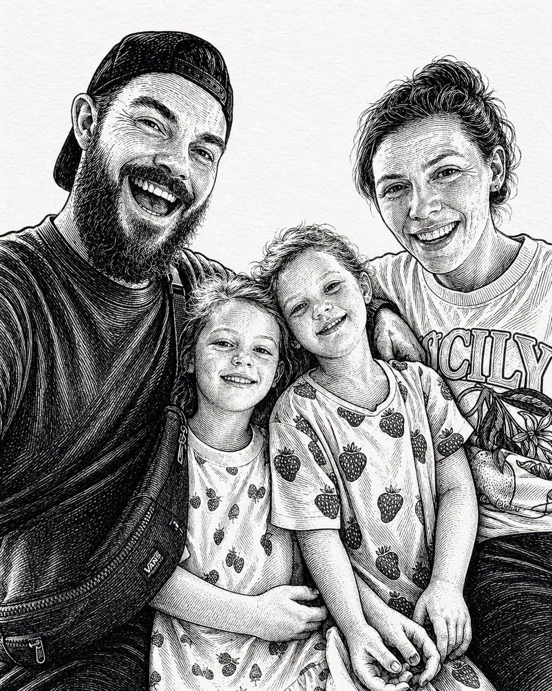

# 👥 群体肖像

> 多人场景的肖像 Prompt，适用于团队照、家庭照、合影留念等场景。

**所属分类**: [人物肖像](README.md)  
**Prompt 数量**: 5 条  
**难度等级**: ⭐⭐ 进阶

---

## Prompt 1: 企业团队照

**Prompt:**

```text
A professional corporate team photo of [5-8] diverse team members, 
standing in a modern office lobby with glass and natural light, 
coordinated but not matching outfits in business casual, 
arranged in a natural staggered composition (not a straight line), 
genuine team chemistry with some members interacting, 
bright even lighting, clean professional aesthetic, 
everyone visible and well-lit, 
modern tech company team page style
```

**参数说明：**

| 参数 | 推荐值 | 说明 |
|------|--------|------|
| 尺寸 | 1536×1024 | 横版宽幅 |
| 风格 | Photorealistic | 企业形象 |
| 模型 | GPT-Image-2 | 推荐 |

**标签**: `#group` `#corporate` `#team` `#professional`

---

## Prompt 2: 家庭温馨合影

**Prompt:**

```text
A warm family portrait of [parents and 2 children] in a [park/living room/backyard], 
natural golden hour sunlight, 
coordinated outfits in [earth tones/white and denim/pastels], 
genuine laughter and interaction between family members, 
relaxed candid feel rather than stiff posed, 
shallow depth of field with beautiful bokeh background, 
warm nostalgic color grading, 
family lifestyle photography style
```

**示例效果：**



**参数说明：**

| 参数 | 推荐值 | 说明 |
|------|--------|------|
| 尺寸 | 1024×768 | 横版 |
| 风格 | Photorealistic | 温暖自然 |
| 模型 | GPT-Image-2 | 推荐 |

**标签**: `#group` `#family` `#warm` `#lifestyle`

---

## Prompt 3: 朋友聚会合影

**Prompt:**

```text
A fun group photo of [3-5] friends at [rooftop bar/beach/concert], 
arms around each other, genuine laughter and celebration, 
party/event atmosphere with ambient string lights or sunset, 
diverse group with individual style expressions, 
slightly wide-angle to fit everyone, 
energetic vibrant colors, 
flash-lit or mixed natural+artificial lighting, 
authentic unposed social gathering moment
```

**参数说明：**

| 参数 | 推荐值 | 说明 |
|------|--------|------|
| 尺寸 | 1024×768 | 横版 |
| 风格 | Photorealistic | 派对/聚会 |
| 模型 | GPT-Image-2 | 推荐 |

**标签**: `#group` `#friends` `#party` `#candid`

---

## Prompt 4: 毕业合影

**Prompt:**

```text
A graduation group photo of [4-6] graduates in caps and gowns, 
standing in front of [university building/campus lawn], 
tossing caps in the air or holding diplomas proudly, 
bright clear day with blue sky, 
mix of formal posed and celebratory candid elements, 
school colors visible on sashes/stoles, 
joyful accomplished expressions, 
wide enough to show the landmark building context
```

**参数说明：**

| 参数 | 推荐值 | 说明 |
|------|--------|------|
| 尺寸 | 1536×1024 | 宽幅横版 |
| 风格 | Photorealistic | 纪念摄影 |
| 模型 | GPT-Image-2 | 推荐 |

**标签**: `#group` `#graduation` `#celebration` `#milestone`

---

## Prompt 5: 创意排列群像

**Prompt:**

```text
A creative overhead (bird's eye view) group portrait of [6-10] people, 
lying on [grass/white floor/colorful backdrop] arranged in a [circle/star/heart] pattern, 
looking up at camera from below, 
matching outfits or coordinated colors, 
creative artistic composition, 
even lighting from above (overcast sky or studio ceiling), 
unique perspective creating a graphic design-like image, 
social media viral style creative group photo
```

**参数说明：**

| 参数 | 推荐值 | 说明 |
|------|--------|------|
| 尺寸 | 1024×1024 | 方形俯瞰 |
| 风格 | Photorealistic | 创意构图 |
| 模型 | GPT-Image-2 | 推荐 |

**标签**: `#group` `#creative` `#overhead` `#artistic`

---

## 🔗 相关推荐

- [全身人像](full-body.md) - 单人全身构图基础
- [企业团队照](#) → [广告创意/品牌广告](../04-advertising/brand-campaign.md)
- [家庭照](#) → [生活场景](../03-ecommerce/lifestyle-scene.md)
