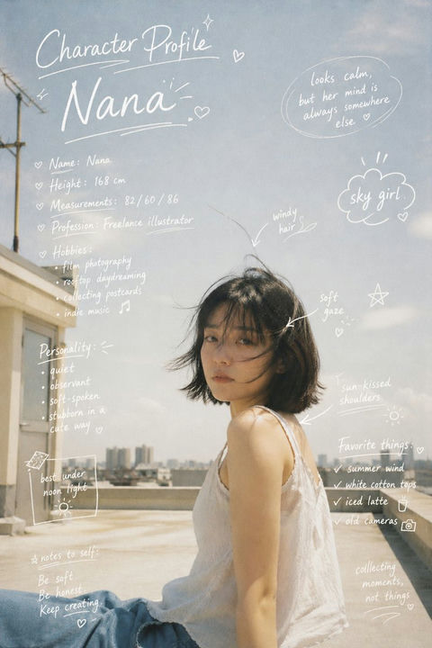

# 🧑‍💼 证件照 / 职业头像

> 适用于 LinkedIn、企业官网、简历等场景的专业商务头像 Prompt。

**所属分类**: [人物肖像](README.md)  
**Prompt 数量**: 5 条  
**难度等级**: ⭐ 入门

---

## 目录

- [Prompt 1: 职业商务头像](#prompt-1-职业商务头像)
- [Prompt 2: 创意行业头像](#prompt-2-创意行业头像)
- [Prompt 3: 科技公司头像](#prompt-3-科技公司头像)
- [Prompt 4: 温暖亲和头像](#prompt-4-温暖亲和头像)
- [Prompt 5: 高端精英头像](#prompt-5-高端精英头像)

---

## Prompt 1: 职业商务头像

> 标准企业级商务头像，适合 LinkedIn 和公司官网

**Prompt:**

```text
A professional corporate headshot of a [young/middle-aged] [Asian/European] [man/woman], 
soft studio lighting with a gentle key light from the left, neutral light gray background, 
sharp focus on eyes, wearing a [navy blazer/white blouse/dark suit], 
confident yet approachable expression with a slight smile, 
shoulders slightly angled, shot from chest up, 
clean skin retouching, shot on Canon EOS R5 with 85mm f/1.8 lens, 
color graded for professional warmth
```

**示例效果：**


**参数说明：**

| 参数 | 推荐值 | 说明 |
|------|--------|------|
| 尺寸 | 1024×1024 | 正方形，适配各平台头像裁切 |
| 风格 | Photorealistic | 写实风格 |
| 模型 | GPT-Image-2 / DALL·E 3 | 推荐模型 |
| 质量 | High | 面部细节需要高质量 |

**变体建议：**

- 替换 `[young/middle-aged]` 调整年龄感
- 替换服装描述适配不同行业
- `neutral light gray background` → `dark navy background` 获得更正式感
- 添加 `shallow depth of field, bokeh background` 增加层次

**标签**: `#photorealistic` `#portrait` `#studio` `#corporate` `#linkedin`

---

## Prompt 2: 创意行业头像

> 适合设计师、艺术家、创意总监等创意行业从业者

**Prompt:**

```text
A creative professional headshot of a [gender] [ethnicity] creative director, 
editorial style lighting with dramatic shadows, 
wearing trendy [black turtleneck/denim jacket/creative outfit], 
artistic background with subtle texture or color gradient, 
confident artistic expression, slightly tilted head, 
shot with natural window light mixed with warm studio fill, 
medium close-up from shoulders, 
modern color grading with slightly desaturated tones, 
shot on Sony A7IV with 50mm f/1.2 lens
```

**示例效果：**



**参数说明：**

| 参数 | 推荐值 | 说明 |
|------|--------|------|
| 尺寸 | 1024×1024 | 正方形 |
| 风格 | Photorealistic | 带编辑风格调色 |
| 模型 | GPT-Image-2 | 推荐 |
| 质量 | High | 高质量 |

**变体建议：**

- 尝试 `moody dark background` 或 `vibrant colored gel lighting`
- `slightly desaturated` → `high contrast black and white` 获得艺术感

**标签**: `#photorealistic` `#portrait` `#creative` `#editorial`

---

## Prompt 3: 科技公司头像

> 硅谷风格的科技公司员工头像

**Prompt:**

```text
A friendly tech company headshot of a [gender] software engineer in their [20s/30s], 
wearing a casual [hoodie/flannel shirt/simple t-shirt], 
bright and clean white background, 
natural relaxed smile showing approachability, 
even flat lighting from a large softbox, 
head and shoulders composition, 
clean modern look, minimal retouching for authentic feel, 
vibrant but not oversaturated colors, 
shot on iPhone-quality natural look
```

**示例效果：**


**参数说明：**

| 参数 | 推荐值 | 说明 |
|------|--------|------|
| 尺寸 | 1024×1024 | 正方形 |
| 风格 | Photorealistic | 自然真实风格 |
| 模型 | GPT-Image-2 | 推荐 |
| 质量 | High | 高质量 |

**标签**: `#photorealistic` `#portrait` `#casual` `#tech`

---

## Prompt 4: 温暖亲和头像

> 适合教育、医疗、咨询等需要亲和力的行业

**Prompt:**

```text
A warm and approachable professional headshot of a [gender] [occupation: teacher/doctor/counselor], 
golden hour warm lighting from a large window on the right, 
soft out-of-focus neutral background with warm tones, 
genuine warm smile with slight eye crinkles, 
wearing smart casual [cardigan/soft blazer/clean shirt], 
shot from chest up with relaxed posture, 
warm color temperature around 5500K, 
gentle skin smoothing maintaining natural texture, 
85mm portrait lens with f/2.0 for gentle background separation
```

**示例效果：**


**参数说明：**

| 参数 | 推荐值 | 说明 |
|------|--------|------|
| 尺寸 | 1024×1024 | 正方形 |
| 风格 | Photorealistic | 温暖自然 |
| 模型 | GPT-Image-2 | 推荐 |
| 质量 | High | 高质量 |

**标签**: `#photorealistic` `#portrait` `#warm` `#approachable`

---

## Prompt 5: 高端精英头像

> CEO、律师、金融高管等高端商务精英形象

**Prompt:**

```text
A premium executive headshot of a distinguished [gender] [CEO/lawyer/executive] 
in their [40s/50s], wearing a perfectly tailored [charcoal suit/power suit], 
Rembrandt lighting with a subtle hair light, 
deep charcoal gradient background, 
commanding yet refined expression, direct eye contact, 
impeccable grooming, 
shot on Hasselblad medium format camera, 
rich tonal range with deep shadows and bright highlights, 
magazine-quality retouching maintaining skin texture, 
16-bit color depth feel
```

**示例效果：**


**参数说明：**

| 参数 | 推荐值 | 说明 |
|------|--------|------|
| 尺寸 | 1024×1024 | 正方形 |
| 风格 | Photorealistic | 杂志级精修 |
| 模型 | GPT-Image-2 | 推荐 |
| 质量 | High | 最高质量 |

**标签**: `#photorealistic` `#portrait` `#executive` `#premium` `#magazine`

---

## 🔗 相关推荐

- [全身人像](full-body.md) - 需要展示更多肢体语言时
- [社交头像](profile-avatar.md) - 非写实风格的头像
- [时尚人像](fashion-portrait.md) - 更有视觉冲击力的人像
