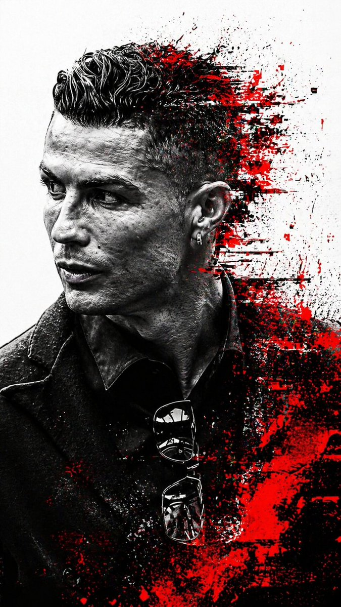

# 🎭 社交头像 / 虚拟形象

> 非写实风格的个人头像，包括 3D 渲染、卡通化、像素风等，适合社交平台个性化展示。

**所属分类**: [人物肖像](README.md)  
**Prompt 数量**: 5 条  
**难度等级**: ⭐ 入门

---

## Prompt 1: 3D 卡通头像

> Pixar/Disney 风格的 3D 渲染卡通头像

**Prompt:**

```text
A 3D rendered cartoon avatar in Pixar style of a [gender] [age] with [hair description], 
big expressive eyes, friendly smile, 
wearing [casual outfit/hoodie/glasses], 
soft gradient background in [pastel blue/pink/purple], 
clean smooth rendering, 
head and shoulders composition, 
vibrant saturated colors, 
ambient occlusion shadows, 
cute proportions with slightly oversized head, 
4K quality rendering
```

**示例效果：**



**参数说明：**

| 参数 | 推荐值 | 说明 |
|------|--------|------|
| 尺寸 | 1024×1024 | 正方形 |
| 风格 | 3D Render | Pixar 风格 |
| 模型 | GPT-Image-2 | 推荐 |

**标签**: `#3d-render` `#avatar` `#cartoon` `#pixar`

---

## Prompt 2: 扁平化矢量头像

> 简洁的扁平化设计风格头像

**Prompt:**

```text
A flat design vector-style avatar portrait of a [gender] with [distinctive features], 
minimal geometric shapes, limited color palette of 4-5 colors, 
solid color background [coral/teal/mustard], 
no outlines, shapes defined by color blocks, 
slightly abstract facial features, 
modern corporate illustration style, 
centered composition, bust-level crop, 
clean edges suitable for scaling to any size
```

**参数说明：**

| 参数 | 推荐值 | 说明 |
|------|--------|------|
| 尺寸 | 1024×1024 | 正方形 |
| 风格 | Flat Illustration | 矢量插画风 |
| 模型 | GPT-Image-2 / DALL·E 3 | 均可 |

**标签**: `#flat-design` `#avatar` `#vector` `#minimalist`

---

## Prompt 3: 像素风头像

> 复古游戏风格像素艺术头像

**Prompt:**

```text
A pixel art avatar portrait in 32x32 pixel style upscaled to high resolution, 
retro 8-bit game aesthetic, [character description], 
limited 16-color palette, 
visible pixel grid, no anti-aliasing, 
solid color background, 
nostalgic Nintendo/Game Boy era feel, 
clean pixel placement with intentional dithering for shading
```

**参数说明：**

| 参数 | 推荐值 | 说明 |
|------|--------|------|
| 尺寸 | 1024×1024 | 正方形 |
| 风格 | Pixel Art | 像素风 |
| 模型 | GPT-Image-2 | 推荐 |

**标签**: `#pixel-art` `#avatar` `#retro` `#gaming`

---

## Prompt 4: 水墨国风头像

> 中国水墨画风格的意境头像

**Prompt:**

```text
A Chinese ink wash painting style (水墨画) avatar of a [gender] figure, 
traditional brush strokes with varying ink density, 
minimalist composition with generous negative space, 
subtle rice paper texture background, 
elegant and ethereal mood, 
flowing black ink with occasional color accent [red/gold], 
classical Chinese aesthetic, 
portrait composition showing face and upper body, 
artistic impression rather than detailed realism
```

**参数说明：**

| 参数 | 推荐值 | 说明 |
|------|--------|------|
| 尺寸 | 1024×1024 | 正方形 |
| 风格 | Artistic | 水墨画风 |
| 模型 | GPT-Image-2 | 推荐 |

**标签**: `#ink-wash` `#avatar` `#chinese` `#artistic`

---

## Prompt 5: 赛博朋克头像

> 未来科技感的赛博朋克风格头像

**Prompt:**

```text
A cyberpunk-style digital avatar portrait, 
neon-lit face with [blue/pink/purple] color scheme, 
futuristic cyber implants and glowing circuit patterns on skin, 
dark background with bokeh neon lights, 
holographic elements floating around the head, 
sharp angular features enhanced by dramatic rim lighting, 
digital glitch effects on edges, 
high contrast with deep blacks and vivid neon highlights, 
sci-fi dystopian aesthetic
```

**参数说明：**

| 参数 | 推荐值 | 说明 |
|------|--------|------|
| 尺寸 | 1024×1024 | 正方形 |
| 风格 | Digital Art | 赛博朋克 |
| 模型 | GPT-Image-2 | 推荐 |

**标签**: `#cyberpunk` `#avatar` `#neon` `#futuristic`

---

## 🔗 相关推荐

- [证件照/职业头像](headshot.md) - 写实商务风格
- [角色设计](character-design.md) - 完整角色设计
- [像素艺术](../05-poster-illustration/pixel-art.md) - 更多像素风格
