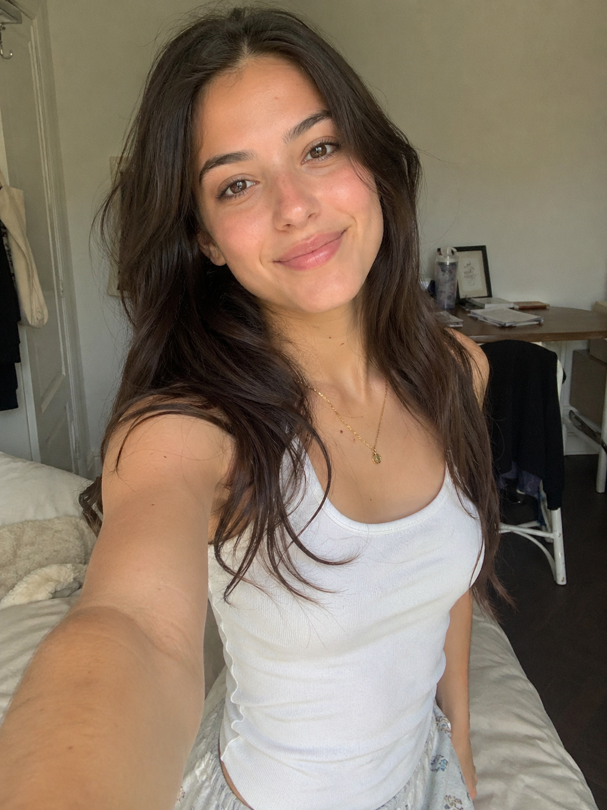
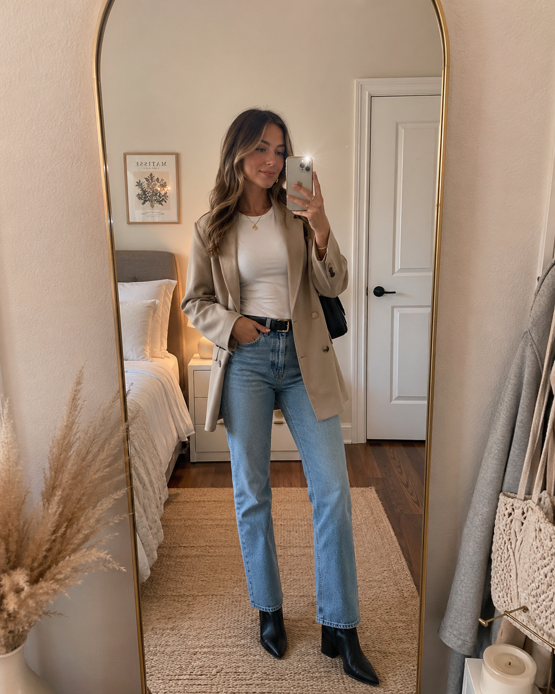

# 🤳 自拍风格

> 模拟手机自拍的自然风格人像，适合社交媒体日常分享和个人品牌建设。

**所属分类**: [人物肖像](README.md)  
**Prompt 数量**: 5 条  
**难度等级**: ⭐ 入门

---

## Prompt 1: 日常清新自拍

**Prompt:**

```text
A natural casual selfie of a [gender] [age] taken with front-facing camera, 
natural daylight from a window, no makeup or light natural makeup, 
relaxed genuine smile, slightly above eye-level angle, 
one arm extended holding the phone (visible perspective distortion), 
cozy home background slightly out of focus, 
warm natural color tones, 
iPhone front camera quality with slight softness, 
authentic social media feel, not overly polished
```

**参数说明：**

| 参数 | 推荐值 | 说明 |
|------|--------|------|
| 尺寸 | 1024×1024 | 方形 |
| 风格 | Photorealistic | 自然真实 |
| 模型 | GPT-Image-2 | 推荐 |

**标签**: `#selfie` `#casual` `#natural` `#social-media`

---

## Prompt 2: 旅行打卡自拍

**Prompt:**

```text
A travel selfie at [iconic landmark: Eiffel Tower/Great Wall/Santorini], 
a happy [gender] tourist holding camera at arm's length, 
wearing [travel outfit: sundress/casual layers], sunglasses on head, 
landmark visible and recognizable in background, 
bright sunny day with blue sky, 
genuine excited expression, 
slightly wide-angle selfie perspective, 
vivid travel photography colors, 
Instagram-worthy composition with both person and location balanced
```

**示例效果：**



**参数说明：**

| 参数 | 推荐值 | 说明 |
|------|--------|------|
| 尺寸 | 1024×1024 | 方形适合 IG |
| 风格 | Photorealistic | 旅行摄影风 |
| 模型 | GPT-Image-2 | 推荐 |

**标签**: `#selfie` `#travel` `#landmark` `#instagram`

---

## Prompt 3: 镜面反射自拍

**Prompt:**

```text
A mirror selfie in a [full-length bedroom mirror/gym mirror/elevator mirror], 
[gender] holding phone at chest level, 
stylish outfit clearly visible in reflection, 
intentional composition showing full outfit, 
natural ambient lighting of the environment, 
phone visible in hand with slight lens flare, 
aesthetic mirror frame visible, 
trendy social media mirror selfie style
```

**示例效果：**



**参数说明：**

| 参数 | 推荐值 | 说明 |
|------|--------|------|
| 尺寸 | 768×1024 | 竖版展示全身 |
| 风格 | Photorealistic | 自然 |
| 模型 | GPT-Image-2 | 推荐 |

**标签**: `#selfie` `#mirror` `#outfit` `#ootd`

---

## Prompt 4: 美妆自拍

**Prompt:**

```text
A beauty selfie close-up of a [gender] showcasing [makeup look: glam/natural/editorial], 
front-facing camera perspective from slightly above, 
ring light reflection visible in eyes (catchlight), 
flawless skin with visible makeup details, 
soft background blur, 
[bold red lip/smoky eye/glass skin/dewy highlight] as focal point, 
beauty influencer style composition, 
high clarity and sharpness on facial features
```

**参数说明：**

| 参数 | 推荐值 | 说明 |
|------|--------|------|
| 尺寸 | 1024×1024 | 方形特写 |
| 风格 | Photorealistic | 美妆博主风 |
| 模型 | GPT-Image-2 | 推荐 |

**标签**: `#selfie` `#beauty` `#makeup` `#close-up`

---

## Prompt 5: 咖啡店/餐厅氛围自拍

**Prompt:**

```text
A cozy café selfie of a [gender] sitting at a window table, 
warm ambient lighting from pendant lamps and natural window light, 
holding or beside a [latte art coffee/aesthetic brunch plate], 
relaxed content expression looking at camera, 
aesthetic café interior as bokeh background, 
warm color grading with golden tones, 
lifestyle blogger vibe, 
slightly above eye-level front camera angle
```

**参数说明：**

| 参数 | 推荐值 | 说明 |
|------|--------|------|
| 尺寸 | 1024×1024 | 方形 |
| 风格 | Photorealistic | 生活方式风 |
| 模型 | GPT-Image-2 | 推荐 |

**标签**: `#selfie` `#cafe` `#lifestyle` `#cozy`

---

## 🔗 相关推荐

- [Instagram 帖文](../06-social-media/instagram-post.md) - 社交平台发布
- [小红书](../06-social-media/xiaohongshu.md) - 小红书风格分享
- [时尚人像](fashion-portrait.md) - 更专业的时尚照
