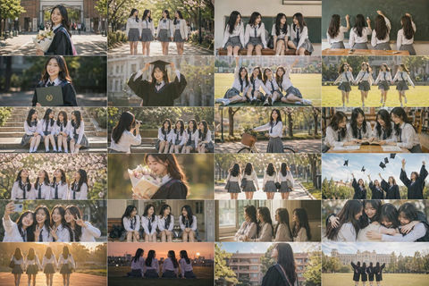

# 🛸 航拍摄影

> 无人机视角的俯瞰摄影，地理图案、城市规划。

**所属分类**: [摄影作品](README.md)  
**Prompt 数量**: 5 条  
**难度等级**: ⭐⭐ 进阶

---

## Prompt 1: 无人机风景俯瞰

> 壮阔自然风景的无人机高空视角

**Prompt:**

```text
A breathtaking aerial drone photograph of a winding river through autumn forest,
looking straight down from 200m altitude revealing serpentine river patterns,
vibrant fall foliage creating a tapestry of red, orange, gold, and green,
river reflecting the sky in silver-blue contrast against warm forest colors,
morning mist lingering in the river valley adding atmospheric depth,
perfect clarity and sharpness across the entire frame,
natural patterns and fractal-like river tributaries visible,
shot with DJI Inspire 3 with Hasselblad camera for maximum resolution,
golden hour warm light raking across the treetops,
nature's abstract painting viewed from above, fine art landscape quality
```

**示例效果：**



**参数说明：**

| 参数 | 推荐值 | 说明 |
|------|--------|------|
| 尺寸 | 1024×1024 | 方形俯瞰构图 |
| 风格 | Photorealistic | 航拍风景 |
| 模型 | GPT-Image-2 | 推荐 |

**变体建议：**

- 改为冬季雪覆森林中的蜿蜒黑色河流
- 换成热带雨林的浓密树冠与隐藏瀑布
- 尝试春季樱花林的粉色花海俯瞰

**标签**: `#photography` `#aerial` `#landscape` `#river` `#autumn`

---

## Prompt 2: 城市网格俯瞰

> 城市街道网格的几何抽象俯瞰

**Prompt:**

```text
A stunning aerial photograph looking straight down at a city intersection,
perfect geometric grid pattern of roads, crosswalks, and building rooftops,
tiny cars and pedestrians providing scale like miniature models,
shot at midday for minimal shadows creating flat graphic clarity,
urban planning grid forming abstract geometric composition,
high contrast between dark asphalt, white road markings, and colored vehicles,
rooftop details: air conditioning units, gardens, swimming pools,
basketball courts and parking lots creating color blocks,
DJI Mavic 3 quality at maximum altitude, processed for graphic impact,
Mondrian-like color blocking from everyday urban infrastructure,
abstract art quality emerging from organized city patterns
```

**示例效果：**


**参数说明：**

| 参数 | 推荐值 | 说明 |
|------|--------|------|
| 尺寸 | 1024×1024 | 方形网格最佳 |
| 风格 | Photorealistic | 城市航拍 |
| 模型 | GPT-Image-2 | 推荐 |

**变体建议：**

- 改为夜间城市交叉路口，车流灯光拖尾
- 换成亚洲密集住宅区的屋顶色彩拼贴
- 尝试环形交叉路口的完美圆形构图

**标签**: `#photography` `#aerial` `#city` `#grid` `#geometric`

---

## Prompt 3: 海岸线图案

> 海岸线海浪与沙滩的自然抽象图案

**Prompt:**

```text
A mesmerizing aerial photograph of a coastline from directly above,
turquoise ocean waves creating white foam patterns against golden sand,
gradient of water color from deep navy to transparent shallow aqua,
wave patterns forming parallel curved lines along the shore,
tiny sunbathers and colorful umbrellas dotting the beach for scale,
tidal pools and wet sand creating mirror-like reflections,
organic curved shapes contrasting with the geometric beach umbrellas,
shot at golden hour with warm light enhancing sand tones,
crystal clear water revealing underwater sand ripple patterns,
color palette: azure blue, turquoise, white foam, golden sand,
abstract expressionism in natural coastal patterns,
travel magazine aerial photography at its finest
```

**示例效果：**


**参数说明：**

| 参数 | 推荐值 | 说明 |
|------|--------|------|
| 尺寸 | 1024×1536 | 竖版展现海岸线延伸 |
| 风格 | Photorealistic | 自然航拍 |
| 模型 | GPT-Image-2 | 推荐 |

**变体建议：**

- 改为冰岛黑沙滩的黑白对比海浪
- 换成珊瑚礁浅海的翡翠绿色渐变
- 尝试退潮后沙滩上的水流树枝状纹理

**标签**: `#photography` `#aerial` `#coastal` `#ocean` `#abstract`

---

## Prompt 4: 农田拼图

> 农业田地的色彩拼图与几何图案

**Prompt:**

```text
A striking aerial photograph of agricultural farmland patchwork,
geometric fields in various stages of cultivation creating color blocks,
rich palette: golden wheat, bright green rice paddies, dark plowed earth, purple lavender,
perfectly straight field boundaries and irrigation channels as grid lines,
a single winding country road cutting diagonally through the composition,
center pivot irrigation circles creating perfect round green patches,
harvesting machinery leaving geometric patterns in golden fields,
shot from high altitude making the landscape appear as abstract quilt,
morning side-light creating subtle shadows along field boundaries,
seasons visible: some fields freshly planted, others ready for harvest,
Yann Arthus-Bertrand "Earth from Above" inspired composition,
agricultural landscape as geometric abstract art
```

**示例效果：**


**参数说明：**

| 参数 | 推荐值 | 说明 |
|------|--------|------|
| 尺寸 | 1024×1024 | 方形拼图效果 |
| 风格 | Photorealistic | 农业航拍 |
| 模型 | GPT-Image-2 | 推荐 |

**变体建议：**

- 改为日本梯田的弯曲等高线图案
- 换成荷兰郁金香花田的彩虹色带
- 尝试盐田或鱼塘的几何水面反光

**标签**: `#photography` `#aerial` `#farmland` `#patchwork` `#agriculture`

---

## Prompt 5: 雪山脊线

> 高山雪峰的航拍纹理与光影

**Prompt:**

```text
A dramatic aerial photograph of a mountain range in winter,
jagged snow-covered peaks and ridgelines creating sharp angular patterns,
deep shadows in valleys contrasting with bright sunlit snow faces,
a mountaineer's trail visible as a thin line along a knife-edge ridge,
clouds below the peaks creating a sea of white with summits emerging,
alpenglow warm pink light on the highest peaks during golden hour,
texture contrast: smooth snow fields versus rocky exposed cliff faces,
shot from helicopter at peak altitude for parallel perspective,
extreme clarity revealing individual rock formations and crevasses,
dramatic scale emphasized by visible climbing route switchbacks,
color palette: pure white snow, warm gold highlights, deep blue shadows,
mountaineering expedition documentary meets fine art aerial photography
```

**示例效果：**


**参数说明：**

| 参数 | 推荐值 | 说明 |
|------|--------|------|
| 尺寸 | 1536×1024 | 横版展现山脉延伸 |
| 风格 | Photorealistic | 高山航拍 |
| 模型 | GPT-Image-2 | 推荐 |

**变体建议：**

- 改为火山口的正圆形俯瞰构图
- 换成冰川裂缝的蓝白色抽象纹理
- 尝试沙漠沙丘的流动线条光影

**标签**: `#photography` `#aerial` `#mountain` `#snow` `#dramatic`

---

## 🔗 相关推荐

- [风景摄影](landscape.md) - 地面视角的自然风光
- [载具摄影](vehicle.md) - 航拍追踪车辆画面
- [建筑摄影](architecture-photo.md) - 俯瞰建筑群体布局
