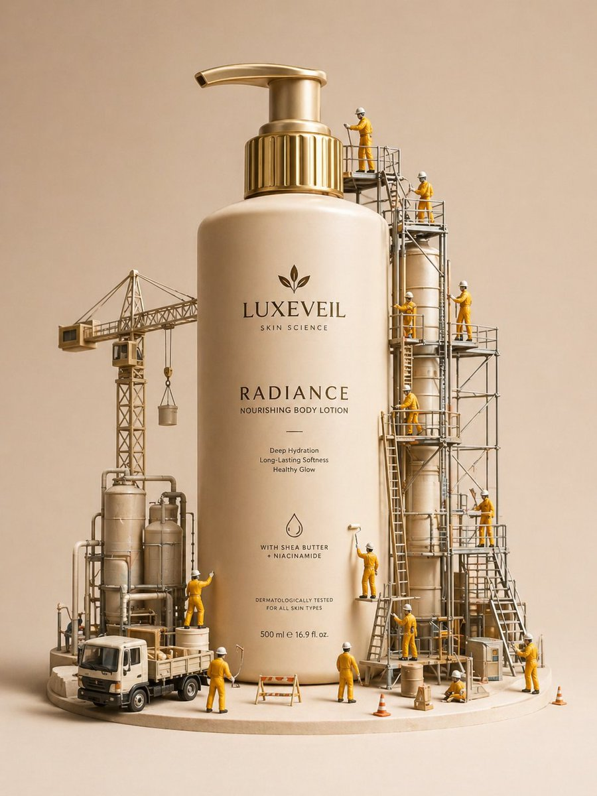
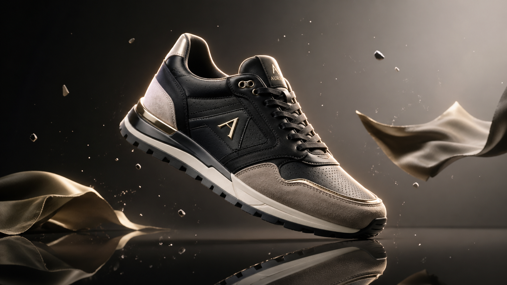

# 📦 产品主图 / 白底展示

> 电商平台标准产品展示图 Prompt，包含白底图、渐变背景、悬浮效果等。

**所属分类**: [电商产品](README.md)  
**Prompt 数量**: 5 条  
**难度等级**: ⭐ 入门

---

## Prompt 1: 标准白底产品图

**Prompt:**

```text
A professional e-commerce product photo of a [product: wireless headphones/sneakers/skincare bottle] 
on a pure white background (#FFFFFF), 
soft studio lighting with large softbox from above and fill from front, 
product centered in frame with even padding on all sides, 
sharp focus throughout the entire product (focus stacking), 
no shadows or minimal soft contact shadow only, 
true-to-life colors without heavy grading, 
Amazon/Tmall product listing standard, 
shot on Canon 5D Mark IV with 100mm macro lens, 
clean isolated product ready for background removal
```

**示例效果：**



**参数说明：**

| 参数 | 推荐值 | 说明 |
|------|--------|------|
| 尺寸 | 1024×1024 | 正方形（电商标准） |
| 风格 | Photorealistic | 商品摄影 |
| 模型 | GPT-Image-2 | 推荐 |

**标签**: `#ecommerce` `#product` `#white-background` `#clean`

---

## Prompt 2: 悬浮动感产品图

**Prompt:**

```text
A dynamic floating product shot of a [product: sneaker/phone/perfume bottle], 
suspended in mid-air with dramatic angle (tilted 15-30 degrees), 
gradient background transitioning from [dark to light / brand color], 
dramatic rim lighting creating a glowing edge effect, 
subtle motion elements: floating particles/droplets/fabric pieces around product, 
reflective surface below suggesting premium quality, 
hero image style for landing page or banner, 
high-end brand campaign photography quality
```

**示例效果：**



**参数说明：**

| 参数 | 推荐值 | 说明 |
|------|--------|------|
| 尺寸 | 1024×1024 | 方形 |
| 风格 | Photorealistic | 高端产品摄影 |
| 模型 | GPT-Image-2 | 推荐 |

**标签**: `#ecommerce` `#product` `#floating` `#dynamic` `#hero`

---

## Prompt 3: 多角度产品组合

**Prompt:**

```text
A product photography composite showing [product] from multiple angles, 
arranged in a grid or artistic layout: front, side, back, detail close-up, 
consistent lighting across all views, 
clean white or light gray background, 
each angle clearly showing different product features, 
professional catalog photography style, 
even spacing between product views, 
suitable for product detail page showing all angles
```

**参数说明：**

| 参数 | 推荐值 | 说明 |
|------|--------|------|
| 尺寸 | 1536×1024 | 横版组合 |
| 风格 | Photorealistic | 产品目录 |
| 模型 | GPT-Image-2 | 推荐 |

**标签**: `#ecommerce` `#product` `#multi-angle` `#catalog`

---

## Prompt 4: 品牌色背景产品图

**Prompt:**

```text
A premium product photography of [product] on a [brand color] gradient background, 
color harmony between product and background creating cohesive brand feel, 
soft complementary colored lighting accenting product edges, 
product placed on a subtle matte platform or floating slightly, 
brand-appropriate mood: [luxurious/playful/technical/natural], 
minimal props that reinforce brand identity, 
suitable for brand website hero section or social media feature
```

**参数说明：**

| 参数 | 推荐值 | 说明 |
|------|--------|------|
| 尺寸 | 1024×1024 | 方形 |
| 风格 | Photorealistic | 品牌产品摄影 |
| 模型 | GPT-Image-2 | 推荐 |

**标签**: `#ecommerce` `#product` `#branded` `#premium`

---

## Prompt 5: 微距细节特写

**Prompt:**

```text
An extreme close-up detail shot of [product: watch dial/fabric texture/shoe stitching], 
macro lens revealing craftsmanship details invisible to naked eye, 
f/2.8 shallow depth of field isolating specific detail area, 
directional side lighting emphasizing texture and material quality, 
shot on 100mm macro lens at near 1:1 magnification, 
showcasing premium materials and manufacturing quality, 
suitable for product detail page 'craftsmanship' section
```

**参数说明：**

| 参数 | 推荐值 | 说明 |
|------|--------|------|
| 尺寸 | 1024×1024 | 方形 |
| 风格 | Photorealistic | 微距产品摄影 |
| 模型 | GPT-Image-2 | 推荐 |

**标签**: `#ecommerce` `#product` `#macro` `#detail` `#craftsmanship`

---

## 🔗 相关推荐

- [平铺摆拍](flat-lay.md) - 俯拍产品组合
- [场景图](lifestyle-scene.md) - 使用场景展示
- [包装设计](packaging.md) - 包装展示图
