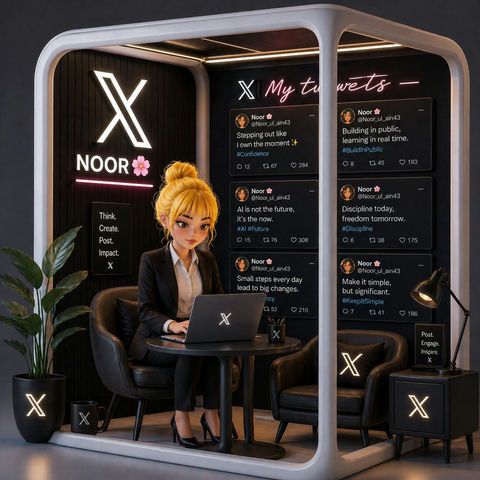

# 🖼️ Banner 横幅广告

> Web Banner、App 开屏、弹窗等数字广告 Prompt。

**所属分类**: [广告创意](README.md)  
**Prompt 数量**: 5 条  
**难度等级**: ⭐⭐ 进阶

---

## Prompt 1: 电商大促首页横幅

> 电商平台首页大促活动 Banner，吸引点击转化

**Prompt:**

```text
A vibrant e-commerce homepage hero banner for a summer fashion sale, dimensions optimized for 1920x600 wide format, a stylish young woman in a flowing sundress leaping joyfully against a gradient sky transitioning from coral pink to warm peach, shopping bags and fashion accessories floating dynamically around her, bold geometric shapes (circles, triangles) as decorative elements in white and gold, clear left-aligned text zone occupying 40% of the frame for headline and CTA button, energetic composition with diagonal lines creating movement, clean cutout style product imagery, high saturation and commercial appeal
```

**示例效果：**



**参数说明：**

| 参数 | 推荐值 | 说明 |
|------|--------|------|
| 尺寸 | 1536×1024 | 生成后裁切为 1920×600 |
| 风格 | Graphic | 扁平化商业插画风 |
| 模型 | GPT-Image-2 | 推荐 |

**变体建议：**

- 改为数码产品主题，使用深蓝科技感配色
- 换为美食/生鲜类目，暖色调搭配食材元素
- 简化为纯产品展示+色块背景的极简风

**标签**: `#advertising` `#banner-ad` `#ecommerce` `#hero-banner`

---

## Prompt 2: SaaS 产品 Google 展示广告

> B2B 软件产品展示广告，专业可信赖感

**Prompt:**

```text
A professional Google Display Network banner ad for a SaaS productivity tool, 1200x628 pixel concept layout, clean modern design with a laptop mockup showing the software dashboard UI on screen, isometric 3D illustration style with floating task cards and workflow arrows around the device, corporate color scheme of navy blue and crisp white with electric green accent for CTA area, right 35% of frame designated as text-safe zone with solid color backing, subtle grid pattern background suggesting organization and structure, professional yet approachable tone, flat design with soft shadows for depth
```

**示例效果：**


**参数说明：**

| 参数 | 推荐值 | 说明 |
|------|--------|------|
| 尺寸 | 1536×1024 | 裁切为 1200×628 |
| 风格 | Graphic | 扁平插画/等距风格 |
| 模型 | GPT-Image-2 | 推荐 |

**变体建议：**

- 改用真人办公场景替代插画风格
- 加入数据图表可视化元素，强调效率提升
- 深色模式版本，适合科技类受众

**标签**: `#advertising` `#banner-ad` `#saas` `#google-ads`

---

## Prompt 3: App 开屏广告

> 移动端 App 全屏开屏广告，5秒内抓住注意力

**Prompt:**

```text
A mobile app splash screen advertisement for a premium coffee brand new product launch, full-screen vertical format 1080x1920 concept, hero shot of an iced latte in a sleek glass with cream swirling artistically captured in freeze-frame, coffee beans and ice cubes floating in zero-gravity arrangement, rich dark brown gradient background with golden light rays streaming from behind the glass, condensation droplets rendered in hyper-realistic detail, bottom 25% reserved for product name and download CTA, top area clean for status bar, luxurious food photography aesthetic with dramatic studio lighting, instant appetite appeal
```

**示例效果：**


**参数说明：**

| 参数 | 推荐值 | 说明 |
|------|--------|------|
| 尺寸 | 1024×1536 | 竖版匹配手机屏幕 |
| 风格 | Photorealistic | 产品摄影级质感 |
| 模型 | GPT-Image-2 | 推荐 |

**变体建议：**

- 替换为护肤品/美妆产品开屏广告
- 改为游戏类 App 推广，使用角色立绘和特效
- 加入节日主题装饰元素（春节红包、圣诞雪花）

**标签**: `#advertising` `#banner-ad` `#mobile` `#splash-screen`

---

## Prompt 4: 社交媒体信息流广告

> Facebook/Instagram 信息流原生广告，融入用户浏览体验

**Prompt:**

```text
A native social media feed advertisement for an online fitness program, Instagram feed post format 1080x1080 square, before-and-after transformation concept shown through a creative split-screen diagonal composition, left side showing a tired person at a desk in desaturated cool tones, right side showing the same silhouette energetically exercising in warm vibrant colors, dynamic paint-splash transition effect at the diagonal divide, bold sans-serif text area at top reading style space for headline, circular profile-style badge in corner for brand avatar, authentic lifestyle photography feel rather than overly polished, scroll-stopping visual contrast
```

**示例效果：**


**参数说明：**

| 参数 | 推荐值 | 说明 |
|------|--------|------|
| 尺寸 | 1024×1024 | 1:1 方形适合社交媒体 |
| 风格 | Photorealistic | 生活方式摄影感 |
| 模型 | GPT-Image-2 | 推荐 |

**变体建议：**

- 改为轮播广告首图，加入"滑动查看"视觉暗示
- 使用用户证言/评价截图风格增加可信度
- 短视频封面风格，加入播放按钮视觉元素

**标签**: `#advertising` `#banner-ad` `#social-media` `#feed-ad`

---

## Prompt 5: 弹窗/浮层促销广告

> 网站弹窗广告和浮层促销，紧凑空间内最大化信息传达

**Prompt:**

```text
A website popup promotional overlay design for an email newsletter signup offer, compact 600x400 pixel concept, split layout with left half showing a beautifully styled flat-lay of curated lifestyle products (notebook, earbuds, plant, coffee) shot from above on a marble surface, right half clean white space for form fields and signup button, subtle confetti or sparkle elements framing the popup edges, warm inviting color palette of sage green and cream with terracotta accent for the CTA button, soft drop shadow giving the popup a floating card appearance, rounded corners modern UI aesthetic, communicating exclusive insider access
```

**示例效果：**


**参数说明：**

| 参数 | 推荐值 | 说明 |
|------|--------|------|
| 尺寸 | 1536×1024 | 生成后裁切为所需比例 |
| 风格 | Graphic | 现代 UI 设计风格 |
| 模型 | GPT-Image-2 | 推荐 |

**变体建议：**

- 改为限时折扣倒计时弹窗，红色紧迫感配色
- 使用全屏遮罩式设计搭配居中卡片
- 底部滑入式 Banner 样式，更轻量化

**标签**: `#advertising` `#banner-ad` `#popup` `#conversion`

---

## 🔗 相关推荐

- [促销活动](seasonal-promo.md) - 节日大促横幅设计
- [社交媒体](../06-social-media/) - 社交平台广告素材
- [电商素材](../03-ecommerce/) - 电商产品广告图
