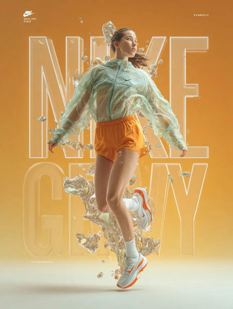

# 🏙️ 户外广告

> 路牌、地铁灯箱、公交站台等户外大幅面广告 Prompt。

**所属分类**: [广告创意](README.md)  
**Prompt 数量**: 5 条  
**难度等级**: ⭐⭐ 进阶

---

## Prompt 1: 高速公路广告牌

> 高速路旁大型广告牌设计，极简构图确保高速行驶中 3 秒内可读

**Prompt:**

```text
A highway billboard advertisement design for a premium electric vehicle brand, ultra-minimalist composition with a single hero image of a sleek silver EV sedan in profile view racing across the frame with subtle motion blur on wheels, solid deep navy blue background for maximum contrast and distance readability, large clean space on left 40% designated for no more than 5 words of headline text, brand logo placement in bottom-right corner at 15% scale, bold flat graphic style with clean vector-like edges rather than photographic subtlety, high saturation colors optimized for outdoor daylight visibility, 3:1 ultra-wide aspect ratio for standard highway billboard format, designed to be comprehensible at 120km/h passing speed
```

**示例效果：**



**参数说明：**

| 参数 | 推荐值 | 说明 |
|------|--------|------|
| 尺寸 | 1536×512 | 3:1 高速路牌比例 |
| 风格 | Graphic | 高对比度图形化 |
| 模型 | GPT-Image-2 | 推荐 |

**变体建议：**

- 替换为快餐品牌，超大产品特写（汉堡/饮料）占满画面
- 改为旅游目的地广告，一张震撼风景照 + 极简文字
- 夜间版本：深色背景 + 荧光色调，适配夜间灯光照射

**标签**: `#advertising` `#billboard` `#highway` `#outdoor` `#minimal`

---

## Prompt 2: 地铁灯箱广告

> 地铁站台灯箱广告，利用乘客等车的 30-60 秒深度阅读时间

**Prompt:**

```text
A subway station lightbox advertisement for a language learning app, vertical portrait format fitting standard metro lightbox dimensions, illustrated scene of a young professional confidently conversing with international colleagues at a global conference, speech bubbles containing symbols of different languages (not actual text) floating around them, bright optimistic color palette with coral pink, warm yellow, and soft teal, friendly modern illustration style with rounded shapes and approachable characters, upper 30% clean for app name and tagline, bottom 20% for QR code and download CTA area, backlit-optimized design with luminous colors that glow when illuminated from behind, clean white background sections to maximize lightbox brightness effect
```

**示例效果：**


**参数说明：**

| 参数 | 推荐值 | 说明 |
|------|--------|------|
| 尺寸 | 1024×1536 | 2:3 竖版灯箱标准 |
| 风格 | Illustration | 现代商业插画 |
| 模型 | GPT-Image-2 | 推荐 |

**变体建议：**

- 改为健身App广告，展示运动前后对比效果
- 替换为音乐流媒体广告，带耳机的人沉浸在音符中
- 采用真人摄影风格，更适合金融/保险等传统行业

**标签**: `#advertising` `#billboard` `#subway` `#lightbox` `#app-promotion`

---

## Prompt 3: 公交站台候车亭广告

> 公交站台广告设计，面向通勤人群的近距离阅读场景

**Prompt:**

```text
A bus shelter advertisement for a premium coffee chain's new seasonal drink launch, the poster showing an oversized photorealistic iced matcha latte in a branded clear cup taking up 65% of the frame, condensation droplets and ice crystals rendered in extreme detail, fresh green tea leaves and vanilla beans artistically scattered at the base, creamy milk pour frozen mid-swirl creating beautiful marbling pattern inside the cup, clean white background fading to soft matcha green gradient at edges, space allocated at top for drink name and at bottom for price point and store locator CTA, food photography hero shot style optimized for 1.2m x 1.8m print size, appetizing and thirst-inducing visual impact for commuters
```

**示例效果：**


**参数说明：**

| 参数 | 推荐值 | 说明 |
|------|--------|------|
| 尺寸 | 1024×1536 | 2:3 候车亭竖版 |
| 风格 | Photorealistic | 超写实食品摄影 |
| 模型 | GPT-Image-2 | 推荐 |

**变体建议：**

- 替换为奶茶品牌新品，加入珍珠/芋圆等配料飞溅
- 改为冬季热饮版本，热气蒸腾 + 温暖色调
- 采用系列海报设计（3联画），适配连续候车亭位置

**标签**: `#advertising` `#billboard` `#bus-shelter` `#food-beverage` `#product`

---

## Prompt 4: 建筑外墙巨幅广告

> 高层建筑外墙巨幅广告，利用建筑体量创造震撼视觉冲击

**Prompt:**

```text
A building wrap mega-format advertisement for a major sportswear brand campaign, designed to cover a 20-story building facade, featuring a larger-than-life athlete in mid-jump slam dunk pose spanning the full height of the building, dynamic diagonal composition with the figure stretching from bottom-left to upper-right creating powerful upward energy, bold simplified graphic treatment with limited color palette of black, white, and vivid electric red, halftone dot pattern texture visible at close range but reading as smooth gradients from street level, strategic window integration where building windows become part of the design grid, minimal text just the brand swoosh/logo at massive scale in bottom-right, designed for maximum impact from 200+ meters viewing distance, weatherproof UV-resistant color specification
```

**示例效果：**


**参数说明：**

| 参数 | 推荐值 | 说明 |
|------|--------|------|
| 尺寸 | 768×1536 | 1:2 竖版建筑外墙比例 |
| 风格 | Graphic | 大色块波普图形风格 |
| 模型 | GPT-Image-2 | 推荐 |

**变体建议：**

- 改为时装品牌，超大模特肖像 + 极简品牌标识
- 替换为电影上映宣传，角色海报 + 上映日期
- 采用互动错觉设计（如3D立体画效果）

**标签**: `#advertising` `#billboard` `#building-wrap` `#large-format` `#sports`

---

## Prompt 5: 机场通道灯箱长廊

> 机场到达通道连续灯箱广告，利用旅客行走动线创造叙事体验

**Prompt:**

```text
A sequential airport corridor lightbox advertisement series for a luxury resort destination, designed as one continuous panoramic scene split across multiple panels, depicting a breathtaking tropical paradise transitioning from sunrise to golden hour across the sequence: left panels show aerial view of crystal turquoise ocean with coral reefs visible below, center panels feature white sand beach with a single luxury cabana and swaying palms, right panels reveal an infinity pool merging with ocean horizon at sunset, consistent warm tropical color palette throughout with teals, corals, and golden yellows, each panel works standalone but creates a cinematic widescreen experience when viewed in sequence, ultra-wide 4:1 panoramic format for the full series, photorealistic travel photography quality with saturated tropical colors, minimal text overlay allowing the paradise visual to speak for itself
```

**示例效果：**


**参数说明：**

| 参数 | 推荐值 | 说明 |
|------|--------|------|
| 尺寸 | 1536×384 | 4:1 超宽全景比例 |
| 风格 | Photorealistic | 旅行目的地摄影 |
| 模型 | GPT-Image-2 | 推荐 |

**变体建议：**

- 替换为商务酒店集团，城市天际线黄昏全景
- 改为汽车品牌，展示一辆车穿越不同地貌的旅程
- 采用四季变换主题，适配高端生活方式品牌

**标签**: `#advertising` `#billboard` `#airport` `#panoramic` `#travel`

---

## 🔗 相关推荐

- [品牌广告](brand-campaign.md) - 品牌形象与故事叙述
- [Banner 横幅广告](banner-ad.md) - 数字平台广告设计
- [海报设计](../05-poster-illustration/) - 海报类创意参考
