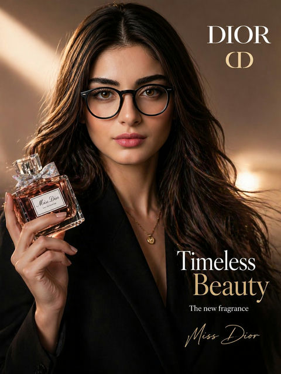

# 🏷️ 品牌广告

> 品牌形象塑造和品牌故事叙述的创意广告 Prompt。

**所属分类**: [广告创意](README.md)  
**Prompt 数量**: 5 条  
**难度等级**: ⭐⭐ 进阶

---

## Prompt 1: 奢侈腕表品牌形象

> 高端腕表品牌广告，强调工艺与传承的永恒感

**Prompt:**

```text
A luxury watch brand campaign image, a precision-crafted timepiece resting on weathered marble beside a crystal whiskey glass, extreme macro detail showing sapphire crystal reflections and brushed steel texture, dark moody studio lighting with a single warm spotlight creating dramatic shadows, shallow depth of field with bokeh highlights suggesting city lights at night, color palette of deep charcoal, champagne gold, and midnight blue, generous copy space on the upper left third for brand tagline, conveying legacy craftsmanship and quiet confidence, shot in 16:9 cinematic widescreen format
```

**示例效果：**


**参数说明：**

| 参数 | 推荐值 | 说明 |
|------|--------|------|
| 尺寸 | 1536×1024 | 16:9 适合横幅投放 |
| 风格 | Photorealistic | 高端摄影质感 |
| 模型 | GPT-Image-2 | 推荐 |

**变体建议：**

- 将腕表替换为珠宝首饰，背景换为丝绒面料
- 改用白色大理石搭配玫瑰金色调，呈现女性向高端感
- 加入人物手腕特写，展示佩戴效果

**标签**: `#advertising` `#brand-campaign` `#luxury` `#watch`

---

## Prompt 2: 高端汽车生活方式

> 豪华汽车品牌广告，融合座驾与理想生活场景

**Prompt:**

```text
A premium automotive brand campaign, a sleek matte black sports car parked at the edge of a cliffside highway overlooking the Mediterranean Sea at golden hour, aerial three-quarter angle showcasing sculpted body lines and dramatic silhouette, warm sunlight casting long shadows across the coastal road, distant white villas and azure water in soft focus background, cinematic color grading with teal shadows and amber highlights, lower right third left clean for logo and tagline placement, evoking freedom and sophisticated adventure, ultra-wide 21:9 panoramic composition
```

**示例效果：**


**参数说明：**

| 参数 | 推荐值 | 说明 |
|------|--------|------|
| 尺寸 | 1536×1024 | 超宽画幅裁切后适合户外大牌 |
| 风格 | Photorealistic | 汽车摄影级真实感 |
| 模型 | GPT-Image-2 | 推荐 |

**变体建议：**

- 场景换为都市夜景，霓虹灯反射在车漆上
- 改为 SUV 车型搭配雪山公路场景
- 加入驾驶者侧脸剪影，增加人文情感

**标签**: `#advertising` `#brand-campaign` `#automotive` `#lifestyle`

---

## Prompt 3: 香水品牌艺术广告

> 以超现实视觉语言诠释香水的嗅觉体验

**Prompt:**

```text
An artistic perfume brand advertisement, an elegant glass perfume bottle floating weightlessly amid an explosion of fresh peonies, jasmine petals, and golden liquid droplets suspended in mid-air, surreal dreamlike atmosphere with soft diffused lavender and blush pink lighting, delicate water splashes frozen in time creating organic sculptural forms, background transitioning from deep plum to soft rose gradient, the bottle catching and refracting prismatic light, composition centered with breathing space around the product for editorial text placement, ultra-high-end beauty photography meets fine art aesthetic
```

**示例效果：**



**参数说明：**

| 参数 | 推荐值 | 说明 |
|------|--------|------|
| 尺寸 | 1024×1536 | 竖版适合杂志整页 |
| 风格 | Photorealistic | 超现实摄影风格 |
| 模型 | GPT-Image-2 | 推荐 |

**变体建议：**

- 改为男性香水，使用深色木质、皮革和烟雾元素
- 融入四季概念，用冰晶或秋叶围绕瓶身
- 极简主义版本：纯白背景搭配单一花朵

**标签**: `#advertising` `#brand-campaign` `#perfume` `#surreal`

---

## Prompt 4: 运动品牌激励广告

> 运动品牌概念广告，传递突破极限的力量感

**Prompt:**

```text
A powerful athletic brand campaign image, a female sprinter captured mid-stride in explosive motion, dramatic low-angle shot emphasizing muscular power and determination, dynamic motion blur on limbs while face remains sharp showing fierce concentration, stadium environment with volumetric light beams cutting through atmospheric haze, sweat droplets frozen in the air catching backlight like diamonds, bold high-contrast color treatment with deep blacks and vibrant orange-red accent lighting, left side of frame kept open with dark gradient for motivational headline text, raw energy and human achievement narrative, sports editorial photography style
```

**示例效果：**


**参数说明：**

| 参数 | 推荐值 | 说明 |
|------|--------|------|
| 尺寸 | 1536×1024 | 横版适合多平台投放 |
| 风格 | Photorealistic | 体育摄影风格 |
| 模型 | GPT-Image-2 | 推荐 |

**变体建议：**

- 替换为篮球运动员扣篮瞬间，俯拍角度
- 改为瑜伽/冥想场景，传递身心平衡理念
- 使用多人团队运动场景，强调协作精神

**标签**: `#advertising` `#brand-campaign` `#sports` `#motivation`

---

## Prompt 5: 科技品牌未来感广告

> 科技公司品牌广告，展现创新与未来愿景

**Prompt:**

```text
A futuristic technology brand campaign visual, a sleek minimal smart device floating above an open palm of a human hand, holographic data streams and geometric light particles emanating from the device forming an abstract constellation pattern, clean white and cool blue color palette with subtle iridescent accents, the environment is a pristine minimalist space with soft ambient lighting and reflective floor, shallow depth of field keeping the device razor-sharp against a dreamy bokeh background, upper third reserved for brand messaging, conveying innovation accessibility and human-centered design philosophy, Apple-inspired clean advertising aesthetic with sci-fi undertones
```

**示例效果：**


**参数说明：**

| 参数 | 推荐值 | 说明 |
|------|--------|------|
| 尺寸 | 1536×1024 | 横版适合数字媒体 |
| 风格 | Photorealistic | 科技产品摄影风格 |
| 模型 | GPT-Image-2 | 推荐 |

**变体建议：**

- 深色主题版本：黑色背景搭配霓虹光效
- 加入多设备生态系统展示，强调互联体验
- 融入自然元素（植物、水），传达科技与自然和谐

**标签**: `#advertising` `#brand-campaign` `#technology` `#futuristic`

---

## 🔗 相关推荐

- [户外广告](billboard.md) - 品牌广告的户外大幅面应用
- [平面广告](print-ad.md) - 杂志和印刷品中的品牌表达
- [海报设计](../05-poster-illustration/) - 海报类视觉参考
