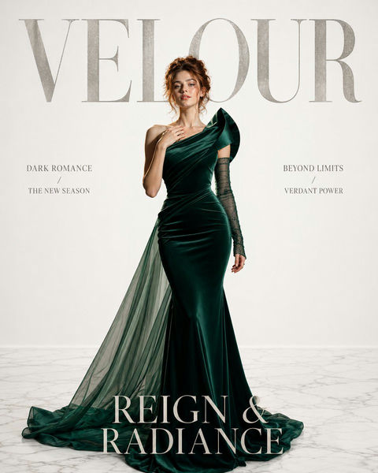

# 📰 平面广告

> 杂志、报纸、DM 单等印刷媒体的广告设计 Prompt。

**所属分类**: [广告创意](README.md)  
**Prompt 数量**: 5 条  
**难度等级**: ⭐⭐ 进阶

---

## Prompt 1: 高端时尚杂志广告

> 顶级时尚杂志全页广告，Vogue/ELLE 级别视觉品质

**Prompt:**

```text
A full-page fashion magazine advertisement for a luxury Italian leather handbag, portrait orientation 8.5x11 inch concept, a sophisticated woman in a tailored black coat walking through a rain-slicked Milanese cobblestone street at dusk, the handbag prominently displayed on her arm catching warm streetlamp light, cinematic shallow depth of field with golden bokeh from distant lights, rich moody atmosphere with deep shadows and warm highlights, bottom 20% reserved as clean space for brand logo and minimal copy, editorial fashion photography quality with film-grain texture, Vogue Italia aesthetic with European elegance
```

**示例效果：**



**参数说明：**

| 参数 | 推荐值 | 说明 |
|------|--------|------|
| 尺寸 | 1024×1536 | 竖版匹配杂志页面 |
| 风格 | Photorealistic | 时尚摄影质感 |
| 模型 | GPT-Image-2 | 推荐 |

**变体建议：**

- 改为纯白影棚环境，突出产品本身细节
- 使用男性模特搭配都市商务场景
- 采用鸟瞰平铺构图展示全系列产品

**标签**: `#advertising` `#print-ad` `#fashion` `#magazine`

---

## Prompt 2: 食品饮料杂志广告

> 美食杂志广告，激发食欲的视觉呈现

**Prompt:**

```text
A magazine print advertisement for an artisan chocolate brand, full-page portrait layout, a dramatic overhead shot of broken dark chocolate pieces arranged artistically on a black slate surface, molten chocolate river flowing between the pieces with visible viscosity and glossy sheen, scattered cocoa powder creating atmospheric dust clouds caught in directional spotlight, fresh raspberries and gold leaf as accent elements, extreme textural detail showing snap lines and cocoa butter crystals, color palette of deep browns, burgundy, and touches of gold, lower portion fading to solid dark background for elegant serif typography placement, food photography meets fine art still life, print-ready CMYK-friendly rich tones
```

**示例效果：**


**参数说明：**

| 参数 | 推荐值 | 说明 |
|------|--------|------|
| 尺寸 | 1024×1536 | 竖版全页广告 |
| 风格 | Photorealistic | 美食摄影风格 |
| 模型 | GPT-Image-2 | 推荐 |

**变体建议：**

- 替换为精酿啤酒广告，使用琥珀色调和泡沫质感
- 改为有机茶品牌，融入茶园和自然元素
- 采用极简日式摆盘风格，强调原料纯净

**标签**: `#advertising` `#print-ad` `#food` `#chocolate`

---

## Prompt 3: 汽车双页跨版广告

> 杂志双页跨版汽车广告，极致视觉冲击力

**Prompt:**

```text
A double-page spread magazine advertisement for a luxury electric vehicle, landscape 17x11 inch concept spanning two full pages, the car positioned at the golden ratio point driving along a winding mountain road during blue hour, headlights creating dramatic light trails suggesting motion and progress, majestic snow-capped peaks reflected in the car's polished surface, aerial drone-style elevated angle showing both the vehicle and the epic landscape scale, cool blue and silver color palette with warm headlight accents, seamless composition designed to work across the center fold with no critical elements at the spine, extreme left page kept minimal for body copy placement, conveys silent power and environmental harmony, large-format print quality with extraordinary detail
```

**示例效果：**


**参数说明：**

| 参数 | 推荐值 | 说明 |
|------|--------|------|
| 尺寸 | 1536×1024 | 横版适合跨页设计 |
| 风格 | Photorealistic | 汽车广告摄影 |
| 模型 | GPT-Image-2 | 推荐 |

**变体建议：**

- 改为城市俯瞰夜景，车辆在光轨中穿行
- 使用沙漠/盐湖镜面环境，强调设计美学
- 加入家庭出行场景，传递安全与温馨

**标签**: `#advertising` `#print-ad` `#automotive` `#spread`

---

## Prompt 4: 公益创意平面广告

> 公益主题创意广告，以视觉隐喻传递社会信息

**Prompt:**

```text
A powerful creative print advertisement for an ocean conservation campaign, full-page portrait concept, a visually striking photomontage showing a plastic water bottle with the ocean ecosystem trapped inside it — fish swimming among coral within the bottle shape while outside is barren wasteland, hyper-realistic rendering of water refraction and marine life details, stark contrast between the vibrant underwater world inside and the gray desolate exterior, single strong directional light from above creating a museum-spotlight effect, minimal clean white border framing the image like a gallery piece, bottom strip reserved for campaign tagline and organization logo, emotionally provocative and thought-provoking, Cannes Lions award-winning public service announcement quality
```

**示例效果：**


**参数说明：**

| 参数 | 推荐值 | 说明 |
|------|--------|------|
| 尺寸 | 1024×1536 | 竖版适合杂志/海报 |
| 风格 | Photorealistic | 创意合成风格 |
| 模型 | GPT-Image-2 | 推荐 |

**变体建议：**

- 改为气候变化主题，使用冰川融化的视觉隐喻
- 反烟草广告，将烟雾塑造为骷髅形状
- 节水公益，用水龙头滴水形成干旱大地图案

**标签**: `#advertising` `#print-ad` `#public-service` `#creative`

---

## Prompt 5: 房地产宣传册内页

> 高端房地产项目宣传册设计，展示生活方式愿景

**Prompt:**

```text
A luxury real estate brochure interior spread for a waterfront condominium development, landscape layout showing a photorealistic rendering of a spacious modern living room with floor-to-ceiling windows overlooking a sunset harbor view, warm interior styling with designer furniture in cream and natural wood tones, balcony visible through open glass doors with a couple enjoying wine in silhouette, golden hour light flooding the space creating long shadows and warm ambiance, left page designed as the hero lifestyle image bleeding to edge, right page with generous white space and a subtle blueprint line-drawing watermark for text overlay, architectural visualization quality with real estate marketing polish, aspirational yet believable residential interior
```

**示例效果：**


**参数说明：**

| 参数 | 推荐值 | 说明 |
|------|--------|------|
| 尺寸 | 1536×1024 | 横版宣传册跨页 |
| 风格 | Photorealistic | 建筑可视化渲染 |
| 模型 | GPT-Image-2 | 推荐 |

**变体建议：**

- 改为别墅外观鸟瞰图，展示社区全貌
- 加入户型平面图与实景对比的分屏设计
- 使用四季变化展示园林景观

**标签**: `#advertising` `#print-ad` `#real-estate` `#brochure`

---

## 🔗 相关推荐

- [品牌广告](brand-campaign.md) - 品牌视觉概念延伸
- [户外广告](billboard.md) - 从平面延伸到户外大幅面
- [海报设计](../05-poster-illustration/) - 更多印刷品视觉参考
