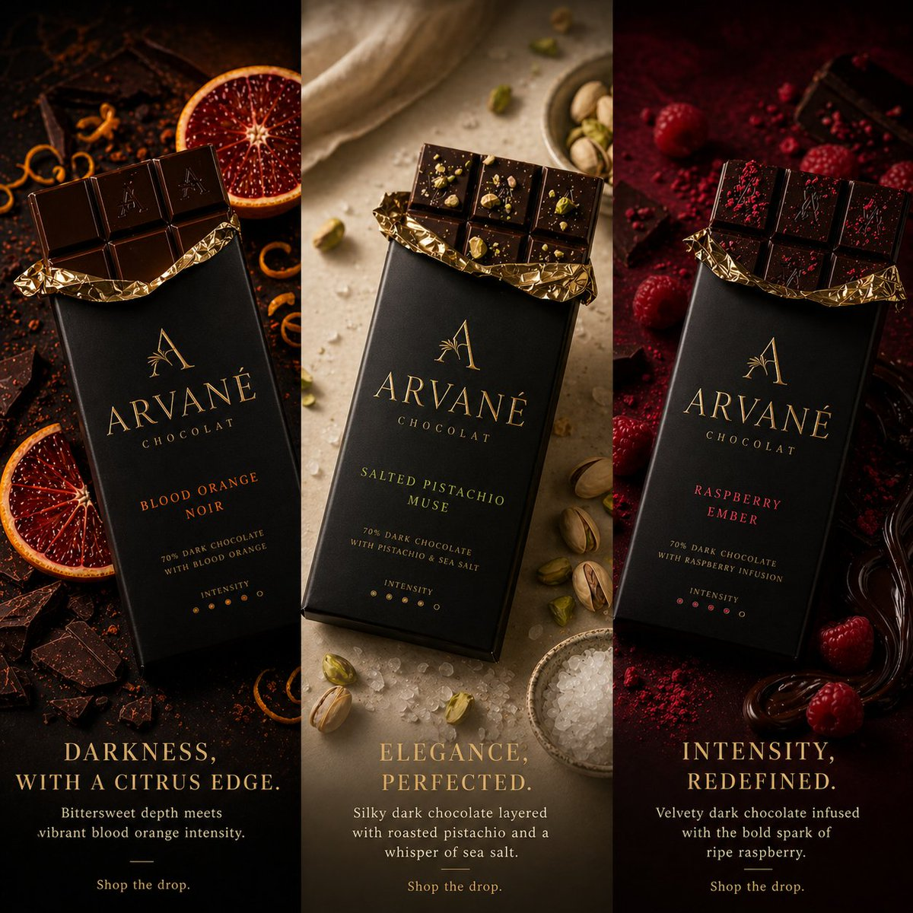

# 🎉 促销活动

> 双11、618、黑五、节日等促销活动视觉 Prompt。

**所属分类**: [广告创意](README.md)  
**Prompt 数量**: 5 条  
**难度等级**: ⭐⭐ 进阶

---

## Prompt 1: 双11 购物节主视觉

> 天猫双11全球购物节主视觉，极致狂欢氛围

**Prompt:**

```text
A Double 11 Singles' Day shopping festival hero banner visual, explosive celebration composition with a giant stylized "11.11" numeral as the centerpiece made of glossy red and gold 3D material, shopping bags, gift boxes, smartphones, and fashion items bursting outward from the numbers in a dynamic radial explosion pattern, confetti and golden particle streams filling the air, rich gradient background from deep crimson to bright red with subtle firework patterns, floating discount tags showing percentage-off numbers, energetic Chinese e-commerce aesthetic with premium production value, 1920x800 ultra-wide banner format, festive urgency conveying once-a-year unmissable deals, Tmall/JD homepage visual quality
```

**示例效果：**



**参数说明：**

| 参数 | 推荐值 | 说明 |
|------|--------|------|
| 尺寸 | 1536×1024 | 裁切为超宽横幅 |
| 风格 | Graphic | 3D 渲染+平面混合 |
| 模型 | GPT-Image-2 | 推荐 |

**变体建议：**

- 改为618年中大促主题，使用蓝色+金色配色
- 简化为单品类专场（美妆/数码/家电）
- 加入倒计时元素，营造预热期悬念

**标签**: `#advertising` `#seasonal-promo` `#double-11` `#shopping-festival`

---

## Prompt 2: 春节年货节

> 中国春节/年货节促销视觉，喜庆传统与现代融合

**Prompt:**

```text
A Chinese New Year Spring Festival shopping promotion visual, a magnificent composition blending traditional and modern celebration elements, a golden dragon sculpture weaving through floating red lanterns and blooming peony flowers, luxury gift hamper boxes wrapped in red and gold with silk ribbons as hero products, traditional paper-cut patterns forming decorative borders, background gradient from deep lucky red to warm gold, scattered golden coins and red envelopes adding festive prosperity symbols, subtle plum blossom branches framing the corners, modern 3D rendering style applied to traditional motifs creating a fresh premium look, center space reserved for "年货节" or sale messaging, auspicious and celebratory atmosphere conveying family reunion and gift-giving season, landscape banner format for e-commerce homepage
```

**示例效果：**


**参数说明：**

| 参数 | 推荐值 | 说明 |
|------|--------|------|
| 尺寸 | 1536×1024 | 横版电商首页 Banner |
| 风格 | Graphic | 国潮3D渲染风格 |
| 模型 | GPT-Image-2 | 推荐 |

**变体建议：**

- 改为中秋节主题，使用月亮/玉兔/月饼元素
- 替换为端午节，龙舟和粽子传统意象
- 简化为红包封面设计风格，社交传播向

**标签**: `#advertising` `#seasonal-promo` `#chinese-new-year` `#festival`

---

## Prompt 3: 黑色星期五大促

> Black Friday 黑五促销视觉，暗色奢华冲击力

**Prompt:**

```text
A Black Friday mega sale promotional visual, dramatic dark luxury aesthetic with a matte black background, a bold shattered 3D "BLACK FRIDAY" text exploding into fragments revealing glowing molten gold underneath, high-end products (headphones, sneakers, watch, sunglasses) arranged in a floating constellation around the text each with subtle golden rim lighting, geometric gold wire-frame shapes and metallic confetti adding visual richness, a large circular badge element for "UP TO 70% OFF" messaging in black and gold, subtle smoke or fog at the bottom adding mystery and depth, premium brand collaboration feeling rather than discount-store cheapness, the entire composition conveying exclusive deals on luxury goods, wide banner format with balanced negative space for additional copy
```

**示例效果：**


**参数说明：**

| 参数 | 推荐值 | 说明 |
|------|--------|------|
| 尺寸 | 1536×1024 | 横版广告大图 |
| 风格 | Graphic | 暗色奢华3D风格 |
| 模型 | GPT-Image-2 | 推荐 |

**变体建议：**

- 加入 Cyber Monday 延续版本，蓝色电子科技感
- 改为单品牌专场，突出一个品类的极致折扣
- 使用倒计时钟表元素，增加限时紧迫感

**标签**: `#advertising` `#seasonal-promo` `#black-friday` `#luxury-sale`

---

## Prompt 4: 夏日清凉季促销

> 夏季促销活动主视觉，清爽降温的视觉体验

**Prompt:**

```text
A summer cooling sale promotional banner visual, refreshing and energetic composition built around a massive splash of crystal-clear water erupting from the center, frozen in time with individual droplets catching rainbow light refractions, summer products (sunglasses, flip-flops, sunscreen, iced drinks, watermelon slices) surfing along the water wave, bright gradient background from sky blue at top to turquoise at bottom mimicking ocean depth, white foam and bubbles adding texture and playfulness, palm leaf shadows casting natural patterns across the scene, a sun-shaped sale badge element with rays for discount messaging, overall feeling of instant refreshment and carefree summer fun, high saturation tropical color palette with coral and yellow accents, landscape e-commerce banner format optimized for fashion and lifestyle categories
```

**示例效果：**


**参数说明：**

| 参数 | 推荐值 | 说明 |
|------|--------|------|
| 尺寸 | 1536×1024 | 横版首页大图 |
| 风格 | Graphic | 鲜艳活力图形风格 |
| 模型 | GPT-Image-2 | 推荐 |

**变体建议：**

- 改为泳池派对主题，加入更多人物元素
- 替换为冰淇淋/冷饮品类专场，美食向
- 使用渐变冰块质感作为主视觉元素

**标签**: `#advertising` `#seasonal-promo` `#summer-sale` `#refreshing`

---

## Prompt 5: 圣诞/新年跨年促销

> 圣诞节至元旦跨年促销季视觉，温馨节日氛围

**Prompt:**

```text
A Christmas and New Year holiday season sale promotional visual, a magical winter wonderland scene with a towering Christmas tree made entirely of stacked gift boxes in various sizes wrapped in emerald green, ruby red, and white with gold ribbon bows, soft snowfall creating a dreamy atmosphere, warm string lights (bokeh orbs) scattered throughout creating a cozy glow, a subtle starry night sky gradient from deep navy to purple in the background, silver and gold ornaments floating around the tree catching light, ground covered in fresh pristine snow with gentle sparkle, open gift boxes at the base revealing product silhouettes and golden light streaming out, vintage holiday card warmth combined with modern commercial polish, wide format with right third providing clean space against the night sky for holiday greeting and sale details, evoking the joy of giving and receiving during the festive season
```

**示例效果：**


**参数说明：**

| 参数 | 推荐值 | 说明 |
|------|--------|------|
| 尺寸 | 1536×1024 | 横版大促主视觉 |
| 风格 | Photorealistic | 梦幻写实混合风格 |
| 模型 | GPT-Image-2 | 推荐 |

**变体建议：**

- 改为纯元旦新年倒计时主题，使用时钟和烟花
- 替换为北欧极简风格圣诞，白色+原木质感
- 加入新年愿望概念，许愿星和流星元素

**标签**: `#advertising` `#seasonal-promo` `#christmas` `#new-year`

---

## 🔗 相关推荐

- [Banner 横幅广告](banner-ad.md) - 促销素材的 Banner 投放版本
- [品牌广告](brand-campaign.md) - 品牌调性的节日表达
- [电商素材](../03-ecommerce/) - 商品详情页促销设计
