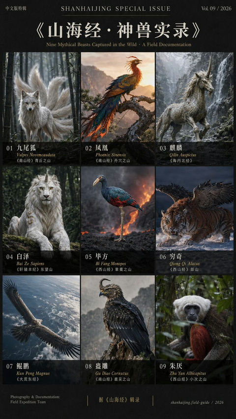

# 📚 书籍封面

> 小说、教材、非虚构等各类书籍封面设计。

**所属分类**: [海报与插画](README.md)  
**Prompt 数量**: 5 条  
**难度等级**: ⭐⭐ 进阶

---

## Prompt 1: 悬疑推理小说封面

> 暗黑氛围的心理悬疑小说封面，利用象征性意象暗示秘密与危险

**Prompt:**

```text
A psychological thriller novel book cover, a perfectly ordinary suburban house photographed at dusk but with one unsettling detail - all the windows reflect a different time of day (some showing noon sunlight, others midnight darkness), a single red door serving as the focal point and color accent against the muted grey-blue palette, long dramatic shadows stretching toward the viewer suggesting something approaching, the garden appears immaculate but on closer look the flowers are all dead and painted to look alive, atmospheric grain and slight vignette adding unease, title placement zone at top third in sharp modern serif typeface, author name at bottom, 6x9 inch standard novel proportions, Gone Girl / Girl on the Train market positioning, bookstore table display impact
```

**示例效果：**



**参数说明：**

| 参数 | 推荐值 | 说明 |
|------|--------|------|
| 尺寸 | 1024×1536 | 标准书籍封面比例 |
| 风格 | Cinematic | 氛围感光影 |
| 模型 | GPT-Image-2 | 推荐 |

**变体建议：**

- 改为近景物件特写（如带裂痕的怀表、染血的钥匙）
- 使用人物背影走入迷雾的构图
- 换成俯拍视角的犯罪现场布局

**标签**: `#book-cover` `#thriller` `#mystery` `#dark`

---

## Prompt 2: 奇幻史诗小说封面

> 宏大奇幻世界观小说封面，融合东方仙侠与西方高幻想美学

**Prompt:**

```text
An epic fantasy novel cover blending Eastern xianxia and Western high fantasy aesthetics, a young warrior standing at the edge of a floating mountain peak looking out over an impossible landscape of inverted waterfalls flowing upward into cloud-ringed celestial islands, the character wears flowing silk robes with ornate dragon-scale armor pieces, holding a luminous jade sword that emits swirling calligraphic energy characters, massive ancient stone gates visible in the far distance between mountain peaks connected by chains of golden light, color palette of deep imperial purple, jade green, and molten gold against misty white clouds, painterly digital art style with visible brushwork suggesting traditional Chinese landscape painting techniques merged with Western fantasy book cover illustration, Brandon Sanderson meets Jin Yong visual epic scope, title area at top in elegant mixed serif-brush typeface
```

**示例效果：**


**参数说明：**

| 参数 | 推荐值 | 说明 |
|------|--------|------|
| 尺寸 | 1024×1536 | 标准书籍封面比例 |
| 风格 | Artistic | 奇幻插画风格 |
| 模型 | GPT-Image-2 | 推荐 |

**变体建议：**

- 改为黑暗奇幻风格，哥特建筑+亡灵大军
- 聚焦单件神器（魔法书/神剑）的特写
- 使用地图式构图展现整个幻想大陆

**标签**: `#book-cover` `#fantasy` `#epic` `#xianxia`

---

## Prompt 3: 商业自助书封面

> 现代极简商业/自助类书籍封面，用单一强力图形传达核心概念

**Prompt:**

```text
A modern self-help business book cover with bold conceptual minimalism, a single powerful visual metaphor - a golden key transforming mid-air into a flock of birds flying upward representing unlocking potential and freedom, set against a clean deep navy background with subtle radial gradient, the transformation point where key becomes birds rendered with geometric particle dissolve effect, generous whitespace maintaining premium feel, title zone prominent in the upper third using bold sans-serif weight hierarchy (large title, smaller subtitle in lighter weight), author credentials line at bottom, accent colors limited to gold and white on navy, designed to stand out in Amazon thumbnail size, Atomic Habits / Think Again market tier visual sophistication, communicates transformation and aspiration at a glance
```

**示例效果：**


**参数说明：**

| 参数 | 推荐值 | 说明 |
|------|--------|------|
| 尺寸 | 1024×1536 | 标准书籍比例 |
| 风格 | Graphic | 干净的图形设计 |
| 模型 | GPT-Image-2 | 推荐 |

**变体建议：**

- 将隐喻替换为：种子→大树、迷宫→直线路径
- 改用亮白背景+单色插图的苹果美学风格
- 加入数据可视化元素，适合商业分析类书籍

**标签**: `#book-cover` `#self-help` `#business` `#minimalist`

---

## Prompt 4: 文学纯文学封面

> 诺贝尔文学奖气质的严肃文学封面，诗意抽象与高级质感

**Prompt:**

```text
A literary fiction book cover with Nobel Prize-level gravitas and poetic abstraction, an extreme close-up of aged hands holding a cracked porcelain teacup, the cracks in the cup filled with gold in the Japanese kintsugi style representing beautiful damage, shallow depth of field with the background dissolving into warm amber bokeh suggesting a remembered kitchen, natural window light falling across the scene creating dramatic chiaroscuro, muted earth tone palette of warm grey, aged ivory, and subtle gold accents, photographic realism with painterly post-processing suggesting a Vermeer painting quality of light, minimal elegant typography - title in refined thin serif (Garamond-like) positioned with generous margin, Penguin Classics or Knopf hardcover design sensibility, quiet power that rewards contemplation, communicates themes of memory, imperfection, and resilience
```

**示例效果：**


**参数说明：**

| 参数 | 推荐值 | 说明 |
|------|--------|------|
| 尺寸 | 1024×1536 | 标准书籍比例 |
| 风格 | Natural | 自然光摄影质感 |
| 模型 | GPT-Image-2 | 推荐 |

**变体建议：**

- 改为窗帘随风飘动的空旷房间，暗示离去
- 使用自然物象：枯枝上最后一片叶子、冰面下的鱼
- 纯抽象色域绘画风格，马克·罗斯科式色块

**标签**: `#book-cover` `#literary-fiction` `#poetic` `#elegant`

---

## Prompt 5: 科幻小说封面

> 硬科幻小说封面，宇宙尺度的孤独感与技术美学的结合

**Prompt:**

```text
A hard science fiction novel cover depicting cosmic scale and human solitude, a massive derelict generation ship drifting through the rings of a gas giant planet, the ship is kilometers long with visible structural damage and sections dark while others still glow with interior light, tiny EVA suit lights visible on the hull suggesting desperate repair activity, the gas giant fills the entire background with swirling bands of ochre, rust, and cream like a Jupiter close-up, ring particles catching sunlight as a field of diamonds around the ship, extreme sense of scale achieved through detailed surface texturing on the ship contrasted with the smooth planetary atmosphere, cold clinical lighting on the ship versus warm planetary glow, hard sci-fi technical accuracy in ship design (rotating habitat sections, radiator panels, no aerodynamic nonsense), Alastair Reynolds or Peter Watts novel aesthetic, title in clean futuristic sans-serif at top
```

**示例效果：**


**参数说明：**

| 参数 | 推荐值 | 说明 |
|------|--------|------|
| 尺寸 | 1024×1536 | 标准书籍比例 |
| 风格 | Cinematic | 宇宙级视觉效果 |
| 模型 | GPT-Image-2 | 推荐 |

**变体建议：**

- 改为行星地表探索场景，宇航员面对外星遗迹
- 使用微观视角：纳米机器人修复人体细胞
- 换成近未来都市，轨道电梯连接地面与太空

**标签**: `#book-cover` `#sci-fi` `#hard-sf` `#cosmic`

---

## 🔗 相关推荐

- [电影海报](movie-poster.md) - 影视叙事视觉
- [数字艺术](digital-art.md) - 概念艺术创作
- [专辑封面](album-art.md) - 方形封面设计
- [水彩风格](watercolor.md) - 手绘感封面
