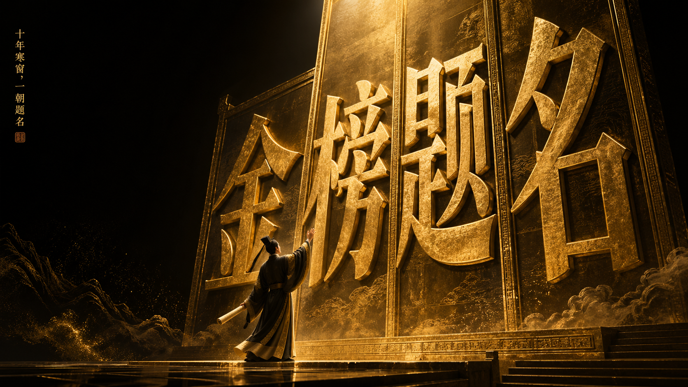
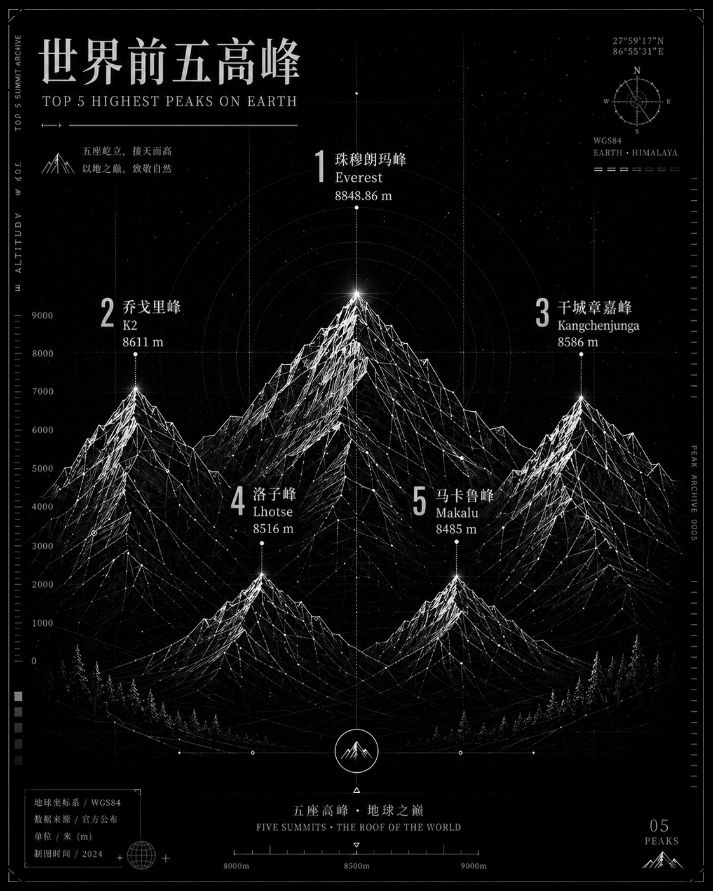
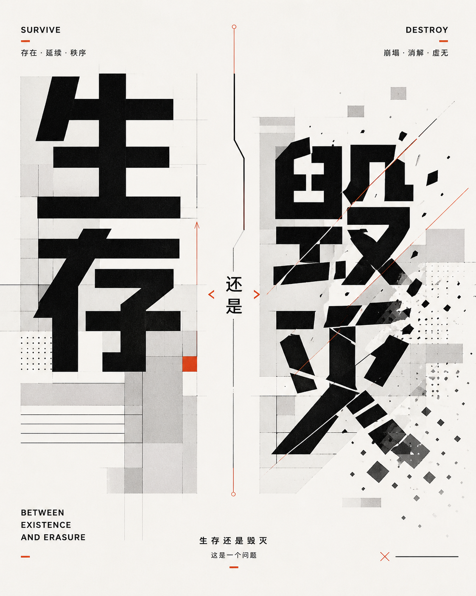

# 🎯 概念海报 / 字体视觉化

> 基于文字含义进行视觉转译的高级概念海报，将字体、几何图形与语义深度融合，创造强传播力的设计作品。

**所属分类**: [海报与插画](README.md)  
**Prompt 数量**: 3 条  
**难度等级**: ⭐⭐⭐ 高级  
**来源作者**: [@xiaoxiaodong01](https://x.com/xiaoxiaodong01)、[@MrLarus](https://x.com/MrLarus)

---

## Prompt 1: 字体美学 × 单词视觉化 — 高级图形艺术海报

> 基于词语含义进行视觉转译的高级概念海报，文字不是贴上去的说明，图像不是独立的插画，二者高度咬合形成统一视觉系统

**作者**: @xiaoxiaodong01（小小东）

**Prompt:**

```text
你要生成的不是普通插画，也不是简单把一个单词放大后贴在画面上的字效海报，而是一张"基于词语含义进行视觉转译"的高级概念海报。

这张海报必须具备真正优秀的设计思维：文字不是贴上去的说明，图像也不是独立存在的插画。文字、图像、构图、色彩、空间、承载面、角色动作、视觉隐喻，必须共同组成一个完整、聪明、克制、极简但有力的视觉表达。

核心任务：
用户会提供一个字、一个词、一个词组、一个短句，或一组字母。你需要先理解这个词语的字面意思、情绪气质、文化联想、隐含象征、心理重量、社会语境与潜在张力，然后把它转译成一张极简而强烈的图形艺术海报。

最终效果必须让人一眼就能感觉到：这个画面不是随便搭配出来的，而是在"准确地表达这个词"。

一、语义理解原则
在开始生成前，先智能理解用户输入的文字内容：
1. 这个词最核心的含义是什么。
2. 它偏向哪种情绪气质：冷静、压迫、温柔、危险、纯真、暴烈、克制、疏离、希望、毁灭、浪漫、孤独、秩序、混乱、沉默、对抗、空虚、信念、欲望等。
3. 它是否包含反差、悖论、双重含义、社会性、哲学性、情感张力或象征意味。
4. 它更适合通过哪种关系来表达：人物与人物、人物与物体、物体与物体、主体与空间、主体与文字、尺度反差、距离关系、动作瞬间、对峙关系、献出关系、遮挡关系、失衡关系、依附关系、侵入关系等。
5. 如果词语很抽象，不要只做抽象纹理，要找到能够承载它的具体视觉对象与动作。
6. 如果词语很具体，也不要只做字面插图，而是要通过关系、尺度、构图与氛围，把它变得更有内涵。

二、核心构图机制
画面必须优先采用"极简主场景 + 承载面 + 角色演绎 + 巨型文字骨架"的构图逻辑。
1. 必须有一个清晰的承载面（舞台、土地、台基、坡面、地平线等）。
2. 必须有少量但关键的演绎主体（1-3个角色/物体），通过姿态和关系演绎词义。
3. 必须有大字作为画面骨架，占据画面重要区域，具有压迫感和存在感。
4. 文字必须真正参与构图（嵌入、穿越、遮挡、借位），图与字高度咬合。

三、画面表达原则
1. 极简但不空洞。2. 强概念但不故弄玄虚。3. 有隐喻但可读懂。
4. 有戏剧性但不花哨。5. 一击即中的视觉冲击力。

四、色彩逻辑
控制在2-4种主色关系内，服务于词义与情绪，具有纸张印刷感、展览海报感。
优先采用"一个强主色 + 纸感浅色 + 深色支撑 + 极少量强调色"的逻辑。

五、视觉风格
接近高级图形艺术海报，具有印刷品气质，允许拼贴感、丝网印刷感、版画感、纸张颗粒。
强烈平面设计感、强整体性、收藏级完成度。

六、文字系统
核心文字为画面主标题和主视觉核心，巨大、强势、清晰。
辅助文字必须与主题直接相关，严禁无意义的假署名、假编号。

用户输入内容：
核心文字 / 单词 / 词组 / 字母：[用户输入]
文字语言：[用户输入]
可选补充语境：[用户输入]
可选情绪倾向：[用户输入]
可选禁用元素：[用户输入]
是否允许辅助文字：[用户输入]
辅助文字如允许，必须与主题的关系说明：[用户输入]
```

**示例效果：**



**参数说明：**

| 参数 | 推荐值 | 说明 |
|------|--------|------|
| 尺寸 | 1024×1536 | 2:3 竖版海报 |
| 风格 | Graphic Art Poster | 图形艺术海报 |
| 模型 | GPT-Image-2 | 推荐（需支持长 prompt） |
| 质量 | High | 印刷级精度 |

**变体建议：**

- 输入不同词语即产生完全不同的视觉（如 "自由"、"SILENCE"、"对抗"、"GRAVITY"）
- 情绪倾向可指定：冷静/压迫/温柔/暴烈/克制/浪漫
- 可补充"禁用元素"排除不想要的视觉（如"不要人物"、"不要红色"）

**标签**: `#concept-poster` `#typography` `#graphic-art` `#visual-translation` `#editorial`

---

## Prompt 2: 线条的艺术 × 抽象几何概念视觉

> 将主题文字转化为诗意抽象几何视觉语言的高完成度作品，适用于封面、海报、头图等

**作者**: @xiaoxiaodong01（小小东）

**Prompt:**

```text
请创作一张高完成度的「抽象几何线条概念视觉 / Abstract Linear Concept Artwork」。

这不是普通文字海报，不是简单给标题配一个背景，也不是随意堆叠抽象图形。
你要生成的是一张能够将"用户输入的主题文字或文案大意"转化为视觉语言的高质量设计作品。

整张图的核心逻辑是：
通过线条、几何、结构、插画化图形、参数化形态、光学感图案、手绘痕迹或其他抽象视觉元素，把用户输入的主题内容转译成一种"可被感受、可被解释、可被阅读"的图像结构。

最终效果应具备：高级审美、强视觉识别度、抽象但有逻辑、诗意但不空洞、可解释但不直白。

一、核心任务
围绕用户输入的主题，自动完成：
1. 先理解主题（表层含义、情绪气质、内在张力、语义关系、可转译的视觉隐喻）
2. 再决定视觉表达方式（图形语言、线条气质、结构方式、色彩策略）
3. 让背景"回应主题"（图形服务于主题表达，而非随机装饰）

二、线条气质智能变化
- 理性/系统/科技 → 精密、参数化、几何化、网格化
- 感性/记忆/诗意 → 柔和、流动、呼吸感、韵律感
- 冲突/撕裂/博弈 → 拉扯、碰撞、断裂、扭曲、压迫
- 生长/生命/自然 → 生物形态、脉络、羽化、能量场
- 手作感/作者性 → 松动、手绘、试探性笔触

三、图形层次系统
- 主视觉层：核心图形结构，承载主题隐喻
- 辅助结构层：路径、节点、弧线、网格、回路
- 氛围装饰层：边注、符号、刻度、点阵、角标
- 质感层：纸感、颗粒、薄雾、印刷肌理

四、风格灵活性
可自动选择：理性几何风 / 光学抽象风 / 生物形态风 / 手绘线稿风 / 观念海报风

五、配色系统
根据主题自动选择：黑白极简 / 冷白灰 / 米白纸感 / 深底浅线 / 低饱和莫兰迪 / 高对比概念色

用户输入：
主题文字：[用户输入]
补充文案：[用户输入]
使用场景：[用户输入]
图片比例：[用户输入]
整体风格倾向：[用户输入]
配色要求：[用户输入]
背景深浅要求：[用户输入]
是否需要四周装饰：[用户输入]
是否需要层次感增强：[用户输入]
其他特殊要求：[用户输入]
```

**示例效果：**



**参数说明：**

| 参数 | 推荐值 | 说明 |
|------|--------|------|
| 尺寸 | 灵活（用户指定） | 支持 1:1 / 2:3 / 16:9 |
| 风格 | Abstract Linear Art | 抽象线条概念艺术 |
| 模型 | GPT-Image-2 | 推荐 |
| 质量 | High | 高完成度输出 |

**变体建议：**

- 风格倾向可切换：`理性几何`、`光学抽象`、`生物形态`、`手绘线稿`、`观念海报`
- 配色可指定：`黑白极简`、`深底浅线`、`高对比概念色`
- 场景用途影响输出：`视频封面` vs `展览海报` vs `文章头图`

**标签**: `#abstract` `#geometric` `#linear-art` `#concept-visual` `#cover-design`

---

## Prompt 3: 现代平面几何字体概念海报

> 以文字为主视觉，以几何图形、色块、线条作为语义延展的现代平面设计海报

**作者**: @MrLarus（Larus Canus）

**Prompt:**

```text
请基于用户输入的【核心文字 / 单词 / 词组 / 短句 / 字母】，创作一张高完成度的「现代平面几何字体概念海报 / Geometric Typographic Concept Poster」。这不是普通插画，也不是简单把文字放大后的字效海报，而是一张"基于主题词含义自动构建视觉隐喻"的现代平面设计海报。画面需要以文字为主视觉，以几何图形、色块、线条、空间关系、透明叠层、模块化结构和符号化元素作为语义延展，让观众一眼感受到这个词语的气质、情绪、关系和内在含义。

用户输入如下：
核心文字 / 单词 / 词组 / 短句 / 字母：【____】；
文字语言：【中文 / 英文 / 中英混排】；
可选补充语境：【____】；
可选情绪倾向：【____】；
可选禁用元素：【____】。

请先理解用户输入内容的字面含义、情绪气质、隐含象征、文化联想、心理感受、语义张力，并判断它更偏向哪一类主题：
- 情绪型（孤独、自由、热烈、焦虑等）→ 通过色块关系、留白比例、图形距离、密度变化表达
- 动作型（逃离、靠近、坠落、生长等）→ 通过运动轨迹、字体切割错位、方向线条表达
- 关系型（连接、对抗、平衡、分裂等）→ 通过主体间距离、重叠、嵌套、碰撞表达
- 抽象概念型（时间、秩序、边界、记忆等）→ 通过系统感排版、网格变化、遮挡偏移表达
- 具象物象型（火焰、种子、月亮等）→ 提炼为符号化、几何化、结构化的视觉表达

整体画面应呈现为现代、清爽、有设计感、有传播力、有视觉记忆点的现代平面几何字体概念海报。

视觉风格：modern graphic design、geometric composition、typographic poster、experimental typography、clean flat design、crisp vector-like precision。
整体气质：现代、平面、清亮、理性、有设计感、有实验性、有系统感、有高级感。

配色根据主题自动选择：
- 活力/热烈 → bright orange, coral red, vivid yellow, electric blue
- 冷静/秩序 → navy, black, white, gray, silver blue  
- 温柔/记忆 → soft pink, warm white, pale green, muted lavender
- 冲突/危险 → red, black, white, neon green（高对比）
- 自由/轻盈 → sky blue, mint green, white, bright yellow
- 神秘/哲思 → indigo, deep violet, black + 亮色点缀

字体必须清晰醒目、有现代感几何感，与图形之间有明确互动关系。
图形元素不是装饰，必须对主题词形成视觉解释。
整体质感干净、crisp、vector-like、精致、高级、平面、当代。
```

**示例效果：**



**参数说明：**

| 参数 | 推荐值 | 说明 |
|------|--------|------|
| 尺寸 | 1024×1536 | 2:3 竖版海报 |
| 风格 | Geometric Typographic | 几何字体概念 |
| 模型 | GPT-Image-2 | 推荐 |
| 质量 | High | 矢量级精度 |

**变体建议：**

- 输入不同情绪类型的词获得截然不同的视觉（如"焦虑" vs "自由" vs "连接"）
- 指定语言：中文单字效果极佳（如"破"、"静"、"界"）
- 英文全大写效果好：`GRAVITY`、`FLOW`、`BREAK`
- 可禁用特定元素限定风格方向

**标签**: `#geometric` `#typographic` `#modern-design` `#flat` `#concept-poster` `#vector`

---

## 🔗 相关推荐

- [杂志封面](editorial-cover.md) - 东方美学编辑大片风格
- [数字艺术](digital-art.md) - 更自由的数字艺术创作
- [矢量插画](vector-illustration.md) - 扁平化矢量设计风格
- [活动海报](event-poster.md) - 更商业化的海报设计
- [06-social-media/twitter-card.md](../06-social-media/twitter-card.md) - 适合社交传播的配图
