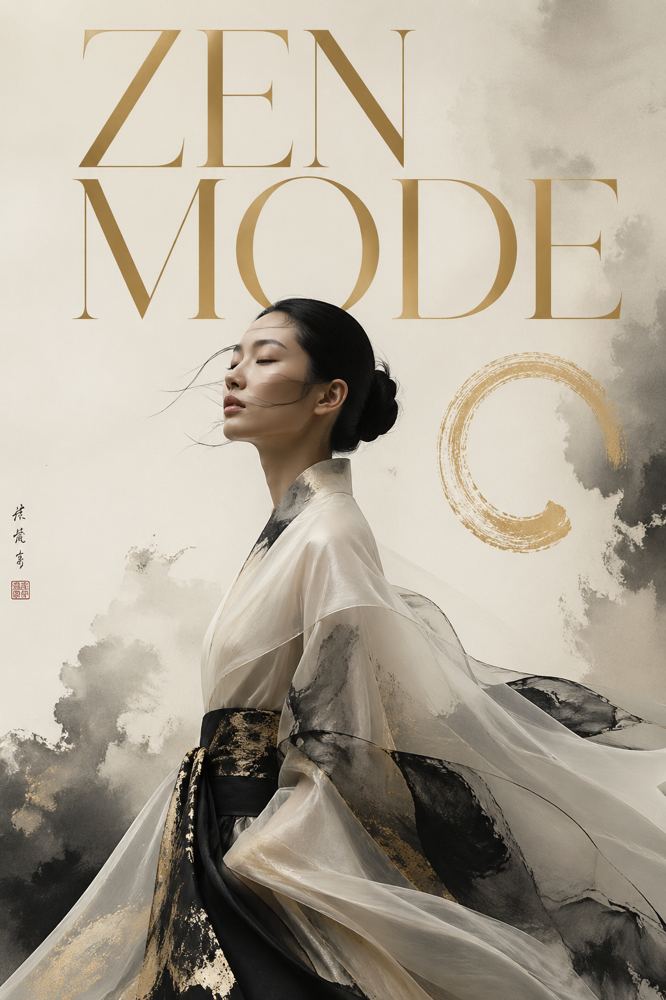
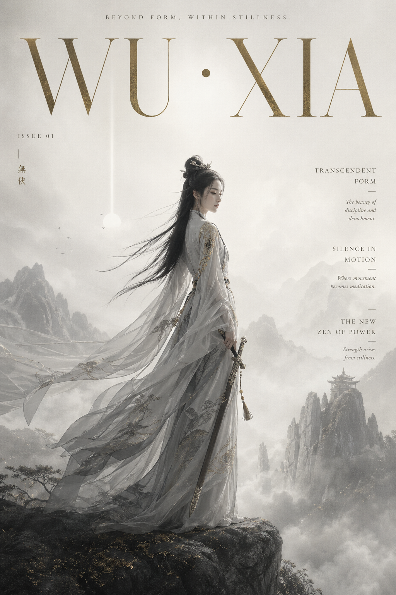

# 📖 杂志封面 / 编辑大片

> 高端杂志封面与编辑级概念肖像 Prompt，融合东方美学与现代高级感。

**所属分类**: [海报与插画](README.md)  
**Prompt 数量**: 2 条  
**难度等级**: ⭐⭐⭐ 高级  
**来源作者**: [@aidavid125](https://x.com/aidavid125)

---

## Prompt 1: 东方美学杂志封面 - ZEN MODE

> 现代亚洲模特概念肖像，极简东方美学杂志封面，水墨渐变与高定时装融合

**Prompt:**

```text
Luxury editorial cover, title "ZEN MODE", featuring a conceptual portrait of a modern Asian model, background with ink wash gradients and abstract brush textures, light mist atmosphere, flowing fabric inspired by traditional garments, minimal and contemporary styling, soft cinematic lighting, low contrast, gallery-level composition, ink black, ivory, and muted gold palette, high fashion + contemporary art fusion, ultra refined, 8K --ar 2:3 --style raw
```

**示例效果：**



**参数说明：**

| 参数 | 推荐值 | 说明 |
|------|--------|------|
| 尺寸 | 1024×1536 | 2:3 竖版杂志封面 |
| 风格 | Editorial / Cinematic | 杂志编辑大片 |
| 模型 | GPT-Image-2 | 推荐 |
| 质量 | High | 8K 精细度 |

**变体建议：**

- 替换 `"ZEN MODE"` 为其他杂志标题如 `"SILENCE"`、`"INK FLOW"`
- 将 `Asian model` 替换为 `European model` 获得不同文化融合感
- `ink black, ivory, and muted gold` → `deep indigo, cream, and copper` 改变色调
- 增加 `strong negative space` 获得更极简的版式

**标签**: `#editorial` `#magazine-cover` `#oriental-aesthetic` `#luxury` `#zen`

**设计解析：**

> 该 Prompt 的核心设计思路是**东方美学与现代高级感的融合**。通过精准的构图控制（画廊级构图）、电影级光影（柔和低对比）以及极简色调（水墨黑、象牙白、哑光金），营造出平静、强大、超然的视觉氛围。传统元素（水墨渐变、飘逸丝绸）与现代排版的结合，呈现出极具高级感的杂志封面效果。

---

## Prompt 2: 东方武侠风美学杂志封面 - WU·XIA

> 东方奇幻仙侠美学，武侠风高级时尚编辑摄影，融合水墨画与电影级视觉

**Prompt:**

```text
Luxury cinematic magazine cover, title "WU · XIA", A lone [角色：female swordsman / immortal / taoist / warrior] standing in vast misty mountains, Eastern fantasy xianxia aesthetic, blending traditional Chinese ink wash painting and high-end fashion editorial photography, flowing silk robes, subtle motion, ethereal presence, surrounded by soft clouds, floating particles, distant mountains fading into fog, minimalist zen composition, strong negative space, vertical balance, cinematic lighting, soft backlight, volumetric fog, diffused glow, color palette: desaturated ink tones (white, ash gray, soft black) with subtle gold accents, ultra high-end magazine layout, refined serif typography, thin elegant font, cover lines in minimal style, lots of breathing space, calm, powerful, transcendent mood, shot like a Wong Kar-wai + Zhang Yimou + Denis Villeneuve fusion cinematic style, ultra realistic, 8K, film grain, masterpiece --ar 2:3 --v 6 --style raw
```

**示例效果：**



**参数说明：**

| 参数 | 推荐值 | 说明 |
|------|--------|------|
| 尺寸 | 1024×1536 | 2:3 竖版封面 |
| 风格 | Cinematic Editorial | 电影级编辑大片 |
| 模型 | GPT-Image-2 / Midjourney v6 | 均适用 |
| 质量 | High | 8K + film grain |

**变体建议：**

- `[角色]` 可替换为 `female swordsman`（女剑客）、`immortal`（仙人）、`taoist`（道士）、`warrior`（武者）
- 标题 `"WU · XIA"` 可替换为 `"SHAN · HAI"`（山海）、`"XIAN · LU"`（仙路）
- 将 `vast misty mountains` 改为 `ancient bamboo forest` 或 `abandoned temple courtyard` 变换场景
- 去掉 `film grain` 获得更干净的数字感

**标签**: `#editorial` `#magazine-cover` `#wuxia` `#xianxia` `#cinematic` `#oriental`

**设计解析：**

> 这条 Prompt 是东方武侠美学与高端时尚摄影的极致融合。通过王家卫的色彩氛围 + 张艺谋的东方视觉 + 维伦纽瓦的规模感，创造出一种超越传统武侠海报的高级杂志视觉。关键技巧在于：强负空间（留白）、垂直平衡构图、去饱和水墨色调 + 金色点缀、体积雾营造的空间层次。

---

## 🔗 相关推荐

- [电影海报](movie-poster.md) - 更侧重叙事性的海报设计
- [数字艺术](digital-art.md) - 概念艺术创作
- [书籍封面](book-cover.md) - 封面设计的其他风格
- [概念海报](concept-poster.md) - 字体与图形结合的概念设计
- [01-portrait/fashion-portrait.md](../01-portrait/fashion-portrait.md) - 时尚人像摄影
