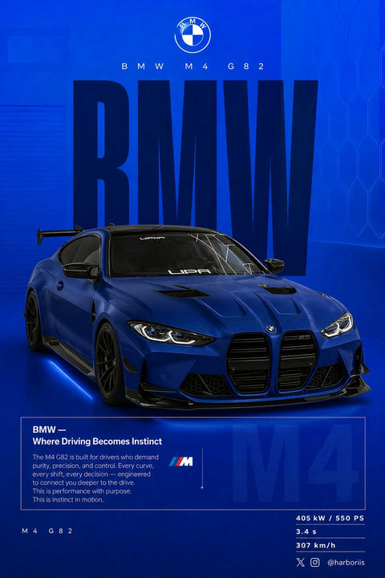

# 🎪 活动海报

> 音乐节、展览、会议等活动宣传海报设计。

**所属分类**: [海报与插画](README.md)  
**Prompt 数量**: 5 条  
**难度等级**: ⭐⭐ 进阶

---

## Prompt 1: 电子音乐节海报

> 赛博霓虹风格的大型户外电子音乐节海报

**Prompt:**

```text
A vibrant electronic music festival poster, abstract geometric soundwave visualization erupting from a central DJ booth silhouette, layered neon gradients flowing from electric magenta at the bottom through cyan to deep space purple at the top, geometric crystal formations floating like asteroids around the central visual, laser beam lines creating a perspective grid extending to a vanishing point, glitch art distortion effects on edges, halftone dot texture overlay on gradient areas, clear horizontal zones for: festival name (top 20%), visual artwork (middle 50%), lineup text (bottom 30%), designed for both 24x36 inch print and Instagram story crop, Coachella meets Tomorrowland visual identity energy
```

**示例效果：**



**参数说明：**

| 参数 | 推荐值 | 说明 |
|------|--------|------|
| 尺寸 | 1024×1536 | 竖版海报比例 |
| 风格 | Graphic | 平面设计感 |
| 模型 | GPT-Image-2 | 推荐 |

**变体建议：**

- 改为迷幻摇滚音乐节：60年代液态艺术+万花筒效果
- 换为爵士音乐节：Art Deco金色线条+深蓝夜色
- 使用日式设计：浮世绘元素融合电子音乐视觉

**标签**: `#event-poster` `#music-festival` `#neon` `#electronic`

---

## Prompt 2: 科技大会海报

> 未来主义风格的科技行业峰会宣传海报

**Prompt:**

```text
A futuristic tech conference poster design, an abstract neural network visualization forming the shape of a human brain made entirely of interconnected luminous nodes and data streams, the network expands outward becoming a global map of connected cities, dark navy-black background with electric blue and white accent lighting, clean Swiss typography grid system with generous whitespace, subtle circuit board pattern texture in the background at 5% opacity, holographic iridescent accent on the brain structure edges, infographic-style icons for keynote topics arranged in a minimal sidebar, QR code placeholder zone in bottom corner, Apple WWDC meets TED conference design language, premium corporate aesthetic with innovative edge
```

**示例效果：**


**参数说明：**

| 参数 | 推荐值 | 说明 |
|------|--------|------|
| 尺寸 | 1024×1536 | 竖版海报或展架比例 |
| 风格 | Graphic | 科技简洁风 |
| 模型 | GPT-Image-2 | 推荐 |

**变体建议：**

- 改为AI主题：生成式对抗网络的抽象可视化
- 换为区块链峰会：去中心化网络的几何拓扑图
- 使用暗色+渐变玻璃态设计（glassmorphism）

**标签**: `#event-poster` `#tech-conference` `#futuristic` `#corporate`

---

## Prompt 3: 艺术展览海报

> 当代艺术展览的高端画廊风格海报

**Prompt:**

```text
A sophisticated contemporary art exhibition poster, a single powerful abstract sculptural form rendered in white marble with gold leaf veins floating in a pure black void, the sculpture is an impossible geometric shape (a Möbius strip merged with organic flowing fabric forms), dramatic museum-quality spotlight creating a sharp circular light pool beneath the sculpture, extremely minimal layout with vast empty black space occupying 60% of the poster, exhibition information in thin elegant serif typography aligned to bottom-left corner, subtle paper grain texture throughout, influenced by Isamu Noguchi and Anish Kapoor sculptural aesthetics, gallery-white sophistication meets dramatic theatrical presentation, suitable for MoMA or Tate Modern exhibition promotion
```

**示例效果：**


**参数说明：**

| 参数 | 推荐值 | 说明 |
|------|--------|------|
| 尺寸 | 1024×1536 | 竖版海报比例 |
| 风格 | Artistic | 艺术极简风 |
| 模型 | GPT-Image-2 | 推荐 |

**变体建议：**

- 改为摄影展：一张震撼的黑白摄影作品占据全幅
- 换为波普艺术展：Andy Warhol式重复网格+荧光色
- 使用东方美学：水墨留白+现代字体的中日风格

**标签**: `#event-poster` `#exhibition` `#gallery` `#minimal`

---

## Prompt 4: 体育赛事海报

> 充满力量感与动态的国际体育赛事海报

**Prompt:**

```text
A dynamic international sports championship poster, a dramatic freeze-frame moment of a sprinter breaking through the finish line tape, captured from a low-angle worm's-eye perspective making the athlete monumental and heroic, motion blur on the trailing leg while the victory expression is tack-sharp, shattered particles and speed trails emanating from the breaking tape point, bold diagonal composition splitting the poster into dark shadow (left) and blazing stadium light (right), national flag colors subtly woven into abstract geometric overlays, metallic gold and deep athletic navy color scheme, event logo zone in top-left corner, Nike/Adidas campaign visual quality, Olympics meets World Championship prestige, photographically real with graphic design enhancement layers
```

**示例效果：**


**参数说明：**

| 参数 | 推荐值 | 说明 |
|------|--------|------|
| 尺寸 | 1024×1536 | 竖版海报比例 |
| 风格 | Cinematic | 运动动态感 |
| 模型 | GPT-Image-2 | 推荐 |

**变体建议：**

- 改为篮球赛事：扣篮瞬间的爆炸式粒子效果
- 换为足球世界杯：球场鸟瞰与球员特写的双重曝光
- 使用复古奥运风格：1970年代平面设计的几何运动员

**标签**: `#event-poster` `#sports` `#dynamic` `#championship`

---

## Prompt 5: 美食节/市集海报

> 温暖手工感的社区美食节活动海报

**Prompt:**

```text
A warm inviting food festival poster with handcrafted artisan aesthetic, a bird's-eye view of a rustic wooden farm table overflowing with beautifully arranged seasonal foods (artisan breads, colorful farmers market vegetables, cheese wheels, honey jars, fresh flowers in mason jars), hand-lettered chalk-style festival title arching across the top, scattered herb leaves and flour dust floating in warm afternoon sunlight streaming from the left, gingham cloth and kraft paper textures, warm earthy color palette of terracotta, sage green, cream, and golden wheat, illustrated border of vine tendrils and small food icons in a folk art style, community gathering warmth, farm-to-table authenticity, Kinfolk magazine meets local farmers market charm
```

**示例效果：**


**参数说明：**

| 参数 | 推荐值 | 说明 |
|------|--------|------|
| 尺寸 | 1024×1024 | 方形适合社交媒体 |
| 风格 | Natural | 手工自然风 |
| 模型 | GPT-Image-2 | 推荐 |

**变体建议：**

- 改为亚洲夜市风格：霓虹灯+蒸汽+街头小吃摊
- 换为精酿啤酒节：复古标签设计+麦穗插画元素
- 使用日本祭典风格：和风插画+灯笼+屋台美食

**标签**: `#event-poster` `#food-festival` `#artisan` `#community`

---

## 🔗 相关推荐

- [电影海报](movie-poster.md) - 电影级视觉构图技巧
- [矢量插画](vector-illustration.md) - 现代平面设计元素
- [书籍封面](book-cover.md) - 排版与留白的艺术
