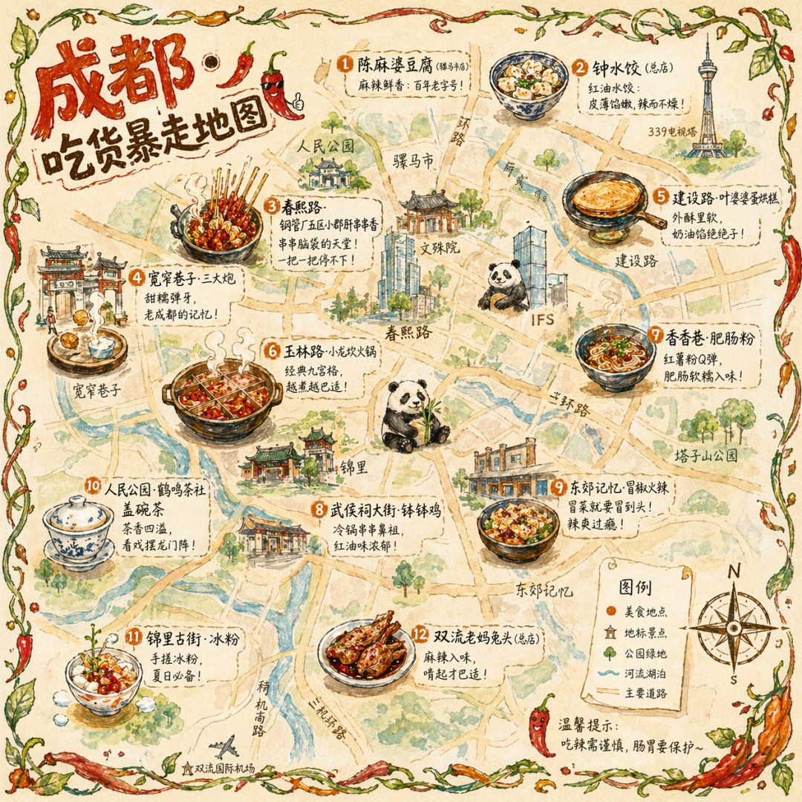

# ✏️ 矢量插画

> 扁平化、MBE 风、线条插画等现代矢量插画风格。

**所属分类**: [海报与插画](README.md)  
**Prompt 数量**: 5 条  
**难度等级**: ⭐⭐ 进阶

---

## Prompt 1: 等距城市场景

> 精致的等距视角（Isometric）城市生活插画

**Prompt:**

```text
A detailed isometric illustration of a vibrant neighborhood block showing a cross-section of urban life, featuring a corner coffee shop with outdoor seating (tiny customers visible through large windows), a rooftop garden on the adjacent building with miniature vegetable plots and solar panels, a bookstore with a cat sleeping in the display window, a bike repair shop with tools visible inside, street level shows a bike lane with cyclists, a small park with a fountain and chess players on a bench, underground cross-section reveals a metro train passing through, consistent 30-degree isometric grid with pixel-perfect alignment, flat color fills with no gradients (solid color only), warm color palette of coral, teal, warm yellow, and soft grey, each building in a slightly different accent color, thick 3px consistent outline weight on all elements, subtle long shadows cast at 45 degrees in a lighter shade of each object's base color, no perspective distortion anywhere, Kurzgesagt meets Houzz editorial illustration style, designed to be zoomed in for discovering small narrative details
```

**示例效果：**



**参数说明：**

| 参数 | 推荐值 | 说明 |
|------|--------|------|
| 尺寸 | 1024×1024 | 方形构图等距场景 |
| 风格 | Flat Illustration | 扁平矢量风 |
| 模型 | GPT-Image-2 | 推荐 |

**变体建议：**

- 改为等距工厂/仓库：展示生产线和物流流程
- 换为等距太空站：舱段剖面展示不同功能区
- 使用等距自然场景：分层展示森林生态系统

**标签**: `#vector` `#isometric` `#cityscape` `#flat-design`

---

## Prompt 2: MBE风格图标插画

> 粗描边彩色填充的MBE设计风格组合插画

**Prompt:**

```text
A collection of food and cooking themed icons in MBE illustration style arranged in a pleasing grid layout, items include: a steaming ramen bowl with chopsticks, a dripping pizza slice, a layered burger with visible ingredients, a cupcake with swirl frosting, a coffee cup with latte art, a sushi roll cross-section, each item drawn with thick bold black outlines (4-5px consistent weight), filled with flat cheerful colors (no gradients) in a candy-like palette of warm red, golden yellow, fresh mint green, sky blue, and soft pink, small decorative elements floating around each item (steam lines, sparkles, tiny hearts, small dots) in lighter outline weight, rounded corners on all shapes giving a friendly approachable feel, subtle offset shadow in a single consistent direction (lower-right, 3px offset, light grey), pure white background, each icon could work independently or as part of the set, Behance trending MBE style meets LINE sticker character design charm, perfect for app UI icons or social media sticker packs
```

**示例效果：**


**参数说明：**

| 参数 | 推荐值 | 说明 |
|------|--------|------|
| 尺寸 | 1024×1024 | 方形图标集 |
| 风格 | Flat Illustration | MBE描边风格 |
| 模型 | GPT-Image-2 | 推荐 |

**变体建议：**

- 改为旅行主题：行李箱、相机、地球仪、飞机等
- 换为科技设备：手机、笔记本、耳机、智能手表
- 使用季节植物主题：不同月份的代表性花卉

**标签**: `#vector` `#MBE` `#icons` `#cute`

---

## Prompt 3: 几何抽象海报

> 包豪斯与瑞士国际主义风格的几何构成插画

**Prompt:**

```text
A geometric abstract composition poster in Swiss International Style meets Bauhaus aesthetic, primary geometric shapes (circles, triangles, rectangles) arranged in a dynamic asymmetrical grid system with mathematical precision, strict limited color palette of exactly 4 colors: deep navy blue, warm vermillion red, golden yellow, and off-white, shapes overlap creating new color zones through transparency effects (simulated at flat color: red over blue = deep purple zone), strong diagonal movement created by a series of progressively smaller circles descending from top-left to bottom-right, horizontal text lines in Helvetica-like sans-serif acting as both information and graphic elements (lorem ipsum is fine), one large circle dominating the upper-left quadrant as the primary focal point, thick black rules dividing the space according to golden ratio proportions, texture-free perfectly flat solid colors, grid-based precision that still feels dynamic through intentional tension between elements, Jan Tschichold meets El Lissitzky constructivist energy, suitable as a museum exhibition poster or design school teaching example
```

**示例效果：**


**参数说明：**

| 参数 | 推荐值 | 说明 |
|------|--------|------|
| 尺寸 | 1024×1536 | 竖版海报比例 |
| 风格 | Graphic | 平面设计风 |
| 模型 | GPT-Image-2 | 推荐 |

**变体建议：**

- 改为De Stijl风格：纯粹直线+原色块（蒙德里安式）
- 换为俄国构成主义：斜线+摄影拼贴+红黑配色
- 使用现代极简：单色背景上一个不完整的圆

**标签**: `#vector` `#geometric` `#bauhaus` `#swiss-design`

---

## Prompt 4: 扁平人物场景插画

> 科技公司风格的无面人物场景插画

**Prompt:**

```text
A modern flat illustration for a tech company showing a diverse team collaborating in a creative workspace, 4-5 stylized characters with simplified features (dot eyes, no detailed faces) and exaggerated body proportions (large heads, small hands), each person engaged in different activities: one standing at a whiteboard sketching ideas, one on a bean bag with a laptop, one pair high-fiving over a shared desk, one watering a large monstera plant, the workspace features modern furniture in rounded organic shapes, floating UI elements and abstract data visualizations hovering in the air like holograms they're interacting with, consistent flat color style with exactly zero gradients, unified color harmony of soft purple as primary, coral as accent, warm grey for neutrals, and crisp white background, all characters have distinct but coordinated outfit colors, oversized props for visual clarity (giant coffee cup, huge pencil), subtle halftone dot texture at 10% opacity on shadow areas only, Google/Slack/Notion illustration style language, communicates collaboration creativity and friendly work culture, hero image for a SaaS landing page
```

**示例效果：**


**参数说明：**

| 参数 | 推荐值 | 说明 |
|------|--------|------|
| 尺寸 | 1536×1024 | 横版网页主图比例 |
| 风格 | Flat Illustration | 科技扁平风 |
| 模型 | GPT-Image-2 | 推荐 |

**变体建议：**

- 改为远程工作场景：各人在不同环境通过屏幕连接
- 换为教育平台：学生与老师互动的在线课堂
- 使用医疗健康主题：友好的医患互动场景

**标签**: `#vector` `#flat-design` `#tech` `#characters`

---

## Prompt 5: 线条艺术编辑插画

> 杂志/报纸配图风格的概念性线条插画

**Prompt:**

```text
An editorial illustration for a magazine article about artificial intelligence and human creativity, executed in sophisticated single-weight line art with selective color fill, a human hand (drawn from the left side) and a robotic hand (drawn from the right side) each holding one end of a paintbrush that is painting a colorful landscape in the center space between them, the human hand is drawn with organic flowing contour lines showing natural imperfections, while the robotic hand uses precise geometric line construction with visible joints and circuits, the painting they create together blooms outward with wild flowers and butterflies on the human side transitioning to geometric patterns and fractals on the robot side meeting harmoniously in the middle, line weight: consistent 2px black throughout all elements, color fill applied ONLY to the central painting area (the hands remain black line on white), limited color in the painted area: emerald green, golden yellow, coral pink, the composition is conceptually rich while remaining visually clean, The New Yorker meets Monocle magazine editorial illustration quality, clever visual metaphor that sparks thought
```

**示例效果：**


**参数说明：**

| 参数 | 推荐值 | 说明 |
|------|--------|------|
| 尺寸 | 1536×1024 | 横版编辑配图比例 |
| 风格 | Graphic | 线条插画风 |
| 模型 | GPT-Image-2 | 推荐 |

**变体建议：**

- 改为关于气候变化的隐喻：城市与自然的天平
- 换为关于全球化的插画：丝线连接的世界各地标
- 使用关于时间的概念：沙漏中流淌的不同人生阶段

**标签**: `#vector` `#editorial` `#line-art` `#conceptual`

---

## 🔗 相关推荐

- [活动海报](event-poster.md) - 矢量风格海报应用
- [像素艺术](pixel-art.md) - 另一种规则化数字风格
- [数字艺术](digital-art.md) - 自由度更高的数字创作
