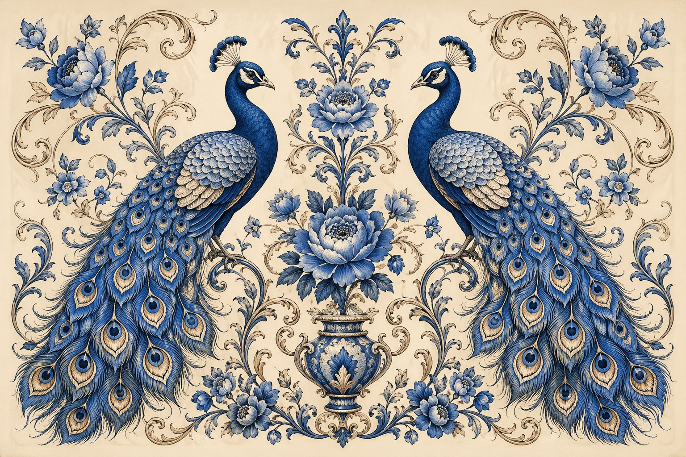

# 🎨 水彩风格

> 传统水彩画风格的插画，花卉、动物、风景等题材。

**所属分类**: [海报与插画](README.md)  
**Prompt 数量**: 5 条  
**难度等级**: ⭐⭐ 进阶

---

## Prompt 1: 植物图鉴水彩

> 科学插画风格的植物标本水彩画，兼具学术精准与艺术美感

**Prompt:**

```text
A botanical watercolor illustration of a blooming magnolia branch in the style of 18th-century scientific illustration, the main branch enters from the lower-left and extends diagonally with three flowers in different stages (tight bud, half-open, and fully bloomed revealing pistils and stamens), each petal painted with multiple transparent washes building up from palest blush pink to deeper rose at the base, visible watercolor granulation in the shadows using a mix of permanent rose and raw umber, leaves rendered in detailed botanical accuracy showing venation patterns with a mix of sap green and indigo, small anatomical detail studies in the corners (seed pod cross-section, individual stamen close-up) labeled with fine pencil annotation lines, painted on hot-pressed watercolor paper with visible deckled edges, the white of the paper serves as the brightest highlights with no white paint used, Royal Horticultural Society exhibition quality, Maria Sibylla Merian meets contemporary botanical art precision
```

**示例效果：**



**参数说明：**

| 参数 | 推荐值 | 说明 |
|------|--------|------|
| 尺寸 | 1024×1536 | 竖版适合植物标本构图 |
| 风格 | Watercolor | 传统水彩技法 |
| 模型 | GPT-Image-2 | 推荐 |

**变体建议：**

- 改为热带花卉（鹤望兰、天堂鸟），色彩更浓烈
- 换为药用植物图鉴，加入根茎和果实分解图
- 使用秋季主题：枫叶色变过程的连续记录

**标签**: `#watercolor` `#botanical` `#scientific-illustration` `#flora`

---

## Prompt 2: 欧洲小镇风景水彩

> 松散写意的旅行速写风格，记录欧洲小镇午后时光

**Prompt:**

```text
A loose expressive watercolor painting of a sun-drenched Italian coastal village (Cinque Terre style), painted in plein air sketching tradition with confident brushstrokes that capture the essence without overworking details, terracotta and ochre buildings stacked up a hillside with Mediterranean blue shutters and cascading bougainvillea in magenta, the sea visible as a strip of cerulean mixed with ultramarine at the bottom with small boats as simple color dots, a foreground café terrace with quick gestural figures sitting under a striped awning rendered in just a few strokes each, deliberate areas left unfinished with pencil underdrawing visible at the edges allowing the viewer's imagination to complete the scene, wet-on-wet sky wash with a few cumulus clouds blooming softly, paint drips and back-runs left as happy accidents adding to the spontaneous charm, limited palette of 6 colors (ultramarine, burnt sienna, cadmium yellow, permanent rose, sap green, Payne's grey), the energy and joy of painting on location comes through in every mark
```

**示例效果：**


**参数说明：**

| 参数 | 推荐值 | 说明 |
|------|--------|------|
| 尺寸 | 1536×1024 | 横版风景构图 |
| 风格 | Watercolor | 写意水彩 |
| 模型 | GPT-Image-2 | 推荐 |

**变体建议：**

- 改为英国乡村：石墙+茅草屋顶+雨后湿润感
- 换为日本京都：红色鸟居+竹林+和式建筑
- 使用冬季版本：雪景中的北欧木屋村落

**标签**: `#watercolor` `#landscape` `#travel-sketch` `#plein-air`

---

## Prompt 3: 动物肖像水彩

> 湿画法为主的动物肖像，捕捉毛发的柔软质感与眼神灵性

**Prompt:**

```text
A sensitive watercolor portrait of a red fox in three-quarter view against a white background, the face rendered with careful layered washes building up warm orange and burnt sienna fur texture while keeping the white chest fluffy and barely touched by paint, the eyes are the sharpest most detailed area - amber irises with a keen intelligent spark and tiny white paper highlight creating life, the ears have delicate wet-on-dry fine brushstrokes suggesting individual fur hairs, the composition becomes progressively looser toward the body and tail which dissolve into abstract splashes and spatters of orange and gold paint suggesting movement and wildness, a few intentional drips running downward from the dissolving body add dynamic energy, the fox emerges from abstraction into realism at the face creating a stunning contrast between control and chaos, painted on cold-pressed Arches paper with visible texture in the washes, color palette limited to transparent pigments (quinacridone gold, burnt sienna, Winsor orange, indigo for darkest accents), wildlife art that transcends illustration into fine art territory
```

**示例效果：**


**参数说明：**

| 参数 | 推荐值 | 说明 |
|------|--------|------|
| 尺寸 | 1024×1024 | 正方形肖像构图 |
| 风格 | Watercolor | 湿画法晕染 |
| 模型 | GPT-Image-2 | 推荐 |

**变体建议：**

- 改为猫头鹰肖像，强调羽毛的层叠纹理
- 换为水中锦鲤，利用水彩的透明性表现水下光影
- 使用多只小鸟构图，麻雀在树枝上的群像

**标签**: `#watercolor` `#animal-portrait` `#wildlife` `#wet-on-wet`

---

## Prompt 4: 美食插画水彩

> 温暖治愈的食物水彩插画，杂志配图级别的精致美食画

**Prompt:**

```text
A mouth-watering watercolor food illustration of a Japanese afternoon tea spread arranged on a wooden table, including: a slice of strawberry shortcake with visible fluffy cream layers, a matcha latte in a ceramic cup with latte art, three pieces of wagashi (traditional sweets) in seasonal cherry blossom shapes on a lacquer plate, and a small glass vase with a single cherry blossom branch, each item rendered with careful attention to texture - the cake sponge has visible air bubbles, the cream looks pillowy soft, the matcha has subtle gradient from green to foam white, natural lighting from upper-left creating soft shadows that anchor objects to the table surface, color palette of soft pink, matcha green, warm cream, and cherry wood brown, the style balances between photorealistic food photography accuracy and painterly watercolor charm, each brushstroke visible up close but reading as realistic from normal viewing distance, recipe book or food magazine editorial illustration quality, makes the viewer crave the food immediately
```

**示例效果：**


**参数说明：**

| 参数 | 推荐值 | 说明 |
|------|--------|------|
| 尺寸 | 1024×1024 | 正方形适合社交平台 |
| 风格 | Watercolor | 精致水彩 |
| 模型 | GPT-Image-2 | 推荐 |

**变体建议：**

- 改为法式面包房：牛角面包+咖啡+花束的清晨场景
- 换为中式早餐：小笼包+豆浆+油条的烟火气
- 使用单品特写：一杯手冲咖啡的制作过程分步图

**标签**: `#watercolor` `#food-illustration` `#japanese` `#editorial`

---

## Prompt 5: 星空夜景水彩

> 湿画法星空与剪影前景结合的梦幻夜景水彩画

**Prompt:**

```text
A dreamy watercolor night sky painting using bold wet-on-wet technique, the Milky Way galaxy stretching across the composition rendered by dropping concentrated pigment (indigo, ultramarine violet, opera pink, and turquoise) onto soaking wet paper and letting the colors bloom and merge organically creating unpredictable cosmic nebula effects, salt crystals sprinkled into the wet wash creating star-like white speckles as the paint dries around them, additional stars added with white gouache spattering from a loaded brush, the lower quarter features a silhouetted treeline (tall pines) painted in a single confident stroke of lamp black after the sky dried completely creating a crisp dark edge against the soft sky, a still lake reflects the sky colors in the bottom strip with a small rowboat silhouette as the focal anchor point, the painting celebrates what only watercolor can do - the beautiful accidents of wet pigment meeting water, pigment granulation visible in the dark sky areas (Daniel Smith pigments known for granulation), the experience of standing alone under an infinite universe translated into paint on paper
```

**示例效果：**


**参数说明：**

| 参数 | 推荐值 | 说明 |
|------|--------|------|
| 尺寸 | 1536×1024 | 横版全景夜空 |
| 风格 | Watercolor | 湿画法晕染 |
| 模型 | GPT-Image-2 | 推荐 |

**变体建议：**

- 改为极光景观，绿色和紫色的大面积晕染
- 换为城市天际线剪影替代森林，展现都市夜色
- 使用月亮特写：超大满月+树枝前景框

**标签**: `#watercolor` `#night-sky` `#milky-way` `#wet-on-wet`

---

## 🔗 相关推荐

- [数字艺术](digital-art.md) - 数字绘画与概念艺术
- [矢量插画](vector-illustration.md) - 现代扁平风格对比
- [书籍封面](book-cover.md) - 水彩风格封面应用
- [活动海报](event-poster.md) - 手绘质感海报设计
