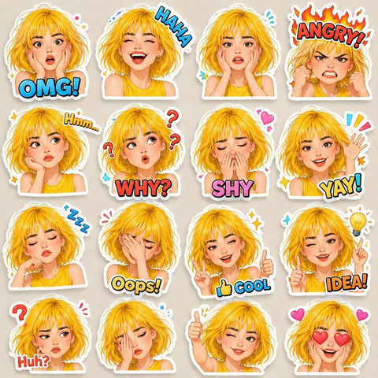

# 📸 Instagram 帖文

> Instagram 方图、Reels 封面、美学网格布局的 Prompt。

**所属分类**: [社交媒体](README.md)  
**Prompt 数量**: 5 条  
**难度等级**: ⭐⭐ 进阶

---

## Prompt 1: 极简生活美学方图

> 北欧风极简生活方式的 Instagram 方形帖文

**Prompt:**

```text
A minimalist lifestyle Instagram post, 1080x1080 square format, Scandinavian-inspired flat lay composition on a pure white marble surface, featuring a ceramic coffee cup, open hardcover book, small succulent plant, and linen napkin arranged with intentional negative space, soft diffused natural window light from upper left casting gentle shadows, muted earth tones with touches of sage green and warm beige, clean modern aesthetic that fits a cohesive feed grid, shot from directly above (top-down perspective), subtle grain texture for organic feel
```

**示例效果：**



**参数说明：**

| 参数 | 推荐值 | 说明 |
|------|--------|------|
| 尺寸 | 1024×1024 | Instagram 方图标准比例 |
| 风格 | Photo | 真实摄影质感 |
| 模型 | GPT-Image-2 | 推荐 |

**变体建议：**

- 将物品换成护肤品套装，背景换为木质托盘
- 加入季节元素（秋叶、圣诞装饰、春花花瓣）
- 更换色调为全白 + 金色配件的奢华风格

**标签**: `#social-media` `#instagram-post` `#minimalist` `#flatlay`

---

## Prompt 2: 美食摆盘俯拍图

> 精致早午餐摆盘的社交媒体美食帖

**Prompt:**

```text
An Instagram-worthy brunch flat lay photograph, 1080x1080 square format, overhead shot of a beautifully plated avocado toast on artisan sourdough with poached eggs and microgreens, accompanied by a matcha latte with latte art in a handmade ceramic cup, fresh berries in a small bowl, on a rustic reclaimed wood table, natural morning light streaming from the side creating soft warm highlights, vibrant greens and golden yellows contrasting with neutral table tones, styled with a cloth napkin and vintage cutlery, food photography with appetizing colors and sharp focus on textures
```

**示例效果：**


**参数说明：**

| 参数 | 推荐值 | 说明 |
|------|--------|------|
| 尺寸 | 1024×1024 | Instagram 方图标准比例 |
| 风格 | Photo | 美食摄影质感 |
| 模型 | GPT-Image-2 | 推荐 |

**变体建议：**

- 换成日式料理（寿司拼盘、抹茶甜点）
- 改为下午茶场景（蛋糕、鲜花、茶具）
- 添加手部入镜的互动感（手举咖啡杯）

**标签**: `#social-media` `#instagram-post` `#food` `#brunch`

---

## Prompt 3: 城市旅行打卡照

> 具有强烈视觉冲击力的旅行目的地打卡帖

**Prompt:**

```text
A stunning travel destination Instagram post, 1080x1080 square format, a solo female traveler in a flowing white dress standing at the edge of the Santorini caldera at golden hour, iconic blue-domed churches and white-washed buildings in the background, dramatic warm sunset light painting the scene in orange and pink hues, rule of thirds composition with the subject in the left third looking towards the view, dreamy soft bokeh on distant buildings, travel photography with aspirational wanderlust mood, cinematic color grading with lifted shadows and warm highlights
```

**示例效果：**


**参数说明：**

| 参数 | 推荐值 | 说明 |
|------|--------|------|
| 尺寸 | 1024×1024 | Instagram 方图标准比例 |
| 风格 | Photo | 旅行摄影风格 |
| 模型 | GPT-Image-2 | 推荐 |

**变体建议：**

- 换成东京街头霓虹灯夜景（赛博朋克色调）
- 改为巴黎埃菲尔铁塔的清晨雾气场景
- 沙漠公路的自驾旅行壮阔构图

**标签**: `#social-media` `#instagram-post` `#travel` `#goldenhour`

---

## Prompt 4: 时尚穿搭展示帖

> 适合时尚博主的 OOTD 穿搭展示方图

**Prompt:**

```text
A fashion OOTD (outfit of the day) Instagram post, 1080x1080 square format, full-body shot of a stylish woman in a contemporary streetwear outfit: oversized blazer, wide-leg trousers, chunky sneakers, and a designer crossbody bag, standing against a clean architectural background with geometric concrete walls, confident relaxed pose with one hand in pocket, soft overcast daylight providing even flattering illumination, slightly desaturated cool-toned color palette with the outfit as the clear focal point, editorial street style photography feel, shallow depth of field blurring the background slightly
```

**示例效果：**


**参数说明：**

| 参数 | 推荐值 | 说明 |
|------|--------|------|
| 尺寸 | 1024×1024 | Instagram 方图标准比例 |
| 风格 | Photo | 街拍时尚摄影 |
| 模型 | GPT-Image-2 | 推荐 |

**变体建议：**

- 更换为度假风穿搭（阳光沙滩背景）
- 改为室内镜前自拍的 mirror selfie 风格
- 换成男士商务休闲风格

**标签**: `#social-media` `#instagram-post` `#fashion` `#ootd`

---

## Prompt 5: 品牌产品展示帖

> 适合品牌账号的产品宣传方图

**Prompt:**

```text
A premium product showcase Instagram post, 1080x1080 square format, a luxury skincare bottle with frosted glass and minimalist label design, placed on a smooth stone pedestal surrounded by fresh botanical elements (eucalyptus leaves and water droplets), soft studio lighting with a gradient background transitioning from warm peach to soft cream, photorealistic product photography with visible liquid texture through the bottle, subtle reflection on the glossy surface below, clean composition with ample negative space in the upper portion for text overlay, high-end beauty brand advertising aesthetic
```

**示例效果：**


**参数说明：**

| 参数 | 推荐值 | 说明 |
|------|--------|------|
| 尺寸 | 1024×1024 | Instagram 方图标准比例 |
| 风格 | Photo | 产品商业摄影 |
| 模型 | GPT-Image-2 | 推荐 |

**变体建议：**

- 换成电子产品（耳机、手表）搭配科技感背景
- 改为香薰蜡烛搭配干花和暖光氛围
- 食品品牌：手工巧克力搭配可可豆和丝绒布

**标签**: `#social-media` `#instagram-post` `#product` `#branding`

---

## 🔗 相关推荐

- [小红书笔记配图](xiaohongshu.md) - 种草分享风格
- [Story/短视频封面](story-cover.md) - 竖屏内容封面
- [轮播图/图文集](carousel.md) - 多图组合内容
- [Twitter/X 卡片](twitter-card.md) - 横版社交配图
