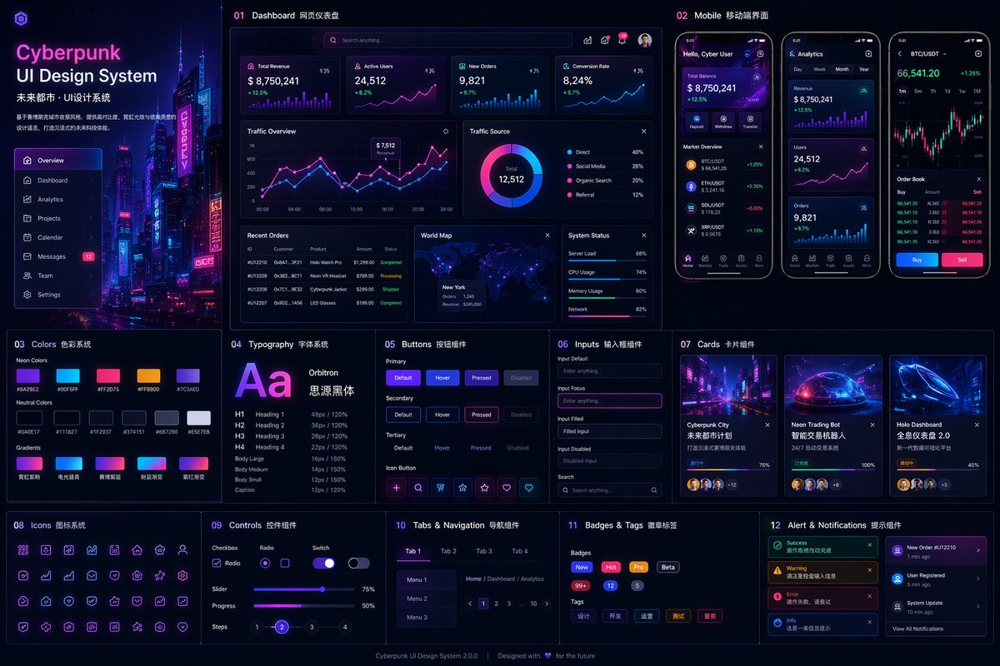

# 📱 App 界面

> iOS/Android 应用界面截图、功能页面设计。

**所属分类**: [UI 与界面](README.md)  
**Prompt 数量**: 5 条  
**难度等级**: ⭐⭐ 进阶

---

## Prompt 1: 健身追踪 App 深色模式

> 运动数据追踪应用的核心界面，Dark Mode 配合活力渐变色

**Prompt:**

```text
A premium iOS fitness tracking app screen design, iPhone 15 Pro frame with Dynamic Island, dark mode UI with deep black (#0A0A0A) background, vibrant gradient accent from electric blue to cyan for progress rings and charts, main screen showing: circular activity rings (calories/exercise/standing) at top, weekly bar chart of workouts in the middle, today's stats cards (steps, heart rate, distance) in a horizontal scroll, bottom tab bar with 5 items (Home/Workouts/Progress/Social/Profile), SF Pro Display font, smooth rounded corners on all cards, subtle card shadows, realistic fitness data populated, Apple Human Interface Guidelines compliant, Dribbble-quality UI design
```

**示例效果：**



**参数说明：**

| 参数 | 推荐值 | 说明 |
|------|--------|------|
| 尺寸 | 768×1536 | iPhone 竖屏比例 |
| 风格 | UI Design | 界面设计 |
| 模型 | GPT-Image-2 | 推荐 |

**变体建议：**

- 将活动环替换为每日运动时间线
- 使用霓虹紫+粉色渐变替代蓝青渐变
- 增加社交排行榜卡片

**标签**: `#app-screen` `#fitness` `#dark-mode` `#ios`

---

## Prompt 2: 金融理财 App 卡片风格

> 个人银行/理财应用首页，卡片层叠 + 玻璃拟态效果

**Prompt:**

```text
A modern fintech banking app UI design, iPhone 15 Pro mockup, light mode with soft off-white (#F8F9FA) background, glassmorphism style credit card floating at top with frosted glass effect and subtle gradient (purple to indigo), account balance displayed prominently in large bold typography, quick action buttons row (Send/Request/Pay/Top-up) with rounded circular icons, recent transactions list with merchant logos and categorized spending, spending analytics mini donut chart in a card, smooth micro-interactions implied through layered depth and shadows, bottom navigation bar, SF Pro Rounded font, realistic banking data (balance $12,450.80), premium and trustworthy design aesthetic, Behance featured quality
```

**示例效果：**


**参数说明：**

| 参数 | 推荐值 | 说明 |
|------|--------|------|
| 尺寸 | 768×1536 | iPhone 竖屏比例 |
| 风格 | UI Design | 界面设计 |
| 模型 | GPT-Image-2 | 推荐 |

**变体建议：**

- 深色模式版本配合金色高亮
- 展示投资组合页面（股票走势图）
- 加入加密货币钱包界面

**标签**: `#app-screen` `#fintech` `#glassmorphism` `#banking`

---

## Prompt 3: 社交媒体 App 个人主页

> Instagram/小红书风格个人资料页面，现代瀑布流布局

**Prompt:**

```text
A social media app profile page UI design, iPhone 15 Pro frame, clean white background with subtle warm tint, profile section at top: circular avatar photo with gradient ring border, username and bio text, follower/following/posts count in a row, Edit Profile and Share buttons side by side, content grid below showing 3-column photo/video thumbnails in masonry layout, tab switcher (Posts/Reels/Tagged) with animated underline indicator, floating action button for new post (gradient purple-pink), stories highlights row with labeled circular thumbnails, proper iOS status bar and navigation, Instagram-meets-Pinterest aesthetic, realistic user-generated content thumbnails, modern social platform design
```

**示例效果：**


**参数说明：**

| 参数 | 推荐值 | 说明 |
|------|--------|------|
| 尺寸 | 768×1536 | iPhone 竖屏比例 |
| 风格 | UI Design | 界面设计 |
| 模型 | GPT-Image-2 | 推荐 |

**变体建议：**

- 深色模式 + AMOLED 纯黑背景
- 创作者/商家版本（含数据分析入口）
- 短视频平台风格（全屏视频 Feed）

**标签**: `#app-screen` `#social-media` `#profile` `#minimal`

---

## Prompt 4: 电商购物 App 商品详情页

> 电商产品详情页面，注重转化率的视觉层次

**Prompt:**

```text
An e-commerce product detail page UI design for a fashion/lifestyle shopping app, iPhone 15 Pro mockup, full-width product image carousel at top (showing a minimalist sneaker) with dot pagination indicator, floating back and wishlist heart buttons overlaid on image, product info section: brand name, product title in bold, star rating (4.8) with review count, price in large red/orange accent ($189.00) with strikethrough original price, color swatches (5 circular options) and size selector chips, quantity stepper, "Add to Cart" prominent full-width gradient button at bottom fixed, sticky bottom bar with price and CTA, clean white card-based layout, trust badges (free shipping/returns), smooth vertical scroll design, Shopify/Nike app quality
```

**示例效果：**


**参数说明：**

| 参数 | 推荐值 | 说明 |
|------|--------|------|
| 尺寸 | 768×1536 | iPhone 竖屏比例 |
| 风格 | UI Design | 界面设计 |
| 模型 | GPT-Image-2 | 推荐 |

**变体建议：**

- 食品外卖类商品详情（含配料信息）
- 增加 AR 试穿/试戴按钮
- 直播带货浮窗叠加效果

**标签**: `#app-screen` `#e-commerce` `#product-detail` `#conversion`

---

## Prompt 5: Android Material Design 音乐播放器

> Material You 设计语言的音乐播放界面，动态取色

**Prompt:**

```text
An Android music player app now-playing screen, Google Pixel 8 frame mockup, Material You (Material Design 3) aesthetic with dynamic color theming extracted from album art, large album artwork (square with 28dp rounded corners) centered in upper half, song title and artist name below in Product Sans font, playback progress bar with custom-colored thumb, playback controls row (shuffle/previous/play-pause/next/repeat) with filled tonal buttons, volume slider, bottom sheet peek showing "Up Next" queue list, top app bar with back arrow and overflow menu, soft pastel tonal surface colors derived from album art (warm coral/peach palette), proper Android system navigation bar (gesture pill), Spotify-meets-YouTube-Music quality design
```

**示例效果：**


**参数说明：**

| 参数 | 推荐值 | 说明 |
|------|--------|------|
| 尺寸 | 768×1536 | Android 竖屏比例 |
| 风格 | UI Design | 界面设计 |
| 模型 | GPT-Image-2 | 推荐 |

**变体建议：**

- 深色模式下的动态取色效果
- 横屏平板版本（分栏布局）
- 播客收听界面（含章节列表和播放速度控制）

**标签**: `#app-screen` `#android` `#material-design` `#music-player`

---

## 🔗 相关推荐

- [网页着陆页](web-landing.md) - 网页设计
- [数据仪表盘](dashboard.md) - 数据面板
- [图标设计](icon-set.md) - App 图标
- [线框图](wireframe.md) - 低保真原型
- [组件库展示](component-library.md) - 设计系统
