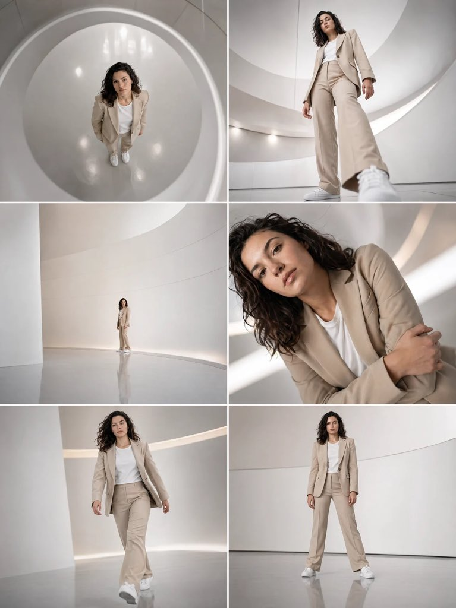

# 🖥️ 网页着陆页

> SaaS 产品、品牌官网、活动落地页的设计。

**所属分类**: [UI 与界面](README.md)  
**Prompt 数量**: 5 条  
**难度等级**: ⭐⭐ 进阶

---

## Prompt 1: SaaS 产品首页深色主题

> AI/科技类 SaaS 产品着陆页，深色背景 + 渐变高光

**Prompt:**

```text
A modern dark-themed SaaS landing page hero section for an AI productivity tool, full browser window mockup at 1440px width, deep dark background (#0D0D12) with subtle radial gradient glow in purple-blue, top navigation bar with logo on left and menu items (Features/Pricing/Docs/Blog) + "Get Started" CTA button on right, hero section: large bold headline "Build faster with AI" in white, subheading paragraph in gray, two CTA buttons (primary gradient purple, secondary outline), right side showing a floating 3D product screenshot with glowing border and soft shadow, animated particle dots in background, trusted-by logo strip below (Google/Meta/Stripe style grayscale logos), clean modern typography (Inter/Satoshi font), above-the-fold conversion-focused layout
```

**示例效果：**



**参数说明：**

| 参数 | 推荐值 | 说明 |
|------|--------|------|
| 尺寸 | 1536×1024 | 桌面端横屏比例 |
| 风格 | UI Design | 界面设计 |
| 模型 | GPT-Image-2 | 推荐 |

**变体建议：**

- 浅色版本配合彩色插画风格
- 增加视频播放按钮和产品 Demo 预览
- 使用 3D 抽象几何体代替产品截图

**标签**: `#web-landing` `#saas` `#dark-theme` `#hero-section`

---

## Prompt 2: 创意作品集网站

> 设计师/摄影师个人作品集，极简留白 + 大图展示

**Prompt:**

```text
A minimalist designer portfolio website landing page, full browser mockup at 1440px, ultra-clean white background with maximum whitespace, top-left logo (designer initials in serif font), minimal navigation on top-right (Work/About/Contact) in thin sans-serif, hero area: oversized bold serif headline "Creative Director & Visual Designer" spanning full width, below a curated grid of 4 portfolio pieces (2x2 layout) with hover state shown on one item (slight zoom + project title overlay), each project thumbnail showing different work (branding/web/print/motion), subtle horizontal line separators, monochrome color scheme with single accent color (warm terracotta or sage green), elegant sophisticated typography hierarchy, inspired by award-winning Awwwards sites
```

**示例效果：**


**参数说明：**

| 参数 | 推荐值 | 说明 |
|------|--------|------|
| 尺寸 | 1536×1024 | 桌面端横屏比例 |
| 风格 | UI Design | 界面设计 |
| 模型 | GPT-Image-2 | 推荐 |

**变体建议：**

- 暗色背景版本（黑底白字极简风）
- 单列全屏滚动式（每个项目占满一屏）
- 增加光标跟随效果和微交互暗示

**标签**: `#web-landing` `#portfolio` `#minimal` `#typography`

---

## Prompt 3: 实体产品发布页

> Apple 风格产品展示页，大图沉浸 + 规格参数陈列

**Prompt:**

```text
A premium product launch landing page in Apple style, full browser window at 1440px, showcasing a pair of wireless headphones, pure black background creating cinematic depth, hero: product floating in center with dramatic studio lighting and subtle reflection below, large sans-serif product name in white above, one-line tagline below ("Immersive sound. Reimagined."), scroll-down indicator arrow, second section visible: split layout with product detail shot on left (close-up of ear cup texture) and key specs on right (bullet points with icons: 40hr battery, spatial audio, adaptive ANC), minimal navigation bar with frosted glass effect, premium luxury e-commerce aesthetic, photorealistic product rendering, high contrast dramatic presentation
```

**示例效果：**


**参数说明：**

| 参数 | 推荐值 | 说明 |
|------|--------|------|
| 尺寸 | 1536×1024 | 桌面端横屏比例 |
| 风格 | UI Design | 界面设计 |
| 模型 | GPT-Image-2 | 推荐 |

**变体建议：**

- 白色背景版本（干净产品摄影风）
- 智能手表/手机等不同产品品类
- 添加颜色选择器和 360° 旋转交互暗示

**标签**: `#web-landing` `#product-page` `#premium` `#apple-style`

---

## Prompt 4: 数字营销代理机构官网

> 创意代理商/工作室官网，大胆配色 + 动态排版

**Prompt:**

```text
A bold creative digital agency website landing page, full browser mockup at 1440px, energetic design with oversized typography as the main visual element, headline "We Create Digital Experiences" in extra-bold condensed font with mixed sizes and colors (key word "Digital" in vibrant electric yellow highlight on dark charcoal background), asymmetric layout with overlapping elements, floating project thumbnails at angles breaking the grid, custom cursor implied, horizontal scrolling section preview for case studies, team photo strip in black and white, stats counter section (150+ Projects / 12 Awards / 8 Years), brutalist-meets-modern design aesthetic, grain texture overlay, unconventional navigation (hamburger menu or side-mounted), CTAs reading "Let's Talk" in pill-shaped buttons, Awwwards SOTD quality
```

**示例效果：**


**参数说明：**

| 参数 | 推荐值 | 说明 |
|------|--------|------|
| 尺寸 | 1536×1024 | 桌面端横屏比例 |
| 风格 | UI Design | 界面设计 |
| 模型 | GPT-Image-2 | 推荐 |

**变体建议：**

- 全屏视频背景版本
- 单色极简版（纯黑白 + 一种强调色）
- 3D WebGL 风格（含三维模型展示）

**标签**: `#web-landing` `#agency` `#bold-typography` `#brutalist`

---

## Prompt 5: 移动端响应式着陆页

> 同一着陆页的多设备响应式展示（桌面+平板+手机）

**Prompt:**

```text
A responsive landing page design shown across three devices simultaneously, centered composition on neutral light gray background, desktop (MacBook Pro mockup) in the center-back showing full 1440px layout, iPad mockup on the right-front showing tablet adaptation, iPhone mockup on the left-front showing mobile version, the landing page design: a health & wellness subscription service with soft gradient background (mint green to light blue), friendly rounded UI elements, illustration of person doing yoga, pricing cards section visible, all three screens showing the same brand/page adapted responsively to each breakpoint, consistent color scheme and typography across devices, clean device mockups with realistic shadows, showcasing responsive design system, suitable for design portfolio case study presentation
```

**示例效果：**


**参数说明：**

| 参数 | 推荐值 | 说明 |
|------|--------|------|
| 尺寸 | 1536×1024 | 横屏展示多设备 |
| 风格 | UI Design | 界面设计 |
| 模型 | GPT-Image-2 | 推荐 |

**变体建议：**

- 仅展示移动端三屏（注册流程）
- 深色主题的多设备展示
- 展示不同页面（首页 + 定价页 + 关于页）

**标签**: `#web-landing` `#responsive` `#multi-device` `#mockup`

---

## 🔗 相关推荐

- [App 界面](app-screen.md) - 移动端设计
- [数据仪表盘](dashboard.md) - 数据面板
- [组件库展示](component-library.md) - 设计系统
- [线框图](wireframe.md) - 低保真原型
- [图标设计](icon-set.md) - 图标系统
