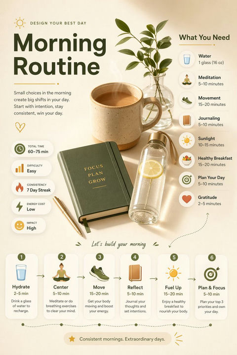

# 📈 数据可视化

> 将数据转化为精美图表的 Prompt，适用于报告和分享。

**所属分类**: [信息图表](README.md)  
**Prompt 数量**: 5 条  
**难度等级**: ⭐⭐ 进阶

---

## Prompt 1: 多维度仪表盘

> 将多种图表组合为一张综合数据仪表盘

**Prompt:**

```text
A comprehensive data dashboard infographic combining multiple chart types in one cohesive layout: a large donut chart showing market share proportions in the center, a line graph tracking monthly growth trends at the top, horizontal bar charts comparing regional performance on the left, and KPI cards with big numbers on the right. Modern flat design with a navy blue and electric teal color palette, clean sans-serif typography (Montserrat style), subtle grid background, white card sections with soft drop shadows, data labels clearly readable at small sizes, professional business presentation quality, 16:9 landscape orientation
```

**示例效果：**



**参数说明：**

| 参数 | 推荐值 | 说明 |
|------|--------|------|
| 尺寸 | 1536×1024 | 横版宽幅适合仪表盘布局 |
| 风格 | Flat Design / Dashboard | 商务仪表盘风格 |
| 模型 | GPT-Image-2 | 推荐 |

**变体建议：**

- 替换为深色背景（dark mode dashboard）打造科技感
- 增加实时数据指示器（live indicator dots）模拟动态效果
- 调整为 SaaS 产品后台数据面板风格

**标签**: `#infographic` `#data-visualization` `#dashboard` `#flat-design`

---

## Prompt 2: 数据故事长图

> 用纵向长图讲述一个完整的数据故事

**Prompt:**

```text
A vertical scrolling data storytelling infographic, narrative-driven layout telling the story of "Global Coffee Consumption in 2024". Starts with a bold headline and hero statistic at the top, flows through sections: world map heat chart showing consumption by country, animated-style area chart showing growth over decades, icon array (pictogram) comparing per-capita consumption, and ends with a key takeaway callout box. Warm earthy color palette (coffee browns, cream, burnt orange accents), hand-drawn style illustrations mixed with clean data charts, section dividers using coffee bean motifs, readable hierarchy with clear H1/H2/body text sizes, Pinterest-friendly tall vertical format
```

**示例效果：**


**参数说明：**

| 参数 | 推荐值 | 说明 |
|------|--------|------|
| 尺寸 | 768×1536 | 竖版长图适合社交分享 |
| 风格 | Editorial / Storytelling | 叙事性信息图 |
| 模型 | GPT-Image-2 | 推荐 |

**变体建议：**

- 改为科技类主题（如全球互联网用户增长）
- 使用极简黑白配色 + 单色强调
- 添加时间轴元素串联各数据段落

**标签**: `#infographic` `#data-visualization` `#storytelling` `#vertical`

---

## Prompt 3: 3D 等距图表

> 用 3D 等距风格呈现数据，增加视觉冲击力

**Prompt:**

```text
A 3D isometric data visualization infographic with playful dimensional charts: isometric bar chart with colorful blocks rising from a grid floor, 3D pie chart segments floating and separated with shadows, small isometric characters interacting with the data (climbing bars, pointing at charts), vibrant gradient color scheme (purple to pink to orange), clean white background with subtle isometric grid, bold rounded typography for labels, data callout bubbles with percentage values, fun yet professional tone suitable for startup pitch deck or tech blog, square format composition
```

**示例效果：**


**参数说明：**

| 参数 | 推荐值 | 说明 |
|------|--------|------|
| 尺寸 | 1024×1024 | 方形适合等距视角构图 |
| 风格 | Isometric 3D / Playful | 等距插画风格 |
| 模型 | GPT-Image-2 | 推荐 |

**变体建议：**

- 去掉人物角色，保持纯图表等距风格
- 改用低饱和度莫兰迪配色打造高级感
- 增加动画暗示元素（运动线条、弹跳效果）

**标签**: `#infographic` `#data-visualization` `#isometric` `#3d`

---

## Prompt 4: 极简数据卡片

> 单一数据点的极简展示，适合社交媒体快速传播

**Prompt:**

```text
A minimalist single-stat data card infographic, ultra-clean design showcasing one powerful statistic: "73% of consumers prefer sustainable brands". Massive bold number "73%" as the hero element taking up 40% of the canvas, thin circular progress ring around the number, brief context sentence below in light gray, subtle supporting mini chart (sparkline) showing trend, ample white space with geometric accent shapes (circles, lines) in muted tones, brand color accent (single bold coral or teal), modern Swiss typography style, Instagram-post square format, high contrast and immediately readable at thumbnail size
```

**示例效果：**


**参数说明：**

| 参数 | 推荐值 | 说明 |
|------|--------|------|
| 尺寸 | 1024×1024 | 方形适合社交媒体发布 |
| 风格 | Minimalist / Swiss Design | 极简瑞士设计风格 |
| 模型 | GPT-Image-2 | 推荐 |

**变体建议：**

- 制作系列卡片（每张一个关键数据点）保持统一风格
- 改为深色背景 + 霓虹色数字打造科技感
- 添加品牌 logo 水印用于企业社交账号

**标签**: `#infographic` `#data-visualization` `#minimalist` `#social-media`

---

## Prompt 5: 地理数据地图

> 基于地图的数据分布可视化

**Prompt:**

```text
A geographic data map infographic showing regional data distribution across a world map or country map. Choropleth-style shading with gradient intensity (light to dark blue) indicating data density per region, circular bubble overlays sized proportionally to data values for major cities/regions, clean legend panel in the corner explaining color scale and bubble sizes, top 5 ranking list on the side with flag icons, title bar with key insight headline, subtle topographic texture on the map surface, professional corporate color palette (slate blue, charcoal, gold accents), data source and methodology note at bottom, suitable for market research report or investment presentation, landscape 16:9 format
```

**示例效果：**


**参数说明：**

| 参数 | 推荐值 | 说明 |
|------|--------|------|
| 尺寸 | 1536×1024 | 横版宽幅适合地图展示 |
| 风格 | Corporate / Cartographic | 商务地图可视化 |
| 模型 | GPT-Image-2 | 推荐 |

**变体建议：**

- 聚焦单一国家/地区做省份级热力图
- 使用深色背景 + 发光数据点营造科幻感
- 添加连线表示区域间流动关系（贸易、迁移）

**标签**: `#infographic` `#data-visualization` `#map` `#geographic`

---

## 🔗 相关推荐

- [统计图表](statistical.md) - 单一图表的精美呈现
- [流程说明图](process-flow.md) - 数据驱动的流程展示
- [对比图](comparison.md) - 数据对比可视化
- [时间线](timeline-info.md) - 时间维度的数据展示
