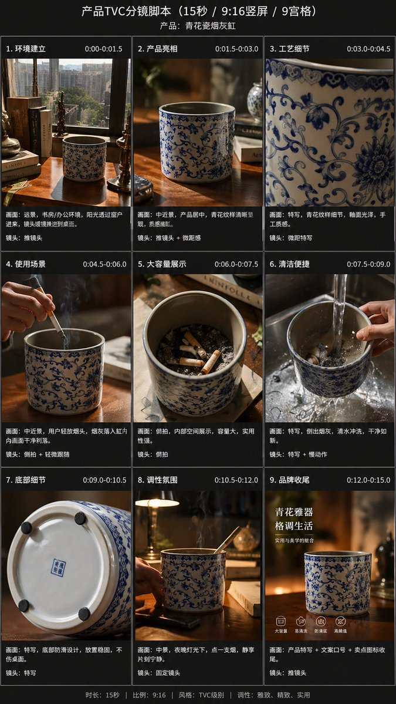

# 🎥 故事板 / 分镜

> 影视、广告、动画等内容的前期分镜设计。

**所属分类**: [漫画与分镜](README.md)  
**Prompt 数量**: 5 条  
**难度等级**: ⭐⭐⭐ 高级

---

## Prompt 1: 电影分镜——追车戏

> 好莱坞动作片风格的追车场景分镜

**Prompt:**

```text
A professional film storyboard sequence for a car chase scene, 6 frames in a 3x2 grid layout, each frame in 2.39:1 cinematic widescreen ratio. Frame 1: Wide establishing shot of city highway, two cars visible with distance between them, camera angle - helicopter/drone overhead; Frame 2: Close-up of protagonist's determined face through windshield, slight dutch angle; Frame 3: Low angle tracking shot from road level as pursuing car swerves between traffic; Frame 4: Interior shot - hand shifting gears with speedometer visible; Frame 5: Side-on medium shot of both cars neck-and-neck with sparks from scraping a guardrail; Frame 6: Wide shot of cars approaching a tunnel entrance with dramatic perspective. Rough pencil sketch style with gray wash shading, camera movement arrows annotated (PAN RIGHT, TRACK FORWARD, CUT TO), frame numbers clearly labeled, action notes below each frame, professional production storyboard quality
```

**示例效果：**



**参数说明：**

| 参数 | 推荐值 | 说明 |
|------|--------|------|
| 尺寸 | 1536×1024 | 宽幅分镜板 |
| 风格 | Pencil Sketch / Storyboard | 铅笔素描 |
| 模型 | GPT-Image-2 | 推荐 |

**变体建议：**

- 改为摩托车追逐穿越小巷
- 换成科幻飞船在小行星带中追逐
- 加入慢动作特写帧（子弹时间效果分解）

**标签**: `#comic` `#storyboard` `#film` `#action` `#chase`

---

## Prompt 2: 动画分镜——变身场景

> 日本魔法少女变身动画序列分镜

**Prompt:**

```text
An animation storyboard for a magical girl transformation sequence, 8 frames in a 4x2 grid, anime production style. Frame 1: character in school uniform, magical item begins to glow (close-up of brooch); Frame 2: burst of light emanating from center, figure silhouette visible; Frame 3: hair flowing upward and changing color, ribbons of light swirling (medium shot); Frame 4: close-up of eyes opening with new eye color and sparkle effects; Frame 5: costume materializing in segments from top to bottom (full body); Frame 6: boots/shoes forming with a stomp pose, magical circle beneath feet; Frame 7: final pose with staff/weapon appearing in hand, cape/ribbons settling; Frame 8: complete transformation with magical sigil background, confident smile. Clean line art suitable for animation keyframes, timing notes (1s, 0.5s, 2s) below each frame, motion arcs drawn with red pencil, key animation quality with clear silhouettes, notes on particle effects and light direction
```

**示例效果：**


**参数说明：**

| 参数 | 推荐值 | 说明 |
|------|--------|------|
| 尺寸 | 1536×1024 | 宽幅分镜板 |
| 风格 | Animation Storyboard | 动画分镜 |
| 模型 | GPT-Image-2 | 推荐 |

**变体建议：**

- 改为机甲合体/变形的分镜序列
- 换成超级赛亚人式能量觉醒
- 设计一段武术招式的连续动作分解

**标签**: `#comic` `#storyboard` `#animation` `#transformation` `#anime`

---

## Prompt 3: 广告分镜——产品广告30秒

> 商业产品广告的视觉脚本分镜

**Prompt:**

```text
A 30-second commercial storyboard for a premium coffee brand, 6 frames in 3x2 grid, each frame in 16:9 TV broadcast ratio. Frame 1 (0:00-0:05): Sunrise over misty coffee plantation mountains, aerial drone shot slowly descending, warm golden light; Frame 2 (0:05-0:10): Close-up of hands picking ripe red coffee cherries, shallow depth of field, natural colors; Frame 3 (0:10-0:15): Artisan roasting process, beans tumbling in slow motion with aromatic steam rising, copper-toned lighting; Frame 4 (0:15-0:20): Pour-over brewing in a modern minimalist kitchen, morning light streaming through window, coffee flowing in detailed slow-mo; Frame 5 (0:20-0:25): A person taking the first sip with eyes closed, genuine satisfaction expression, lifestyle photography aesthetic; Frame 6 (0:25-0:30): Product pack shot centered with brand logo, tagline text area, beans artfully scattered, clean studio background. Polished marker render storyboard style with color (Copic marker aesthetic), timecodes and scene descriptions below each frame, VO/SFX notes, camera movement indicators, professional agency presentation quality
```

**示例效果：**


**参数说明：**

| 参数 | 推荐值 | 说明 |
|------|--------|------|
| 尺寸 | 1536×1024 | 16:9 广告比例 |
| 风格 | Color Marker Render | 彩色马克笔渲染 |
| 模型 | GPT-Image-2 | 推荐 |

**变体建议：**

- 改为汽车广告（山路驾驶→城市到达）
- 换成手机新品发布广告
- 设计公益广告（环保/教育主题）

**标签**: `#comic` `#storyboard` `#commercial` `#advertising` `#product`

---

## Prompt 4: 游戏过场动画分镜

> RPG 游戏过场 CG 动画的电影化分镜

**Prompt:**

```text
A cinematic game cutscene storyboard for a fantasy RPG boss encounter, 6 frames in 3x2 grid with 16:9 ratio. Frame 1: Wide shot of the party entering a massive underground cavern, torch light revealing scale, camera slowly tilting up; Frame 2: Reverse shot - POV of party looking up at a colossal dragon sleeping on a mountain of gold, eye beginning to open (extreme wide); Frame 3: Close-up of dragon's eye snapping fully open, reflections of the adventurers visible in the golden iris, camera pushes in; Frame 4: Low angle as dragon rises, wings unfurling and knocking pillars, debris falling (dynamic action with screen shake notation); Frame 5: Over-the-shoulder from dragon's perspective looking down at the tiny party drawing weapons, fire building in throat; Frame 6: Split-second freeze frame as dragon breathes fire and lead character raises magical shield, impact moment before gameplay begins. Dark dramatic values with selective color lighting (torch warm vs. dragon fire orange vs. magic blue), detailed pencil with digital tone overlay, cinematic camera language annotations (DOLLY IN, TILT UP, SHAKE), transition notes (CUT, DISSOLVE, SLOW-MO TO GAMEPLAY)
```

**示例效果：**


**参数说明：**

| 参数 | 推荐值 | 说明 |
|------|--------|------|
| 尺寸 | 1536×1024 | 16:9 宽屏 |
| 风格 | Cinematic Storyboard | 电影化分镜 |
| 模型 | GPT-Image-2 | 推荐 |

**变体建议：**

- 改为科幻FPS游戏的任务简报过场
- 换成格斗游戏的角色开场动画
- 设计开放世界游戏的过渡引导镜头

**标签**: `#comic` `#storyboard` `#game` `#cutscene` `#fantasy` `#cinematic`

---

## Prompt 5: 音乐MV分镜脚本

> 音乐录影带的视觉叙事分镜

**Prompt:**

```text
A music video storyboard for an emotional ballad, 8 frames in 4x2 grid layout, each frame 16:9. The narrative follows parallel timelines of a relationship. Frame 1: Present - singer alone in an empty apartment, sitting on the floor by a window, blue/cold tones, static camera; Frame 2: Past (warm filter) - same room but full of life, couple cooking together, warm golden tones; Frame 3: Present - singer walking through city streets at night, neon reflections on wet pavement, slow dolly; Frame 4: Past - couple running through the same streets laughing in summer daylight; Frame 5: Present - close-up of singer's face with a single tear, rack focus to rain on window behind; Frame 6: Past - intimate close-up moment, foreheads touching, soft focus everything else; Frame 7: Present - singer at a crossroads/bridge looking at the horizon, wide shot emphasizing solitude; Frame 8: Resolution - singer walks forward into morning light, symbolizing moving on, crane shot rising up and away. Strong color contrast between timelines (cool blue present vs. warm amber past), beat/lyric sync notes below frames (VERSE 1, CHORUS, BRIDGE), transition style notes (MATCH CUT, DISSOLVE, JUMP CUT), emotional arc clearly communicated through composition and lighting
```

**示例效果：**


**参数说明：**

| 参数 | 推荐值 | 说明 |
|------|--------|------|
| 尺寸 | 1536×1024 | 16:9 MV比例 |
| 风格 | Artistic Storyboard | 艺术化分镜 |
| 模型 | GPT-Image-2 | 推荐 |

**变体建议：**

- 改为快节奏舞曲MV（舞蹈编排+快速剪辑）
- 换成动画MV风格（实拍转动画的转场设计）
- 设计概念性/抽象表达的实验性MV

**标签**: `#comic` `#storyboard` `#music-video` `#MV` `#narrative` `#emotional`

---

## 🔗 相关推荐

- [四格漫画](four-panel.md) - 简短叙事结构
- [日式漫画](manga-style.md) - 漫画分镜参考
- [美式漫画](western-comic.md) - 动态页面布局
- [条漫/Webtoon](webtoon.md) - 竖屏叙事节奏
- [主题演讲视觉](../10-presentation/keynote-visual.md) - 视觉叙事技巧
