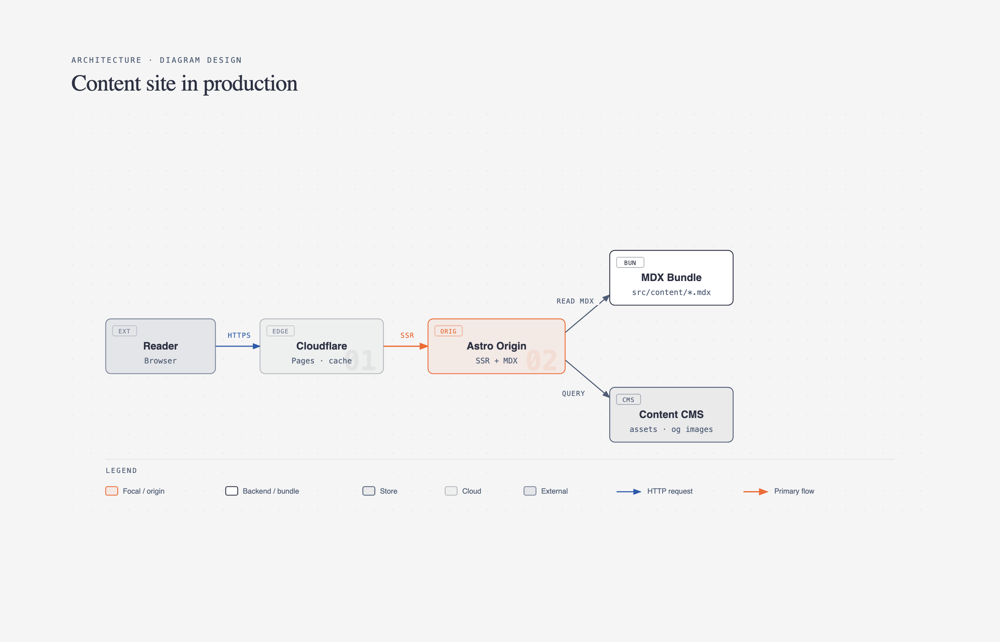

# 🏗️ 系统架构图

> 软件系统、微服务、分布式架构的可视化 Prompt，适用于技术文档、方案评审、博客配图。

**所属分类**: [技术图表](README.md)  
**Prompt 数量**: 5 条  
**难度等级**: ⭐⭐⭐ 高级

---

## Prompt 1: 微服务架构图（暗色主题）

> 典型微服务架构的暗色技术风格图

**Prompt:**

```text
A professional microservices architecture diagram on a dark navy background, 
showing 6-8 service boxes (User Service, Order Service, Payment Service, 
Notification Service, API Gateway, Auth Service) as rounded rectangles 
with subtle gradient fills in [teal/purple/blue] tones, 
connected by labeled arrows showing REST/gRPC communication paths, 
API Gateway at the top receiving client requests, 
Message Queue (Kafka/RabbitMQ) connecting async services, 
shared databases shown as cylinder icons at bottom, 
service mesh or load balancer layer indicated, 
clean modern tech diagram style with slight glow effects on connections, 
consistent icon set for different service types, 
legend in corner explaining arrow types and colors
```

**示例效果：**



**参数说明：**

| 参数 | 推荐值 | 说明 |
|------|--------|------|
| 尺寸 | 1536×1024 | 横版宽幅 |
| 风格 | Technical Diagram | 暗色技术风 |
| 模型 | GPT-Image-2 | 推荐 |

**变体建议：**

- 改为 `light theme with white background` 适配白色文档
- 添加 `isometric 3D perspective` 获得立体视角
- 指定 `AWS/Azure/GCP icons` 使用特定云厂商图标

**标签**: `#architecture` `#microservices` `#dark-theme` `#technical`

---

## Prompt 2: 云原生架构图

> Kubernetes + 云服务的云原生架构

**Prompt:**

```text
A cloud-native architecture diagram showing a Kubernetes-based deployment, 
clean modern design on light gray background, 
outer box labeled 'Cloud Provider (AWS/GCP/Azure)', 
VPC network boundary containing: 
  - Kubernetes cluster with 3 node groups
  - Each node showing pod deployments as small colored rectangles
  - Ingress controller at top receiving external traffic
  - Service mesh (Istio) connecting pods
External services around the cluster: 
  - Managed database (RDS/CloudSQL)
  - Object storage (S3/GCS)
  - CDN layer at the very top
  - CI/CD pipeline on the side
Color coding: blue for compute, green for storage, orange for networking, 
professional cloud architecture diagram style, 
clear labels and annotations for each component
```

**参数说明：**

| 参数 | 推荐值 | 说明 |
|------|--------|------|
| 尺寸 | 1536×1024 | 横版 |
| 风格 | Technical Diagram | 云架构图 |
| 模型 | GPT-Image-2 | 推荐 |

**标签**: `#architecture` `#cloud-native` `#kubernetes` `#devops`

---

## Prompt 3: 事件驱动架构

**Prompt:**

```text
An event-driven architecture (EDA) diagram, 
dark background with neon accent colors, 
event producers on the left (Web App, Mobile App, IoT Devices) as source icons, 
central event bus/stream (Apache Kafka) shown as a flowing pipeline with glowing particles, 
event consumers on the right (Analytics, Notifications, Order Processing, ML Pipeline), 
events flowing left-to-right as small glowing dots along connection lines, 
event schema registry shown as a catalog icon, 
dead letter queue shown with warning styling, 
clear separation of domains with dashed boundaries, 
modern tech blog illustration quality
```

**参数说明：**

| 参数 | 推荐值 | 说明 |
|------|--------|------|
| 尺寸 | 1536×1024 | 横版 |
| 风格 | Technical Diagram | 暗色现代风 |
| 模型 | GPT-Image-2 | 推荐 |

**标签**: `#architecture` `#event-driven` `#kafka` `#dark-theme`

---

## Prompt 4: 前后端分离架构

**Prompt:**

```text
A frontend-backend separation architecture diagram, 
clean whiteboard style with hand-drawn aesthetic, 
three clear tiers arranged top to bottom:
  - Client Tier: Browser (React/Vue), Mobile (iOS/Android), Desktop
  - Server Tier: API Gateway → Backend Services (Node.js/Spring), Auth, Cache (Redis)
  - Data Tier: Primary DB, Read Replicas, Search Engine (ES), File Storage
CDN and Load Balancer between client and server tiers,
arrows showing request/response flow with HTTP/WebSocket labels,
each component as a simple box with recognizable tech logo/icon,
color coding by tier: blue (frontend), green (backend), orange (data),
educational diagram suitable for junior developer documentation
```

**参数说明：**

| 参数 | 推荐值 | 说明 |
|------|--------|------|
| 尺寸 | 1024×1024 | 方形 |
| 风格 | Whiteboard | 白板教学风 |
| 模型 | GPT-Image-2 | 推荐 |

**标签**: `#architecture` `#full-stack` `#whiteboard` `#educational`

---

## Prompt 5: AI/ML 系统架构

**Prompt:**

```text
A machine learning system architecture diagram, 
modern gradient style on dark background, 
data pipeline flowing left to right:
  Data Sources → Data Lake → Feature Engineering → Model Training → Model Registry → Serving,
feedback loop from Serving back to Monitoring → Retraining,
infrastructure layer at bottom: GPU Clusters, Object Storage, Container Platform,
MLOps tools labeled: MLflow, Kubeflow, Airflow,
A/B testing and canary deployment shown in serving layer,
metrics dashboard icon showing model performance,
modern AI company tech blog style (similar to Uber/Netflix engineering blogs),
purple and blue gradient color scheme with white text
```

**参数说明：**

| 参数 | 推荐值 | 说明 |
|------|--------|------|
| 尺寸 | 1536×1024 | 横版 |
| 风格 | Technical Diagram | 现代 AI 风 |
| 模型 | GPT-Image-2 | 推荐 |

**标签**: `#architecture` `#ml-system` `#mlops` `#ai`

---

## 🔗 相关推荐

- [云基础设施图](cloud-infra.md) - AWS/Azure/GCP 特定图
- [数据流图](data-flow.md) - 数据管道详图
- [网络拓扑图](network.md) - 网络层架构
- [分层堆叠图](layer-stack.md) - 技术栈层次展示
