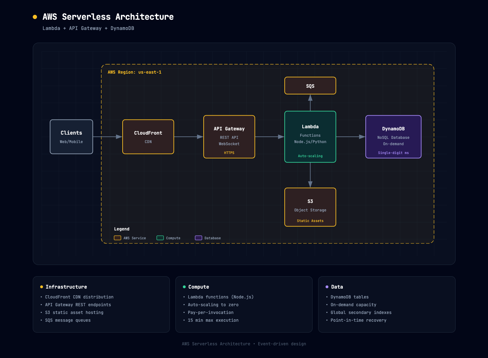

# ☁️ 云基础设施图

> AWS/Azure/GCP 架构、容器编排、Serverless 架构图。

**所属分类**: [技术图表](README.md)  
**Prompt 数量**: 5 条  
**难度等级**: ⭐⭐⭐ 高级

---

## Prompt 1: AWS Serverless 架构

> 基于 AWS Lambda 的无服务器事件驱动架构

**Prompt:**

```text
A cloud infrastructure diagram showing AWS serverless architecture for a web application. Components arranged in logical flow: Users → CloudFront CDN → API Gateway (REST and WebSocket) → Lambda functions (grouped by domain: auth, orders, notifications) → DynamoDB tables and S3 buckets. Supporting services: Cognito for auth, SQS queues for async processing, SNS for fan-out notifications, EventBridge for event routing, Step Functions for orchestration workflows. Show VPC-connected Lambda for RDS Aurora Serverless access. CloudWatch for monitoring with alarms triggering Lambda auto-remediation. Include cost annotations ($0.20/1M requests). All components use official AWS architecture icons (orange themed). Isometric 3D perspective with light gray background, AWS orange accent color, services as 3D icon blocks connected by directional arrows, clean modern AWS documentation style, slight depth and shadow for visual hierarchy.
```

**示例效果：**



**参数说明：**

| 参数 | 推荐值 | 说明 |
|------|--------|------|
| 尺寸 | 1536×1024 | 横版宽幅 |
| 风格 | Isometric 3D | 等轴测立体 |
| 模型 | GPT-Image-2 | 推荐 |

**变体建议：**

- 添加 CI/CD 管道（CodePipeline → CodeBuild → SAM deploy）
- 增加多区域容灾配置（Route53 故障转移）
- 加入成本优化注释（预留并发、Provisioned Capacity）

**标签**: `#technical-diagram` `#cloud-infra` `#aws` `#serverless`

---

## Prompt 2: Azure 混合云架构

> Azure 混合云的本地与云端协同部署

**Prompt:**

```text
A cloud infrastructure diagram showing Azure hybrid cloud architecture. Left side: On-premises data center with Active Directory, legacy SQL Server databases, file servers inside a corporate network boundary. Right side: Azure cloud with Hub-and-Spoke VNet topology. Hub VNet contains: Azure Firewall, VPN Gateway (connected to on-prem via ExpressRoute), Azure Bastion. Spoke VNets: Production (AKS cluster, Azure SQL, Redis Cache), Development (App Service, Cosmos DB), Data (Synapse Analytics, Data Lake Storage). Shared services: Azure AD (synced with on-prem AD via Azure AD Connect), Key Vault, Container Registry, Azure Monitor. Show ExpressRoute as thick dedicated connection and backup Site-to-Site VPN as dashed line. Azure Arc managing on-prem servers. Corporate professional style with Microsoft blue color scheme on white background, official Azure architecture icons, clean geometric layout, enterprise architecture documentation quality, clear labeling with service tiers annotated.
```

**示例效果：**


**参数说明：**

| 参数 | 推荐值 | 说明 |
|------|--------|------|
| 尺寸 | 1536×1024 | 横版宽幅 |
| 风格 | Corporate Professional | 企业正式风 |
| 模型 | GPT-Image-2 | 推荐 |

**变体建议：**

- 添加 Azure Stack HCI 本地云扩展
- 增加灾难恢复 (Azure Site Recovery) 配置
- 加入合规和治理层（Azure Policy, Blueprints, Management Groups）

**标签**: `#technical-diagram` `#cloud-infra` `#azure` `#hybrid-cloud`

---

## Prompt 3: GCP 数据平台

> Google Cloud 的现代数据分析平台架构

**Prompt:**

```text
A cloud infrastructure diagram showing GCP modern data platform architecture. Data flow left to right: Data Sources (Cloud SQL, Pub/Sub streaming, Cloud Storage files, external APIs via Dataflow) → Ingestion Layer (Pub/Sub for streaming, Cloud Data Fusion for batch ETL, Transfer Service for SaaS data) → Processing (Dataflow for stream/batch, Dataproc Spark for heavy processing) → Storage (BigQuery data warehouse as central hub, Cloud Storage data lake in raw/curated/serving zones) → Serving (Looker for BI dashboards, Vertex AI for ML model serving, BigQuery ML for in-DB analytics) → Consumers (analysts, data scientists, applications). Data governance overlay: Data Catalog for discovery, DLP API for sensitive data, IAM for access control. Show data lineage arrows tracking transformations. Modern gradient style with Google Cloud blue primary color, smooth gradient background from dark navy to deep blue, services as frosted glass cards with GCP icons, flowing data streams as animated gradient lines, clean contemporary tech aesthetic.
```

**示例效果：**


**参数说明：**

| 参数 | 推荐值 | 说明 |
|------|--------|------|
| 尺寸 | 1536×1024 | 横版宽幅 |
| 风格 | Modern Gradient | 渐变现代风 |
| 模型 | GPT-Image-2 | 推荐 |

**变体建议：**

- 添加实时 ML 特征工程管道（Feature Store → Vertex AI）
- 增加数据质量监控和数据合约层
- 加入成本控制（BigQuery Slots, 按需 vs 固定费率）

**标签**: `#technical-diagram` `#cloud-infra` `#gcp` `#data-platform`

---

## Prompt 4: 多云 Kubernetes 架构

> 跨多个云提供商的 Kubernetes 联邦管理

**Prompt:**

```text
A cloud infrastructure diagram showing multi-cloud Kubernetes architecture. Central management plane: Rancher/Anthos multi-cluster management console. Three cloud clusters: AWS EKS (us-east-1, 3 node groups: system, application, GPU), Azure AKS (westeurope, with virtual nodes for burst), GCP GKE (asia-east1, autopilot mode). Each cluster shows internal components: Ingress controller, Service mesh (Istio), Cert-manager, External-DNS, ArgoCD agent. Cross-cluster services: Global load balancer (DNS-based), shared container registry (Harbor), centralized logging (Elasticsearch), unified monitoring (Prometheus federation → Thanos → Grafana). GitOps workflow: Git repo → ArgoCD hub → syncs to all clusters. Show failover arrows between clusters for disaster recovery. Dark theme with neon accents, black background, each cloud provider in their brand color glow (AWS=orange, Azure=blue, GCP=red/green/blue/yellow), Kubernetes components in purple, connecting mesh lines in cyan, futuristic multi-cloud command center aesthetic.
```

**示例效果：**


**参数说明：**

| 参数 | 推荐值 | 说明 |
|------|--------|------|
| 尺寸 | 1536×1024 | 横版宽幅 |
| 风格 | Dark Neon Tech | 暗色科技感 |
| 模型 | GPT-Image-2 | 推荐 |

**变体建议：**

- 添加服务网格跨集群通信（mTLS, 流量策略）
- 增加多云成本对比和工作负载调度策略
- 加入合规要求驱动的数据驻留（Data Residency）限制

**标签**: `#technical-diagram` `#cloud-infra` `#multi-cloud` `#kubernetes`

---

## Prompt 5: 灾难恢复架构

> 多区域主备切换的灾难恢复部署方案

**Prompt:**

```text
A cloud infrastructure diagram showing disaster recovery architecture with RPO < 1min and RTO < 15min. Two regions shown side by side: Primary Region (us-east-1) as active, DR Region (us-west-2) as standby. Primary: Multi-AZ deployment with ALB, Auto Scaling Group (3 instances), RDS Multi-AZ (synchronous replication), ElastiCache cluster, S3 with cross-region replication enabled. DR Region: Pilot light configuration with scaled-down infrastructure: ALB (pre-configured), ASG (min=0, ready to scale), RDS read replica (async replication from primary), S3 replica bucket, pre-warmed Lambda for failover automation. Global services connecting both: Route53 health checks with failover routing, Global Accelerator, CloudFront with origin groups. Failover automation: CloudWatch alarm → Lambda → update DNS + scale up DR ASG + promote RDS replica. Show RPO/RTO metrics. Blueprint engineering style with dark navy background, primary region in solid green borders, DR region in dashed amber borders, replication arrows in cyan, failover path in red, precise technical annotations, disaster recovery documentation quality.
```

**示例效果：**


**参数说明：**

| 参数 | 推荐值 | 说明 |
|------|--------|------|
| 尺寸 | 1536×1024 | 横版宽幅 |
| 风格 | Blueprint Engineering | 工程蓝图风 |
| 模型 | GPT-Image-2 | 推荐 |

**变体建议：**

- 对比四种 DR 策略（Backup/Restore, Pilot Light, Warm Standby, Multi-Site Active-Active）
- 添加数据库故障转移的详细步骤流程
- 加入 DR 演练日程和自动化测试流程

**标签**: `#technical-diagram` `#cloud-infra` `#disaster-recovery` `#high-availability`

---

## 🔗 相关推荐

- [网络拓扑图](network.md) - 网络架构设计
- [系统架构图](architecture.md) - 整体架构设计
- [数据流图](data-flow.md) - 数据管道可视化
- [分层堆叠图](layer-stack.md) - 技术栈分层
- [时间线图](timeline-diagram.md) - 迁移计划时间线
