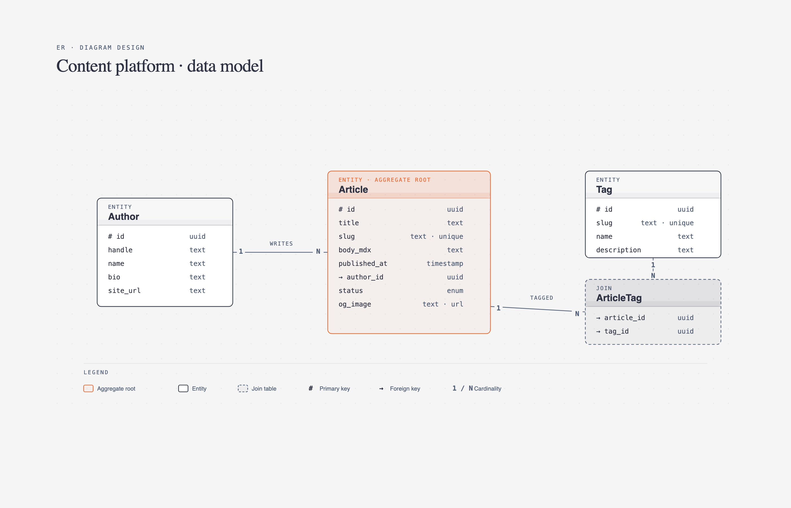

# 🗃️ ER 实体关系图

> 数据库设计、数据模型、表关系的可视化。

**所属分类**: [技术图表](README.md)  
**Prompt 数量**: 5 条  
**难度等级**: ⭐⭐⭐ 高级

---

## Prompt 1: 电商数据库模型

> 完整的电商平台核心数据模型设计

**Prompt:**

```text
An Entity-Relationship diagram for an e-commerce platform database. Show 8 entities: Users (id, email, password_hash, created_at), Products (id, name, price, sku, category_id), Categories (id, name, parent_id self-reference), Orders (id, user_id, total_amount, status, created_at), Order_Items (id, order_id, product_id, quantity, unit_price), Payments (id, order_id, method, amount, status), Addresses (id, user_id, street, city, zip, is_default), and Reviews (id, user_id, product_id, rating, comment). Entities as rectangles with table name header bar and typed field list. Primary keys marked with golden key icon, foreign keys with arrow icon. Relationships using crow's foot notation: Users 1:N Orders, Orders 1:N Order_Items, Products 1:N Order_Items, Users 1:N Addresses, Users 1:N Reviews. Clean professional style on white background, entity headers color-coded by domain: user entities in blue, product entities in green, transaction entities in orange, content entities in purple.
```

**示例效果：**



**参数说明：**

| 参数 | 推荐值 | 说明 |
|------|--------|------|
| 尺寸 | 1536×1024 | 横版宽幅适合多实体 |
| 风格 | Corporate Professional | 企业正式风 |
| 模型 | GPT-Image-2 | 推荐 |

**变体建议：**

- 添加库存管理和仓储相关实体（Warehouses, Inventory, Shipments）
- 增加优惠券和促销活动表（Coupons, Promotions, Discount_Rules）
- 加入多商户模式的 Merchants 和 Stores 实体

**标签**: `#technical-diagram` `#er-diagram` `#e-commerce` `#database`

---

## Prompt 2: 社交网络数据模型

> 社交平台的用户关系与内容模型设计

**Prompt:**

```text
An Entity-Relationship diagram for a social network platform database. Entities: Users (id, username, avatar_url, bio, verified), Posts (id, author_id, content, media_urls, visibility, created_at), Comments (id, post_id, user_id, parent_id for threading, body), Likes (user_id, target_id, target_type polymorphic), Follows (follower_id, following_id, status: pending/accepted), Messages (id, sender_id, conversation_id, content, read_at), Conversations (id, type: direct/group), Hashtags (id, name, post_count), and Post_Hashtags (post_id, hashtag_id). Show self-referencing relationship on Users through Follows, M:N relationship between Posts and Hashtags via junction table. Highlight the polymorphic Likes pattern with a note. Dark theme with neon accents, deep charcoal background, entities as dark cards with glowing colored borders, neon pink and cyan relationship lines, modern social media aesthetic with rounded corners and gradient headers.
```

**示例效果：**


**参数说明：**

| 参数 | 推荐值 | 说明 |
|------|--------|------|
| 尺寸 | 1536×1024 | 横版宽幅 |
| 风格 | Dark Neon Tech | 暗色科技感 |
| 模型 | GPT-Image-2 | 推荐 |

**变体建议：**

- 添加 Stories 和 Reels 短视频相关实体
- 增加内容审核和举报系统表（Reports, Moderation_Actions）
- 加入推荐系统所需的用户兴趣和行为追踪表

**标签**: `#technical-diagram` `#er-diagram` `#social-network` `#database`

---

## Prompt 3: CMS 内容管理系统

> 灵活的内容管理系统数据模型

**Prompt:**

```text
An Entity-Relationship diagram for a headless CMS database. Entities: Content_Types (id, name, slug, schema_json), Entries (id, content_type_id, title, slug, status, published_at, author_id), Fields (id, content_type_id, name, field_type, validation_rules, position), Field_Values (id, entry_id, field_id, value_text, value_number, value_json), Assets (id, filename, mime_type, url, size, dimensions), Users (id, name, email, role), Taxonomies (id, name, type: category/tag), Terms (id, taxonomy_id, name, slug, parent_id), and Entry_Terms (entry_id, term_id). Show the flexible EAV (Entity-Attribute-Value) pattern with Content_Types defining Fields and Entries having Field_Values. Hierarchical Terms with self-reference. Clean whiteboard style with slightly off-white background, neat hand-drawn entity boxes with colored headers, pencil-style relationship lines, sticky note annotations explaining design patterns, friendly documentation aesthetic.
```

**示例效果：**


**参数说明：**

| 参数 | 推荐值 | 说明 |
|------|--------|------|
| 尺寸 | 1536×1024 | 横版宽幅 |
| 风格 | Whiteboard Sketch | 白板手绘风 |
| 模型 | GPT-Image-2 | 推荐 |

**变体建议：**

- 添加版本历史和内容草稿系统（Revisions, Drafts）
- 增加多语言/国际化支持（Locales, Translations）
- 加入工作流审批状态和定时发布队列

**标签**: `#technical-diagram` `#er-diagram` `#cms` `#content`

---

## Prompt 4: SaaS 多租户架构

> SaaS 平台的多租户数据隔离模型

**Prompt:**

```text
An Entity-Relationship diagram for a SaaS multi-tenant platform. Entities: Tenants (id, name, domain, plan_id, created_at), Users (id, tenant_id, email, role, last_login), Roles (id, tenant_id, name, permissions_json), Teams (id, tenant_id, name), Team_Members (team_id, user_id, role), Subscriptions (id, tenant_id, plan_id, status, current_period_end), Plans (id, name, price, features_json, limits_json), Usage_Records (id, tenant_id, metric, quantity, recorded_at), Audit_Logs (id, tenant_id, user_id, action, resource, timestamp), and API_Keys (id, tenant_id, key_hash, scopes, expires_at). Every entity includes tenant_id showing row-level security. Highlight the tenant isolation boundary with a dashed enclosure. Show Plans as a shared (non-tenanted) entity outside the boundary. Modern gradient style with soft blue-to-teal gradient background, frosted glass entity cards, clean sans-serif typography, subtle depth with drop shadows, SaaS dashboard aesthetic.
```

**示例效果：**


**参数说明：**

| 参数 | 推荐值 | 说明 |
|------|--------|------|
| 尺寸 | 1536×1024 | 横版宽幅 |
| 风格 | Modern Gradient | 渐变现代风 |
| 模型 | GPT-Image-2 | 推荐 |

**变体建议：**

- 对比 Schema-per-tenant vs Row-level-security 两种隔离方案
- 添加计费和用量限制相关实体（Invoices, Usage_Limits）
- 增加 SSO 和 SCIM 用户同步集成实体

**标签**: `#technical-diagram` `#er-diagram` `#saas` `#multi-tenant`

---

## Prompt 5: 医疗健康系统

> 符合 HIPAA 的医疗数据模型设计

**Prompt:**

```text
An Entity-Relationship diagram for a healthcare management system (HIPAA-compliant). Entities: Patients (id, mrn, name_encrypted, dob, blood_type, emergency_contact), Providers (id, npi, name, specialty, department_id), Departments (id, name, location), Appointments (id, patient_id, provider_id, datetime, status, type), Medical_Records (id, patient_id, provider_id, record_type, content_encrypted, created_at), Prescriptions (id, record_id, medication_id, dosage, frequency, start_date, end_date), Medications (id, name, drug_class, interactions_json), Lab_Results (id, patient_id, test_type, values_json, reference_range, status), Insurance_Claims (id, patient_id, appointment_id, amount, status, submitted_at), and Access_Logs (id, user_id, patient_id, action, timestamp, ip_address). Mark encrypted fields with a lock icon. Show Access_Logs as an audit trail connected to all sensitive entities. Blueprint engineering style with dark navy background, precise white lines, medical cross symbols, security indicators (lock icons) on PHI fields, technical medical documentation aesthetic with strict geometric layout.
```

**示例效果：**


**参数说明：**

| 参数 | 推荐值 | 说明 |
|------|--------|------|
| 尺寸 | 1536×1024 | 横版宽幅 |
| 风格 | Blueprint Engineering | 工程蓝图风 |
| 模型 | GPT-Image-2 | 推荐 |

**变体建议：**

- 添加 FHIR 资源模型映射注释
- 增加数据脱敏和匿名化处理标记
- 加入远程医疗（Telemedicine Sessions）和可穿戴设备数据表

**标签**: `#technical-diagram` `#er-diagram` `#healthcare` `#hipaa`

---

## 🔗 相关推荐

- [系统架构图](architecture.md) - 整体架构设计
- [数据流图](data-flow.md) - 数据管道可视化
- [UML 类图](uml.md) - 面向对象模型
- [分层堆叠图](layer-stack.md) - 技术栈分层
- [云基础设施图](cloud-infra.md) - 云架构设计
