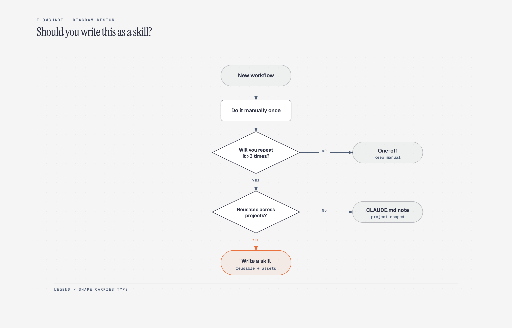

# 🔀 流程图

> 业务流程、决策树、审批流等通用流程图的 Prompt。

**所属分类**: [技术图表](README.md)  
**Prompt 数量**: 5 条  
**难度等级**: ⭐⭐ 进阶

---

## Prompt 1: 用户注册流程图

**Prompt:**

```text
A clean professional flowchart showing user registration and authentication flow, 
start node (rounded rectangle) → input email → validate format (diamond decision) → 
check existing account → send verification email → user clicks link → 
create account → redirect to dashboard, 
error paths branching to error handling nodes, 
standard flowchart shapes: rectangles for process, diamonds for decisions, 
parallelograms for input/output, 
clean modern design with [blue/teal] process nodes and [orange/red] error paths, 
light background with subtle grid, 
arrows clearly showing flow direction with labels on decision branches (Yes/No), 
professional technical documentation quality
```

**示例效果：**



**参数说明：**

| 参数 | 推荐值 | 说明 |
|------|--------|------|
| 尺寸 | 1024×1024 | 方形或竖版 |
| 风格 | Technical Diagram | 标准流程图 |
| 模型 | GPT-Image-2 | 推荐 |

**标签**: `#flowchart` `#process` `#auth` `#technical`

---

## Prompt 2: 电商订单流程

**Prompt:**

```text
A business process flowchart for e-commerce order lifecycle, 
horizontal flow from left to right, 
stages: Order Placed → Payment Processing → Inventory Check → 
Warehouse Picking → Packaging → Shipping → Delivery → Confirmation, 
decision diamonds for: payment success?, in stock?, delivery successful?,
exception paths: refund flow, backorder notification, return process,
each stage has a small icon above the process box,
color progression from light to dark showing order maturity,
status indicators (pending/processing/completed) for each stage,
suitable for operations documentation or customer-facing FAQ
```

**参数说明：**

| 参数 | 推荐值 | 说明 |
|------|--------|------|
| 尺寸 | 1536×768 | 宽幅横版 |
| 风格 | Technical Diagram | 业务流程 |
| 模型 | GPT-Image-2 | 推荐 |

**标签**: `#flowchart` `#ecommerce` `#business-process`

---

## Prompt 3: 决策树

**Prompt:**

```text
A decision tree flowchart for [choosing a tech stack/debugging/hiring process], 
tree structure branching top to bottom, 
root question at top in prominent styling, 
each level represents a decision point (diamond shape), 
Yes/No or multiple choice branches, 
leaf nodes show final recommendations or outcomes in colored boxes, 
maximum 4 levels deep for readability, 
clear visual hierarchy with decreasing node size per level, 
connecting lines with clear labels, 
useful reference guide style suitable for blog or documentation
```

**参数说明：**

| 参数 | 推荐值 | 说明 |
|------|--------|------|
| 尺寸 | 1024×1024 | 方形 |
| 风格 | Technical Diagram | 决策树 |
| 模型 | GPT-Image-2 | 推荐 |

**标签**: `#flowchart` `#decision-tree` `#guide`

---

## Prompt 4: CI/CD 管道流程

**Prompt:**

```text
A CI/CD pipeline flowchart showing software delivery process, 
horizontal pipeline with distinct stages as connected blocks:
Code Commit → Build → Unit Tests → Integration Tests → 
Security Scan → Staging Deploy → E2E Tests → Production Deploy,
gates between stages shown as vertical barriers with approval icons,
parallel paths where applicable (e.g., tests running simultaneously),
tool icons for each stage: GitHub, Jenkins/Actions, Docker, Kubernetes,
green pipeline path for success, red branch for failure/rollback,
modern DevOps documentation style with dark or gradient background
```

**参数说明：**

| 参数 | 推荐值 | 说明 |
|------|--------|------|
| 尺寸 | 1536×768 | 宽幅 |
| 风格 | Technical Diagram | DevOps 风 |
| 模型 | GPT-Image-2 | 推荐 |

**标签**: `#flowchart` `#cicd` `#devops` `#pipeline`

---

## Prompt 5: 审批工作流

**Prompt:**

```text
A business approval workflow flowchart, 
showing document/request approval process with multiple reviewers:
Submit Request → Manager Review → [Approve/Reject/Request Changes] →
if amount > threshold → Director Review → Finance Review → Final Approval,
role-based swimlanes or color coding for different approvers,
status indicators: pending (yellow), approved (green), rejected (red),
email notification triggers at each state transition,
escalation path for overdue approvals,
clean corporate style suitable for internal process documentation,
light professional color scheme with clear typography
```

**参数说明：**

| 参数 | 推荐值 | 说明 |
|------|--------|------|
| 尺寸 | 1024×1024 | 方形 |
| 风格 | Technical Diagram | 企业流程 |
| 模型 | GPT-Image-2 | 推荐 |

**标签**: `#flowchart` `#approval` `#workflow` `#business`

---

## 🔗 相关推荐

- [泳道图](swimlane.md) - 跨部门流程
- [状态机图](state-machine.md) - 状态转换
- [时序图](sequence.md) - 交互时序
- [流程说明图](../08-infographic/process-flow.md) - 非技术流程图
