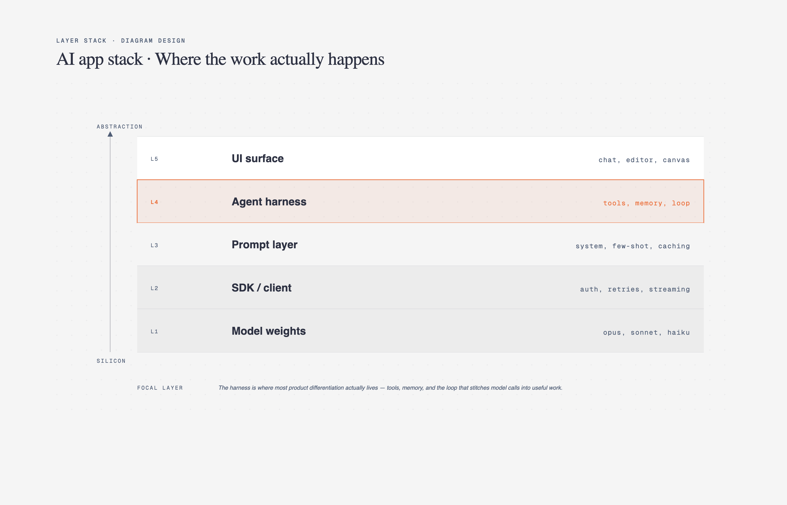

# 📚 分层堆叠图

> 技术栈、OSI 模型、协议栈等分层结构图。

**所属分类**: [技术图表](README.md)  
**Prompt 数量**: 5 条  
**难度等级**: ⭐⭐⭐ 高级

---

## Prompt 1: OSI 七层模型

> 网络通信的 OSI 参考模型分层详解

**Prompt:**

```text
A layered stack diagram showing the OSI 7-layer network model with real-world protocol mapping. Seven horizontal layers stacked vertically, each as a distinct colored band. From bottom to top: Layer 1 Physical (gray) - Ethernet cables, fiber optics, WiFi radio, voltage levels, bit transmission. Layer 2 Data Link (brown) - MAC addresses, switches, ARP, Ethernet frames, PPP. Layer 3 Network (green) - IP addresses, routers, ICMP, routing protocols (BGP, OSPF). Layer 4 Transport (blue) - TCP/UDP, ports, segments, flow control, congestion control. Layer 5 Session (yellow) - session establishment, RPC, authentication tokens. Layer 6 Presentation (orange) - SSL/TLS encryption, data serialization (JSON, protobuf), compression. Layer 7 Application (red) - HTTP/HTTPS, DNS, SMTP, FTP, gRPC, WebSocket. Left side: PDU names (bits, frames, packets, segments, data). Right side: typical devices at each layer. Encapsulation arrows showing headers added at each layer. Data flow direction arrows (send down, receive up). Isometric 3D perspective with layers as floating translucent platforms stacked with gaps between them, slight perspective showing depth, colorful layers with glass-like material, protocols as small labeled boxes on each platform, educational 3D visualization, textbook quality with modern aesthetic.
```

**示例效果：**



**参数说明：**

| 参数 | 推荐值 | 说明 |
|------|--------|------|
| 尺寸 | 1024×1536 | 竖版适合堆叠 |
| 风格 | Isometric 3D | 等轴测立体 |
| 模型 | GPT-Image-2 | 推荐 |

**变体建议：**

- 对比 OSI 7层和 TCP/IP 4层模型（并排显示层级对应）
- 添加数据包在各层的封装/解封装动画式展示
- 展示特定场景（HTTPS 请求）穿越各层的具体操作

**标签**: `#technical-diagram` `#layer-stack` `#osi` `#networking`

---

## Prompt 2: 现代 Web 技术栈

> 全栈 Web 应用的技术选型分层架构

**Prompt:**

```text
A layered technology stack diagram for a modern full-stack web application. Layers from bottom to top: Infrastructure Layer (bottom) - AWS/GCP cloud, Kubernetes orchestration, Terraform IaC, Docker containers. Data Layer - PostgreSQL primary DB, Redis cache, Elasticsearch search, S3 object storage. Backend Layer - Node.js/Go runtime, Express/Fastify framework, GraphQL API (Apollo), background job workers (Bull). API Layer - REST endpoints, GraphQL schema, WebSocket connections, rate limiting, authentication middleware. Frontend Layer - React 19 with Next.js 15, TypeScript, TailwindCSS, Zustand state management. Delivery Layer (top) - Vercel/CloudFlare edge network, CDN, browser caching. Cross-cutting concerns shown as vertical bars on the right side: Observability (Datadog), Security (OAuth2, WAF), CI/CD (GitHub Actions). Each layer shows 3-4 technology logos/names. Connections between layers labeled with protocols (TCP, HTTP/2, WebSocket). Modern gradient style with deep blue-to-indigo gradient background, layers as horizontal frosted glass panels with subtle spacing, technology names in clean white text, brand colors for each tech logo area, contemporary developer blog hero image quality.
```

**示例效果：**


**参数说明：**

| 参数 | 推荐值 | 说明 |
|------|--------|------|
| 尺寸 | 1024×1536 | 竖版适合堆叠 |
| 风格 | Modern Gradient | 渐变现代风 |
| 模型 | GPT-Image-2 | 推荐 |

**变体建议：**

- 改为 Python/Django 技术栈（ML-heavy 应用）
- 对比两个技术栈方案的选型差异
- 添加各层的替代方案选项（A or B 标注）

**标签**: `#technical-diagram` `#layer-stack` `#tech-stack` `#fullstack`

---

## Prompt 3: 通信协议层

> 物联网设备通信的协议栈分层

**Prompt:**

```text
A layered protocol stack diagram for IoT (Internet of Things) device communication. Showing three protocol stacks side by side for comparison: Stack A (MQTT-based): Application (MQTT v5, payload JSON/CBOR) → Session (MQTT keep-alive, QoS levels 0/1/2) → Security (TLS 1.3, X.509 certificates) → Transport (TCP) → Network (IPv4/IPv6) → Link (WiFi 802.11, Ethernet) → Physical (2.4GHz radio, cable). Stack B (CoAP-based): Application (CoAP, observe pattern) → Security (DTLS) → Transport (UDP) → Network (6LoWPAN, IPv6) → Link (IEEE 802.15.4, Thread) → Physical (868MHz/2.4GHz). Stack C (LoRaWAN): Application (payload encoding) → MAC (LoRaWAN Classes A/B/C) → Physical (LoRa spread spectrum, 868/915MHz). Comparison annotations: bandwidth, range, power consumption, latency for each stack. Use case labels: MQTT=home automation, CoAP=industrial sensors, LoRaWAN=agriculture/cities. Blueprint engineering style with dark navy background, three parallel stacks as white-outlined columns, protocol names in cyan monospace font, comparison arrows between equivalent layers, technical engineering reference diagram quality, IEEE paper illustration aesthetic.
```

**示例效果：**


**参数说明：**

| 参数 | 推荐值 | 说明 |
|------|--------|------|
| 尺寸 | 1536×1024 | 横版适合并排对比 |
| 风格 | Blueprint Engineering | 工程蓝图风 |
| 模型 | GPT-Image-2 | 推荐 |

**变体建议：**

- 改为 5G 网络协议栈（用户面 vs 控制面）
- 添加 WebRTC 通信的协议分层详解
- 展示 HTTP/3 (QUIC) 与 HTTP/2 的协议栈差异

**标签**: `#technical-diagram` `#layer-stack` `#protocol` `#iot`

---

## Prompt 4: 云平台服务分层

> 云计算服务模型的 IaaS/PaaS/SaaS 分层

**Prompt:**

```text
A layered stack diagram showing cloud computing service models (IaaS, PaaS, SaaS) with responsibility boundaries. Four columns side by side: On-Premises (all layers self-managed), IaaS (infrastructure managed by provider), PaaS (platform managed by provider), SaaS (everything managed by provider). Common layer stack (bottom to top): Networking, Storage, Servers, Virtualization, Operating System, Middleware, Runtime, Data, Applications. Color coding: blue layers = customer manages, orange layers = provider manages. The boundary line shifts upward from left (on-prem, all blue) to right (SaaS, all orange). Examples for each model: IaaS = AWS EC2, Azure VMs, GCP Compute. PaaS = Heroku, AWS Elastic Beanstalk, Google App Engine, Vercel. SaaS = Salesforce, Google Workspace, Slack. Additional emerging models shown: FaaS/Serverless (even less customer responsibility), CaaS (Container as a Service). Clean whiteboard style with light background, layers as clean rectangular bands, clear color distinction between customer-managed and provider-managed, simple and educational, suitable for cloud computing introduction or certification study material.
```

**示例效果：**


**参数说明：**

| 参数 | 推荐值 | 说明 |
|------|--------|------|
| 尺寸 | 1536×1024 | 横版适合并排对比 |
| 风格 | Whiteboard Sketch | 白板教学风 |
| 模型 | GPT-Image-2 | 推荐 |

**变体建议：**

- 添加共享责任模型的安全视角（谁负责什么安全层）
- 增加各模型的成本结构对比（资本支出 vs 运营支出）
- 展示混合模型和多云场景下的责任划分

**标签**: `#technical-diagram` `#layer-stack` `#cloud` `#service-model`

---

## Prompt 5: 安全防御纵深

> 企业安全的纵深防御多层架构

**Prompt:**

```text
A layered security stack diagram showing Defense-in-Depth architecture for enterprise security. Layers from outermost to innermost (like an onion or castle walls): Layer 1 (outermost) - Perimeter Security: DDoS protection (CloudFlare), WAF rules, DNS security (DNSSEC), edge firewall, IP reputation filtering. Layer 2 - Network Security: network segmentation (VLANs), IDS/IPS (Snort/Suricata), VPN for remote access, network access control (802.1X), east-west traffic inspection. Layer 3 - Endpoint Security: EDR (CrowdStrike), device management (MDM), disk encryption (BitLocker), host firewall, anti-malware. Layer 4 - Application Security: SAST/DAST scanning, runtime protection (RASP), input validation, secure coding practices, dependency scanning (Snyk). Layer 5 - Data Security (innermost): encryption at rest (AES-256), encryption in transit (TLS 1.3), tokenization, DLP policies, access controls (RBAC), key management (HSM). Cross-cutting: Identity and Access Management (IAM), Security Monitoring (SIEM), Incident Response. Concentric rings or nested rectangles showing each layer wrapping the next. Dark theme with neon accents, layers as concentric glowing shields on black background, outermost layer largest and dimmest, innermost brightest and most protected, red attack arrows being blocked at various layers, cybersecurity operations center war room aesthetic, dramatic and impactful.
```

**示例效果：**


**参数说明：**

| 参数 | 推荐值 | 说明 |
|------|--------|------|
| 尺寸 | 1536×1024 | 横版宽幅 |
| 风格 | Dark Neon Tech | 暗色科技感 |
| 模型 | GPT-Image-2 | 推荐 |

**变体建议：**

- 添加攻击者视角（各层对应的攻击手法和 MITRE ATT&CK 映射）
- 增加 Zero Trust 模型如何改变传统纵深防御
- 展示云原生安全（CNAPP）的层次对应关系

**标签**: `#technical-diagram` `#layer-stack` `#security` `#defense-in-depth`

---

## 🔗 相关推荐

- [网络拓扑图](network.md) - 网络架构设计
- [云基础设施图](cloud-infra.md) - 云平台部署
- [系统架构图](architecture.md) - 整体架构设计
- [金字塔图](pyramid.md) - 层级优先关系
- [UML 类图](uml.md) - 组件依赖关系
