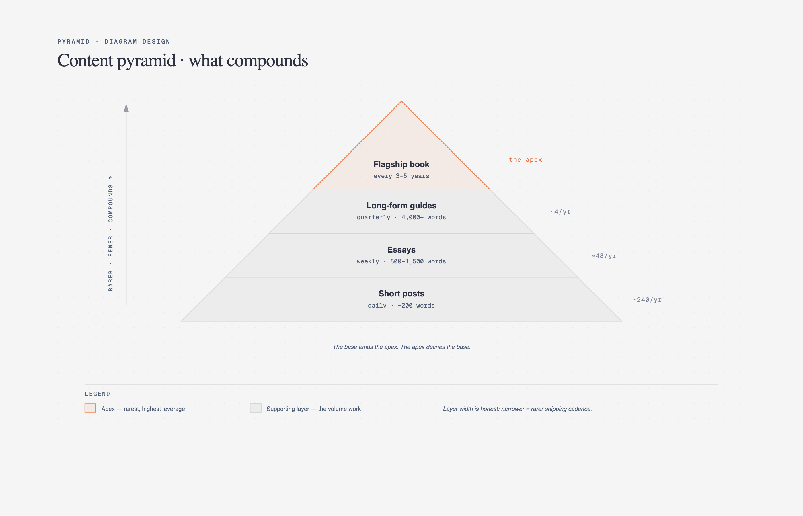

# 🔺 金字塔 / 漏斗图

> 层级关系、优先级、转化漏斗等金字塔结构图。

**所属分类**: [技术图表](README.md)  
**Prompt 数量**: 5 条  
**难度等级**: ⭐⭐⭐ 高级

---

## Prompt 1: 测试金字塔

> 软件测试策略的自动化测试金字塔

**Prompt:**

```text
A testing pyramid diagram showing software test automation strategy. Triangular shape divided into 4 horizontal layers from bottom to top: Unit Tests (widest base, ~70% of tests) - fast, isolated, thousands of tests, mock dependencies, run in milliseconds. Integration Tests (second layer, ~20%) - test component interactions, database queries, API contracts, moderate speed. End-to-End Tests (third layer, ~8%) - full user flow simulation, browser automation, slower execution. Manual/Exploratory Tests (narrow top, ~2%) - edge cases, UX validation, creative testing. Left side annotations: Speed (fast at bottom, slow at top), Cost (cheap at bottom, expensive at top). Right side: Confidence in isolation (high at bottom) vs Confidence in integration (high at top). Anti-pattern callout: inverted pyramid (ice cream cone) shown as small warning diagram in corner. Numbers showing typical execution times: unit 5ms, integration 500ms, E2E 30s, manual 30min. Modern gradient style with deep blue-to-purple gradient background, pyramid layers as smooth gradient bands (green base through yellow to red top), frosted glass annotations, clean contemporary tech blog illustration, educational yet visually striking.
```

**示例效果：**



**参数说明：**

| 参数 | 推荐值 | 说明 |
|------|--------|------|
| 尺寸 | 1536×1024 | 横版宽幅 |
| 风格 | Modern Gradient | 渐变现代风 |
| 模型 | GPT-Image-2 | 推荐 |

**变体建议：**

- 改为"测试奖杯"（Testing Trophy）模型突出集成测试
- 添加 Contract Testing 层在集成和 E2E 之间
- 展示前端特定的组件测试金字塔（Visual/Component/Unit）

**标签**: `#technical-diagram` `#pyramid` `#testing` `#qa`

---

## Prompt 2: 营销转化漏斗

> SaaS 产品的用户获取到付费转化漏斗

**Prompt:**

```text
A conversion funnel diagram for a SaaS product showing user journey from awareness to advocacy. Inverted trapezoid shape narrowing from top to bottom with 6 stages: Awareness (widest, 100K visitors/month) - blog posts, SEO, social media, ads. Interest (60K) - landing page visits, content downloads, webinar signups. Consideration (15K) - free trial signups, demo requests, pricing page views. Conversion (3K) - paid subscriptions, plan selection. Retention (2.4K) - active usage, feature adoption, support satisfaction. Advocacy (500) - referrals, reviews, case studies, community contributions. Conversion rates between each stage shown as percentages on the right (60%, 25%, 20%, 80%, 21%). Drop-off reasons annotated on left side at each stage. Key metrics per stage on the right. Funnel color gradient from light blue (cold/awareness) to deep red (hot/conversion) to gold (advocacy). Corporate professional style with white background, clean funnel shape with subtle 3D depth, data-driven annotations, executive dashboard quality, suitable for board presentation or investor deck.
```

**示例效果：**


**参数说明：**

| 参数 | 推荐值 | 说明 |
|------|--------|------|
| 尺寸 | 1536×1024 | 横版宽幅 |
| 风格 | Corporate Professional | 企业正式风 |
| 模型 | GPT-Image-2 | 推荐 |

**变体建议：**

- 添加 PLG (Product-Led Growth) 的免费增值漏斗变体
- 增加各阶段的营销自动化触发动作
- 对比 B2B vs B2C 漏斗的结构差异

**标签**: `#technical-diagram` `#pyramid` `#funnel` `#marketing`

---

## Prompt 3: 马斯洛需求层次（开发者版）

> 开发者体验的需求层次金字塔

**Prompt:**

```text
A Maslow-style hierarchy pyramid adapted for Developer Experience (DX). Five layers from base to peak: Layer 1 (Physiological/Basic): It works - correct documentation, code compiles, dependencies resolve, API responds correctly, setup takes < 5 minutes. Layer 2 (Safety/Reliability): It's stable - backward compatibility, semantic versioning, no breaking changes without notice, reliable CI/CD, good error messages. Layer 3 (Belonging/Community): I'm not alone - active community, Stack Overflow answers, Discord/Slack channels, conference talks, contributor guides. Layer 4 (Esteem/Productivity): I'm productive - great DX tooling, autocomplete/IntelliSense, debugging tools, performance profiling, comprehensive testing utilities. Layer 5 (Self-actualization/Delight): I love this - elegant API design, delightful developer experience, inspiration to build, contributes to open source, teaches others. Each layer with relevant emoji icons. Satisfaction percentage decreasing upward. Hand-drawn sketch style with graph paper background, pyramid outlined in thick marker, each layer filled with different colored pencil (warm gradient from red base to golden peak), playful annotations and doodles, developer notebook aesthetic with personality.
```

**示例效果：**


**参数说明：**

| 参数 | 推荐值 | 说明 |
|------|--------|------|
| 尺寸 | 1536×1024 | 横版宽幅 |
| 风格 | Hand-drawn Sketch | 手绘草图风 |
| 模型 | GPT-Image-2 | 推荐 |

**变体建议：**

- 改为用户体验 (UX) 需求金字塔（功能 → 可用 → 高效 → 愉悦）
- 适配为 API 设计质量层次模型
- 展示云服务成熟度的层级递进

**标签**: `#technical-diagram` `#pyramid` `#dx` `#developer-experience`

---

## Prompt 4: 优先级金字塔

> 系统可靠性工程的优先级金字塔（SRE）

**Prompt:**

```text
A priority pyramid diagram for Site Reliability Engineering (SRE) showing what to focus on first, inspired by Google's SRE hierarchy of reliability. Five layers from base to top: Layer 1 (Foundation) - Monitoring and Alerting: know when things break, SLIs defined, dashboards operational, on-call rotation established. Layer 2 - Incident Response: runbooks documented, escalation paths clear, communication templates ready, post-mortems process. Layer 3 - Postmortem/Root Cause Analysis: blameless culture, action items tracked, patterns identified, systemic fixes prioritized. Layer 4 - Testing and Release: canary deployments, load testing, chaos engineering, progressive rollouts, feature flags. Layer 5 (Peak) - Capacity Planning and Demand Forecasting: predictive scaling, cost optimization, growth modeling, infrastructure evolution. Side annotation: "You must master each layer before the next provides value." Error budget concept shown alongside. Dark theme with neon accents, pyramid as a glowing wireframe structure on black background, each layer in different neon color (red base → orange → yellow → green → cyan peak), holographic floating labels, futuristic SRE operations center aesthetic.
```

**示例效果：**


**参数说明：**

| 参数 | 推荐值 | 说明 |
|------|--------|------|
| 尺寸 | 1536×1024 | 横版宽幅 |
| 风格 | Dark Neon Tech | 暗色科技感 |
| 模型 | GPT-Image-2 | 推荐 |

**变体建议：**

- 改为安全成熟度金字塔（基础防护 → 检测 → 响应 → 预测）
- 添加每层的典型工具映射（Prometheus, PagerDuty, Gremlin 等）
- 展示团队成熟度与金字塔层级的对应关系

**标签**: `#technical-diagram` `#pyramid` `#sre` `#reliability`

---

## Prompt 5: 技术成熟度模型

> 组织技术能力的成熟度评估阶梯

**Prompt:**

```text
A maturity model pyramid/staircase diagram showing organizational DevOps maturity levels (CMMI-inspired). Five ascending levels displayed as a stepped pyramid or staircase: Level 1 - Initial (Chaotic): manual deployments, no version control discipline, heroic individuals, firefighting culture. Level 2 - Managed (Repeatable): basic CI setup, manual testing, documented processes, some automation, deployment playbooks. Level 3 - Defined (Standardized): full CI/CD pipeline, automated testing, infrastructure as code, monitoring in place, incident response process. Level 4 - Measured (Quantitative): DORA metrics tracked, SLOs defined, data-driven decisions, A/B testing, chaos engineering. Level 5 - Optimizing (Continuous Improvement): self-healing systems, AI-ops, continuous optimization, innovation culture, industry-leading practices. Each level shows: capabilities gained, typical tools, team characteristics, and time to reach from previous level. Assessment indicators showing "You Are Here" marker. Blueprint engineering style with navy background, staircase as architectural cross-section drawing, white technical lines, each level with distinct shade from gray (L1) through cyan to bright white (L5), engineering assessment document quality, precise and authoritative.
```

**示例效果：**


**参数说明：**

| 参数 | 推荐值 | 说明 |
|------|--------|------|
| 尺寸 | 1536×1024 | 横版宽幅 |
| 风格 | Blueprint Engineering | 工程蓝图风 |
| 模型 | GPT-Image-2 | 推荐 |

**变体建议：**

- 改为数据治理成熟度（从无治理到数据民主化）
- 添加各级别的关键绩效指标 (KPI) 基准
- 展示从当前级别到目标级别的路线图

**标签**: `#technical-diagram` `#pyramid` `#maturity` `#assessment`

---

## 🔗 相关推荐

- [象限图](quadrant.md) - 优先级矩阵分析
- [分层堆叠图](layer-stack.md) - 技术栈分层
- [维恩图](venn.md) - 概念交集分析
- [时间线图](timeline-diagram.md) - 演进路线规划
- [树形图](tree-org.md) - 层次结构展示
