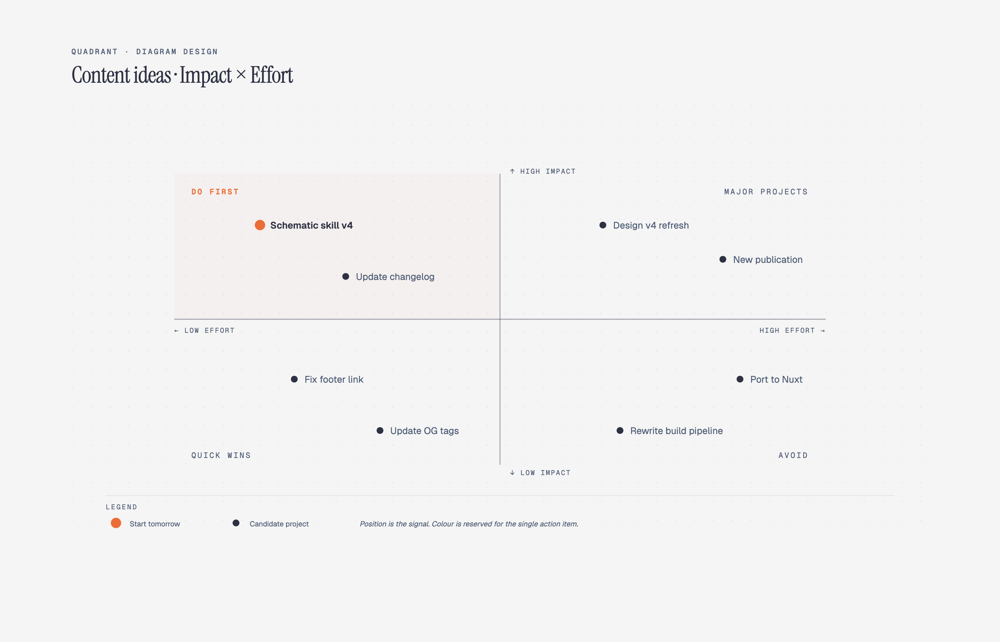

# 📊 象限图 / 矩阵

> 2×2 矩阵、优先级矩阵、BCG 矩阵等四象限分析图。

**所属分类**: [技术图表](README.md)  
**Prompt 数量**: 5 条  
**难度等级**: ⭐⭐⭐ 高级

---

## Prompt 1: 艾森豪威尔矩阵

> 任务优先级的紧急-重要四象限管理

**Prompt:**

```text
A 2x2 quadrant matrix showing the Eisenhower Priority Matrix for engineering team task management. X-axis: Urgency (low to high, left to right). Y-axis: Importance (low to high, bottom to top). Quadrant 1 (top-right, red): DO FIRST - Critical production bug affecting 50% users, security vulnerability patch, client demo preparation for tomorrow. Quadrant 2 (top-left, green): SCHEDULE - Architecture refactoring, technical debt reduction, team skill development, documentation updates, automation improvements. Quadrant 3 (bottom-right, yellow): DELEGATE - Routine deployment requests, meeting scheduling, status report compilation, non-critical bug triage. Quadrant 4 (bottom-left, gray): ELIMINATE - Unnecessary meetings, over-engineering nice-to-haves, premature optimization, excessive email threads. Each item shown as a task card/sticky note positioned within its quadrant. Annotations showing time allocation recommendation (Q1: 20%, Q2: 50%, Q3: 20%, Q4: 10%). Modern gradient style with soft dark background, quadrants as frosted glass panels with distinct color washes, task cards as floating elements with subtle shadows, clean modern productivity app aesthetic, visually calming yet informative.
```

**示例效果：**



**参数说明：**

| 参数 | 推荐值 | 说明 |
|------|--------|------|
| 尺寸 | 1536×1024 | 横版正方形区域 |
| 风格 | Modern Gradient | 渐变现代风 |
| 模型 | GPT-Image-2 | 推荐 |

**变体建议：**

- 将工程任务替换为产品功能优先级排序
- 添加时间投入占比的面积可视化
- 增加每周回顾的动态调整箭头

**标签**: `#technical-diagram` `#quadrant` `#priority` `#productivity`

---

## Prompt 2: BCG 增长-份额矩阵

> 技术产品组合的 BCG 矩阵战略分析

**Prompt:**

```text
A BCG Growth-Share Matrix diagram for a tech company's product portfolio analysis. X-axis: Relative Market Share (high to low, left to right). Y-axis: Market Growth Rate (low to high, bottom to top). Quadrant labels with icons: Stars (top-left, star icon) - high growth, high share: Mobile App Platform (growing 40% YoY, market leader), AI Assistant product. Cash Cows (bottom-left, cow/dollar icon) - low growth, high share: Legacy Enterprise CRM (stable revenue $50M, 35% market share), Email Service. Question Marks (top-right, question mark icon) - high growth, low share: AR/VR collaboration tool (growing market but 5% share), Blockchain analytics. Dogs (bottom-right, warning icon) - low growth, low share: Desktop-only product (declining), On-premise backup tool. Each product plotted as a circle with size proportional to revenue. Arrows showing strategic direction: invest, harvest, divest. Corporate professional style with clean white background, four distinct pastel quadrant colors, products as bubbles with company logo badges, Wall Street analyst report quality, serif fonts for titles, executive presentation polish.
```

**示例效果：**


**参数说明：**

| 参数 | 推荐值 | 说明 |
|------|--------|------|
| 尺寸 | 1536×1024 | 横版宽幅 |
| 风格 | Corporate Professional | 企业正式风 |
| 模型 | GPT-Image-2 | 推荐 |

**变体建议：**

- 添加时间维度（上一年位置用虚线圆表示，显示产品迁移方向）
- 增加投资建议标注（invest heavily, maintain, harvest, divest）
- 对比多个竞争对手的产品组合

**标签**: `#technical-diagram` `#quadrant` `#bcg` `#strategy`

---

## Prompt 3: 风险评估矩阵

> IT 项目风险的概率-影响评估矩阵

**Prompt:**

```text
A risk assessment matrix (5x5) for IT project risk management. X-axis: Impact/Severity (Negligible, Minor, Moderate, Major, Catastrophic). Y-axis: Likelihood/Probability (Rare, Unlikely, Possible, Likely, Almost Certain). Color gradient from green (low-low corner) through yellow, orange to red (high-high corner). Specific risks plotted as numbered circles within cells: R1-Data breach (Unlikely × Catastrophic = High), R2-Key person leaving (Possible × Major = High), R3-Vendor lock-in (Likely × Moderate = Medium), R4-Scope creep (Almost Certain × Minor = Medium), R5-Hardware failure (Rare × Major = Low), R6-Regulatory change (Unlikely × Moderate = Low), R7-DDoS attack (Possible × Major = High). Legend showing risk levels: Low (green, accept), Medium (yellow, monitor), High (orange, mitigate), Critical (red, immediate action). Risk count summary in corner. Dark theme with neon accents, black background, matrix cells as glowing colored tiles increasing in intensity from green to red, risk points as pulsing dots, cybersecurity operations dashboard aesthetic, serious and authoritative.
```

**示例效果：**


**参数说明：**

| 参数 | 推荐值 | 说明 |
|------|--------|------|
| 尺寸 | 1536×1024 | 横版宽幅 |
| 风格 | Dark Neon Tech | 暗色科技感 |
| 模型 | GPT-Image-2 | 推荐 |

**变体建议：**

- 添加风险缓解后的残余风险位置（箭头从原始到缓解后位置）
- 增加风险类别分组（技术风险、人员风险、外部风险）
- 加入风险承受阈值线（可接受线以上需要行动计划）

**标签**: `#technical-diagram` `#quadrant` `#risk` `#assessment`

---

## Prompt 4: 技术雷达

> 团队技术选型的 ThoughtWorks 风格技术雷达

**Prompt:**

```text
A Technology Radar diagram (ThoughtWorks style) showing team's technology assessment. Four concentric rings from center outward: Adopt (use in production), Trial (use in non-critical projects), Assess (explore and research), Hold (do not start new projects with). Four quadrants: Techniques (top-left): Adopt-trunk based development, Trial-feature flags, Assess-AI pair programming, Hold-long-lived branches. Platforms (top-right): Adopt-Kubernetes, Trial-Deno, Assess-WebAssembly edge, Hold-Heroku. Tools (bottom-right): Adopt-GitHub Actions, Trial-Cursor AI, Assess-Temporal, Hold-Jenkins. Languages & Frameworks (bottom-left): Adopt-TypeScript/Next.js, Trial-Rust for CLI tools, Assess-Elixir/Phoenix, Hold-jQuery. Each technology as a numbered dot in its ring/quadrant position. Legend explaining rings and movement arrows (newly added, moved in/out). Clean whiteboard style with light background, radar rings as thin gray circles, quadrant dividers as dashed lines, colored dots by movement status (new=triangle, moved=arrow, unchanged=circle), clear numbered legend, ThoughtWorks radar aesthetic recreated as an image, educational and opinionated.
```

**示例效果：**


**参数说明：**

| 参数 | 推荐值 | 说明 |
|------|--------|------|
| 尺寸 | 1536×1536 | 正方形适合雷达 |
| 风格 | Whiteboard Sketch | 白板教学风 |
| 模型 | GPT-Image-2 | 推荐 |

**变体建议：**

- 添加历史版本对比（上一期 vs 本期的技术移动）
- 增加团队投票/共识程度标注
- 加入学习资源链接和评估依据注释

**标签**: `#technical-diagram` `#quadrant` `#tech-radar` `#evaluation`

---

## Prompt 5: 工作量-价值优先级矩阵

> 功能开发的投入产出比优先级排序

**Prompt:**

```text
A 2x2 priority matrix for feature development prioritization. X-axis: Implementation Effort (Low to High, left to right, measured in engineering weeks). Y-axis: Business Value/Impact (Low to High, bottom to top, measured in revenue potential or user satisfaction). Quadrant 1 (top-left): Quick Wins / Low-hanging Fruit (green, do immediately) - items: dark mode toggle (1 week, high user demand), email notification preferences (3 days, reduces churn), CSV export (1 week, enterprise requirement). Quadrant 2 (top-right): Strategic Initiatives / Big Bets (blue, plan carefully) - items: real-time collaboration (3 months, competitive differentiator), AI-powered search (2 months, 10x improvement), mobile app (4 months, new market). Quadrant 3 (bottom-left): Fill-ins / Nice-to-haves (yellow, do if time permits) - items: emoji reactions (2 days, engagement), custom themes (1 week, delight), keyboard shortcuts (3 days, power users). Quadrant 4 (bottom-right): Money Pit / Avoid (red, reconsider) - items: blockchain integration (6 months, unclear value), complete rewrite (8 months, risky), AR features (4 months, niche). Items as positioned sticky notes/cards with effort and impact scores. Sprint capacity line overlay. Blueprint engineering style with navy background, quadrant grid in precise white lines, feature cards as technical specification blocks, effort estimates in monospace font, impact scores with star ratings, engineering planning session aesthetic, data-driven decision making.
```

**示例效果：**


**参数说明：**

| 参数 | 推荐值 | 说明 |
|------|--------|------|
| 尺寸 | 1536×1024 | 横版宽幅 |
| 风格 | Blueprint Engineering | 工程蓝图风 |
| 模型 | GPT-Image-2 | 推荐 |

**变体建议：**

- 添加 RICE 评分标注（Reach × Impact × Confidence / Effort）
- 增加依赖关系连线（某些功能必须先完成才能做其他的）
- 对比不同利益相关者的优先级差异（工程 vs 产品 vs 销售视角）

**标签**: `#technical-diagram` `#quadrant` `#priority` `#product-management`

---

## 🔗 相关推荐

- [金字塔图](pyramid.md) - 层级优先关系
- [维恩图](venn.md) - 概念交集分析
- [时间线图](timeline-diagram.md) - 路线图规划
- [泳道图](swimlane.md) - 流程协作设计
- [树形图](tree-org.md) - 决策树分析
