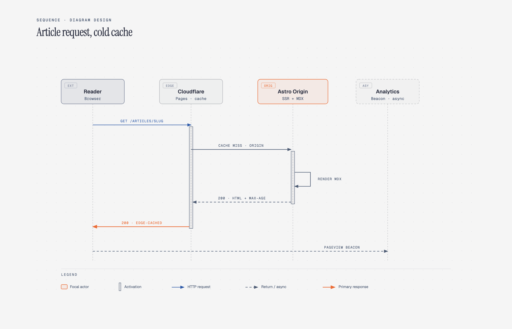

# ⏱️ 时序图

> API 调用链、消息传递、系统交互序列的时序图。

**所属分类**: [技术图表](README.md)  
**Prompt 数量**: 5 条  
**难度等级**: ⭐⭐⭐ 高级

---

## Prompt 1: OAuth 2.0 授权流程

> OAuth 2.0 授权码模式的完整时序交互

**Prompt:**

```text
A UML sequence diagram illustrating OAuth 2.0 Authorization Code Flow, with five vertical lifelines: User Browser, Client App, Authorization Server, Token Endpoint, and Resource Server. Show activation boxes on each lifeline during processing. Solid arrows for synchronous requests labeled with HTTP methods (GET /authorize, POST /token, GET /resource), dashed arrows for responses with status codes. Include redirect steps (302 Found) between browser and auth server, authorization code exchange, access token and refresh token issuance. Add an alt fragment showing token refresh flow when access token expires. Dark theme with neon cyan arrows on charcoal background, participant headers in gradient blue-purple boxes, timestamps on left margin, protocol annotations in monospace font.
```

**示例效果：**



**参数说明：**

| 参数 | 推荐值 | 说明 |
|------|--------|------|
| 尺寸 | 1536×1024 | 横版宽幅适合多参与者 |
| 风格 | Dark Neon Tech | 暗色科技感 |
| 模型 | GPT-Image-2 | 推荐 |

**变体建议：**

- 将 OAuth 2.0 替换为 OIDC (OpenID Connect) 流程，增加 ID Token 和 UserInfo 端点
- 添加 PKCE 扩展流程，展示 code_verifier 和 code_challenge
- 改为 Client Credentials Grant 模式，适用于服务间通信

**标签**: `#technical-diagram` `#sequence` `#oauth` `#authentication`

---

## Prompt 2: 支付 API 交互流程

> 第三方支付系统的完整下单-支付-回调时序

**Prompt:**

```text
A detailed sequence diagram showing payment API integration flow between Mobile App, Merchant Server, Payment Gateway (Stripe/Alipay), Issuing Bank, and Notification Service. Lifelines with colored activation bars. Show the complete flow: create order, generate payment intent, client-side tokenization, charge authorization, 3D Secure challenge (in an opt fragment), capture confirmation, webhook callback to merchant, and push notification to user. Include timeout annotations (30s for bank response), retry logic in a loop fragment for failed webhooks, and error handling in alt fragments (insufficient funds, card declined). Clean whiteboard style with hand-drawn feel, soft shadows, colorful sticky-note headers for each participant, pencil-style arrows with neat handwritten labels.
```

**示例效果：**


**参数说明：**

| 参数 | 推荐值 | 说明 |
|------|--------|------|
| 尺寸 | 1536×1024 | 横版宽幅 |
| 风格 | Whiteboard Sketch | 白板手绘风 |
| 模型 | GPT-Image-2 | 推荐 |

**变体建议：**

- 改为微信支付 JSAPI 流程，包含 prepay_id 生成和前端调起支付
- 添加退款流程分支，展示退款审核和资金原路退回
- 加入对账流程，展示每日批量对账和差异处理

**标签**: `#technical-diagram` `#sequence` `#payment` `#api`

---

## Prompt 3: 微服务通信编排

> 电商下单场景的微服务 Saga 编排模式

**Prompt:**

```text
A sequence diagram depicting microservice orchestration using the Saga pattern for an e-commerce order placement. Participants: API Gateway, Order Service (orchestrator), Inventory Service, Payment Service, Shipping Service, and Notification Service. Show the happy path with sequential service calls: reserve inventory, process payment, schedule shipping, send confirmation. Then show compensating transactions in a break fragment when payment fails: release inventory reservation, cancel order, notify user of failure. Each service call shows request/response with JSON payload snippets. Use numbered steps on the left. Corporate professional style with crisp lines, navy blue and gold color scheme, white background, service icons in participant headers, clear separation between forward and compensation flows with a red dashed divider line.
```

**示例效果：**


**参数说明：**

| 参数 | 推荐值 | 说明 |
|------|--------|------|
| 尺寸 | 1536×1024 | 横版宽幅 |
| 风格 | Corporate Professional | 企业正式风 |
| 模型 | GPT-Image-2 | 推荐 |

**变体建议：**

- 改为 Choreography（编舞）模式，使用事件驱动代替集中编排
- 添加超时和重试机制，展示幂等性处理
- 加入分布式追踪 ID 在消息头中的传递

**标签**: `#technical-diagram` `#sequence` `#microservice` `#saga`

---

## Prompt 4: WebSocket 实时通信

> 即时通讯应用的 WebSocket 连接建立与消息收发

**Prompt:**

```text
A sequence diagram showing WebSocket real-time communication for a chat application. Participants: Client A, Load Balancer, WebSocket Server, Redis Pub/Sub, WebSocket Server 2, Client B. Show the complete lifecycle: HTTP upgrade handshake (101 Switching Protocols), connection established with session ID, heartbeat ping/pong in a loop fragment (every 30s), Client A sends message (JSON frame), server publishes to Redis channel, Server 2 receives subscription message and delivers to Client B, read receipt flows back, and graceful connection close (close frame exchange). Show connection state annotations (CONNECTING, OPEN, CLOSING, CLOSED). Blueprint engineering style with dark navy background, white grid lines, cyan technical annotations, component headers styled as engineering stamps, arrow labels in monospace technical font.
```

**示例效果：**


**参数说明：**

| 参数 | 推荐值 | 说明 |
|------|--------|------|
| 尺寸 | 1536×1024 | 横版宽幅 |
| 风格 | Blueprint Engineering | 工程蓝图风 |
| 模型 | GPT-Image-2 | 推荐 |

**变体建议：**

- 改为 Socket.IO 带房间和命名空间的通信模式
- 添加断线重连机制和消息队列缓存
- 展示消息确认和顺序保证机制（序列号）

**标签**: `#technical-diagram` `#sequence` `#websocket` `#realtime`

---

## Prompt 5: GraphQL Subscription 订阅流程

> GraphQL 订阅的完整生命周期与事件推送

**Prompt:**

```text
A sequence diagram illustrating GraphQL Subscription lifecycle over WebSocket transport. Participants: React Client, Apollo Client (local), GraphQL Gateway, Subscription Service, and PostgreSQL (with LISTEN/NOTIFY). Show: connection_init and connection_ack handshake, subscribe operation with query document and variables, server registers subscription in memory map, database trigger fires on data change, NOTIFY sends payload to Subscription Service, service filters by subscription criteria, server pushes data event to client via next message, client updates local cache and re-renders UI, and finally client sends complete to unsubscribe. Include a par fragment showing multiple concurrent subscriptions. Modern gradient style with smooth purple-to-blue gradient background, frosted glass participant boxes, glowing white arrows, elegant sans-serif typography, subtle particle effects in background.
```

**示例效果：**


**参数说明：**

| 参数 | 推荐值 | 说明 |
|------|--------|------|
| 尺寸 | 1536×1024 | 横版宽幅 |
| 风格 | Modern Gradient | 渐变现代风 |
| 模型 | GPT-Image-2 | 推荐 |

**变体建议：**

- 改为 Server-Sent Events (SSE) 单向推送模式
- 添加订阅鉴权和速率限制处理
- 展示多租户场景下的订阅隔离机制

**标签**: `#technical-diagram` `#sequence` `#graphql` `#subscription`

---

## 🔗 相关推荐

- [系统架构图](architecture.md) - 整体架构设计
- [流程图](flowchart.md) - 业务流程设计
- [数据流图](data-flow.md) - 数据管道可视化
- [状态机图](state-machine.md) - 状态转换逻辑
- [泳道图](swimlane.md) - 跨角色协作流程
