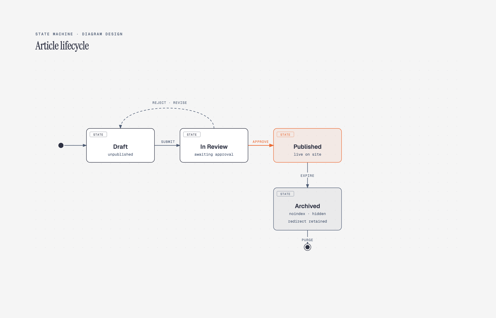

# 🔄 状态机图

> 订单状态、用户生命周期、工作流状态转换图。

**所属分类**: [技术图表](README.md)  
**Prompt 数量**: 5 条  
**难度等级**: ⭐⭐⭐ 高级

---

## Prompt 1: 电商订单生命周期

> 电商平台订单从创建到完成的完整状态转换

**Prompt:**

```text
A state machine diagram showing e-commerce order lifecycle with 8 states: Created, Pending Payment, Paid, Processing, Shipped, Delivered, Completed, and Cancelled. States rendered as rounded rectangles with state name in bold and internal actions (entry/exit/do) in smaller text. Initial state marked with filled black circle pointing to Created. Transitions as curved arrows with trigger events (payment_received, merchant_confirms, courier_pickup, delivery_confirmed), guard conditions in square brackets [amount > 0], and actions after slash /send_notification. Include a composite state for "In Fulfillment" containing Processing and Shipped as substates. Terminal states (Completed, Cancelled) marked with bullseye symbol. Color-coded: active states in green, pending in amber, terminal in gray, cancelled in red. Clean professional style on white background with subtle grid, clear hierarchy and left-to-right flow.
```

**示例效果：**



**参数说明：**

| 参数 | 推荐值 | 说明 |
|------|--------|------|
| 尺寸 | 1536×1024 | 横版宽幅 |
| 风格 | Corporate Professional | 企业正式风 |
| 模型 | GPT-Image-2 | 推荐 |

**变体建议：**

- 添加退款子状态机（退款申请、审核中、退款中、已退款）
- 增加超时自动取消的定时器事件 (after 30min)
- 添加售后维权分支状态

**标签**: `#technical-diagram` `#state-machine` `#e-commerce` `#order`

---

## Prompt 2: 用户认证状态

> 用户账户认证与会话管理的状态机

**Prompt:**

```text
A state machine diagram for user authentication and session management. States: Anonymous, Authenticating (composite state with substates: Entering Credentials, MFA Challenge, Biometric Verify), Authenticated, Session Active, Session Idle, Session Expired, Locked Out, and Password Reset. Show transitions: login_attempt triggers Anonymous to Authenticating, success moves to Authenticated, session_start to Session Active, inactivity_timeout (15min) to Session Idle, max_idle_exceeded to Session Expired, failed_attempts[count>=5] to Locked Out with /increment_counter action. Include history pseudostate (H*) for resuming after MFA. Fork/join for parallel regions: session tracking and audit logging running concurrently. Dark theme with neon green accent lines on black background, states as glowing bordered rectangles, matrix-style digital aesthetic, monospace font for all labels, subtle scan-line effect.
```

**示例效果：**


**参数说明：**

| 参数 | 推荐值 | 说明 |
|------|--------|------|
| 尺寸 | 1536×1024 | 横版宽幅 |
| 风格 | Dark Neon Tech | 暗色科技感 |
| 模型 | GPT-Image-2 | 推荐 |

**变体建议：**

- 添加 OAuth 第三方登录的并行认证路径
- 增加设备信任状态和新设备验证流程
- 加入渐进式身份验证（低风险操作不需要完整认证）

**标签**: `#technical-diagram` `#state-machine` `#authentication` `#security`

---

## Prompt 3: CI/CD 流水线状态

> 持续集成/持续部署管道的状态流转

**Prompt:**

```text
A state machine diagram for CI/CD pipeline execution states. States: Idle, Triggered, Source Checkout, Building (with substates: Compile, Unit Test, Static Analysis), Testing (with substates: Integration Test, E2E Test, Security Scan), Staging Deploy, Approval Gate (human intervention), Production Deploy, Deployed, Rollback, and Failed. Transitions with events: commit_pushed, build_success, tests_passed, approved/rejected, deploy_success, health_check_failed. Guard conditions [coverage >= 80%] [no critical vulnerabilities]. Show parallel regions in Testing composite state (all tests run concurrently with join). Error transitions from any active state to Failed with /alert_team action. Rollback transition from Deployed to previous stable version. Blueprint engineering style with dark navy background, white technical lines, cyan state borders, orange for error paths, engineering notation and precise geometric layout.
```

**示例效果：**


**参数说明：**

| 参数 | 推荐值 | 说明 |
|------|--------|------|
| 尺寸 | 1536×1024 | 横版宽幅 |
| 风格 | Blueprint Engineering | 工程蓝图风 |
| 模型 | GPT-Image-2 | 推荐 |

**变体建议：**

- 添加金丝雀发布和蓝绿部署的并行路径
- 增加特性开关 (Feature Flag) 控制的条件部署
- 加入多环境（dev/staging/prod）的级联部署状态

**标签**: `#technical-diagram` `#state-machine` `#cicd` `#devops`

---

## Prompt 4: 游戏角色状态

> 游戏角色行为的有限状态机（FSM）设计

**Prompt:**

```text
A state machine diagram for a game character AI behavior system. States: Idle (with do/play_idle_animation), Patrol (do/follow_waypoints), Alert (entry/play_alert_sound), Chase (do/pursue_target), Attack (entry/select_weapon), Flee (do/run_to_cover), Stunned (entry/disable_input, after 3s/recover), Dead (entry/play_death_animation, final state). Transitions with game events: enemy_spotted[distance < detection_range], target_lost[timer > 5s], health_low[hp < 20%], hit_by_stun, health_zero. Priority transitions from any state on health_zero to Dead. Show detection range as a note annotation. Include a superstate "Combat" containing Chase, Attack, and Flee. Hand-drawn sketch style with graph paper background, colored pencil state bubbles, playful arrows with handwritten labels, game controller doodles in corners, indie game dev notebook aesthetic.
```

**示例效果：**


**参数说明：**

| 参数 | 推荐值 | 说明 |
|------|--------|------|
| 尺寸 | 1536×1024 | 横版宽幅 |
| 风格 | Hand-drawn Sketch | 手绘草图风 |
| 模型 | GPT-Image-2 | 推荐 |

**变体建议：**

- 改为分层状态机（HFSM），展示嵌套行为层次
- 添加行为树与状态机的混合方案
- 增加多人游戏中的网络同步状态和预测回滚

**标签**: `#technical-diagram` `#state-machine` `#gamedev` `#ai`

---

## Prompt 5: 文档审批工作流

> 企业文档审批的多层级状态流转

**Prompt:**

```text
A state machine diagram for enterprise document approval workflow. States: Draft, Submitted, Under Review (composite with substates: Department Review, Legal Review, Finance Review), Revision Requested, Approved, Published, Archived, and Rejected. Show parallel review tracks within Under Review using fork and join bars (all three reviews must complete). Transitions: submit triggers Draft to Submitted, auto-route to appropriate reviewers based on document type guard [type == 'contract'], reviewer actions (approve/reject/request_changes) with reviewer identity in action /log(reviewer_id). Escalation path after timeout [pending > 7 days] /escalate_to_manager. Version control: Published can transition back to Draft via create_new_version with /increment_version action. Modern gradient style with soft purple-to-pink gradient background, frosted glass state containers, smooth rounded connections, elegant typography, subtle depth shadows, professional SaaS application aesthetic.
```

**示例效果：**


**参数说明：**

| 参数 | 推荐值 | 说明 |
|------|--------|------|
| 尺寸 | 1536×1024 | 横版宽幅 |
| 风格 | Modern Gradient | 渐变现代风 |
| 模型 | GPT-Image-2 | 推荐 |

**变体建议：**

- 添加委托审批和代理审批的临时状态
- 增加紧急审批快速通道（跳过部分审核环节）
- 加入电子签章状态和合规审计追踪

**标签**: `#technical-diagram` `#state-machine` `#workflow` `#approval`

---

## 🔗 相关推荐

- [流程图](flowchart.md) - 业务流程设计
- [泳道图](swimlane.md) - 跨部门协作流程
- [时序图](sequence.md) - 系统交互时序
- [时间线图](timeline-diagram.md) - 项目时间规划
- [UML 类图](uml.md) - 面向对象设计
