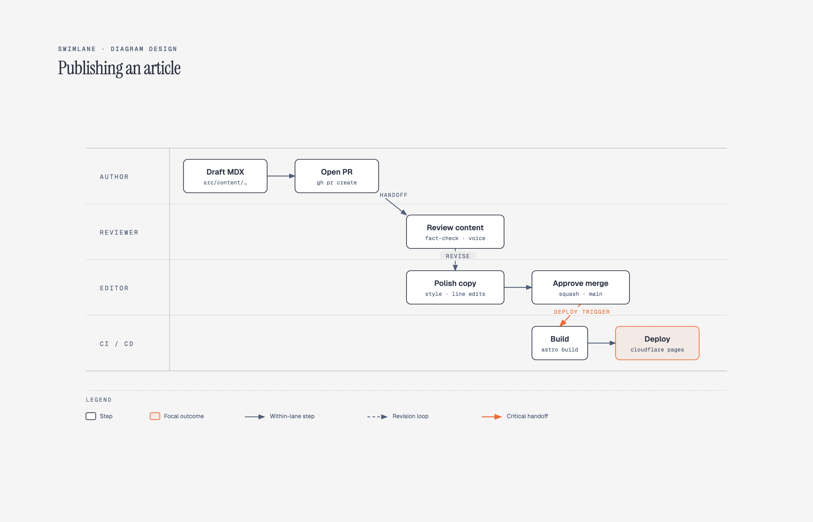

# 🏊 泳道图

> 跨部门协作流程、职责划分的泳道图。

**所属分类**: [技术图表](README.md)  
**Prompt 数量**: 5 条  
**难度等级**: ⭐⭐⭐ 高级

---

## Prompt 1: 企业采购审批流程

> 跨部门采购审批的完整协作流程

**Prompt:**

```text
A swimlane process diagram showing enterprise procurement approval workflow. Four horizontal lanes labeled: Requester, Department Manager, Finance Team, and Procurement Office. Process flow: Requester submits purchase request → Manager reviews and approves/rejects (decision diamond) → Finance checks budget availability → if over threshold [amount > $10K] routes to VP approval (additional lane interaction) → Procurement creates PO → Vendor selection and negotiation → PO issued → Goods received → Invoice matching → Payment processed. Clear handoff arrows crossing lane boundaries highlighted in orange. Start event (green circle) in Requester lane, end event (red circle) in Finance lane. Each process step as rounded rectangle with action verb. Corporate professional style with clean white background, lanes in alternating light blue and light gray, navy blue process nodes, gold accent for decision points, crisp Helvetica typography.
```

**示例效果：**



**参数说明：**

| 参数 | 推荐值 | 说明 |
|------|--------|------|
| 尺寸 | 1536×1024 | 横版宽幅 |
| 风格 | Corporate Professional | 企业正式风 |
| 模型 | GPT-Image-2 | 推荐 |

**变体建议：**

- 改为垂直泳道布局（部门从左到右排列）
- 添加 SLA 时间标注（每步骤预期完成时间）
- 增加异常处理路径（预算不足、供应商问题）

**标签**: `#technical-diagram` `#swimlane` `#approval` `#workflow`

---

## Prompt 2: 客户支持工单流程

> 技术支持从接单到解决的跨团队协作

**Prompt:**

```text
A swimlane diagram for customer support ticket resolution process. Five horizontal lanes: Customer, Support L1, Support L2/Engineering, QA Team, and Product Manager. Flow: Customer reports issue via portal → L1 triages and categorizes (P1-P4) → if reproducible, L1 resolves with knowledge base → if not, escalates to L2 → L2 investigates root cause → creates bug fix branch → QA verifies fix in staging → if regression found, loop back to L2 → PM approves for release → fix deployed to production → Customer notified of resolution → satisfaction survey sent. Show parallel paths: while engineering fixes, L1 provides workaround to customer. Time annotations on each step (SLA: L1 response < 4hr, L2 fix < 48hr). Dark theme with neon accents, charcoal background, lanes separated by glowing cyan lines, process nodes as dark cards with colored left borders (green=automated, blue=manual), neon pink for escalation arrows, modern support dashboard aesthetic.
```

**示例效果：**


**参数说明：**

| 参数 | 推荐值 | 说明 |
|------|--------|------|
| 尺寸 | 1536×1024 | 横版宽幅 |
| 风格 | Dark Neon Tech | 暗色科技感 |
| 模型 | GPT-Image-2 | 推荐 |

**变体建议：**

- 添加 AI 聊天机器人作为第一道自动响应层
- 增加客户情感分析触发优先级升级
- 加入知识库更新的反馈循环

**标签**: `#technical-diagram` `#swimlane` `#support` `#customer-service`

---

## Prompt 3: 软件部署流程

> 从代码提交到生产发布的 DevOps 部署泳道

**Prompt:**

```text
A swimlane diagram depicting software deployment process across DevOps roles. Four vertical lanes (left to right): Developer, CI/CD Pipeline (automated), Platform/SRE Team, and Production Environment. Flow: Developer pushes code to feature branch → automated lint and unit tests run → PR review requested (parallel: security scan) → merge to main triggers build → Docker image built and pushed to registry → automated integration tests in ephemeral environment → if passed, deploy to staging → SRE reviews metrics and approves → canary deployment to 5% production traffic → monitor error rates and latency (decision: healthy?) → progressive rollout 25% → 50% → 100% → post-deployment verification → if anomaly detected, automatic rollback triggered. Automated steps shown with gear icons, manual gates with person icons. Blueprint engineering style with dark navy background, white precise lines, cyan for automated flows, amber for manual interventions, green for success paths, red for rollback, technical engineering precision.
```

**示例效果：**


**参数说明：**

| 参数 | 推荐值 | 说明 |
|------|--------|------|
| 尺寸 | 1536×1024 | 横版宽幅 |
| 风格 | Blueprint Engineering | 工程蓝图风 |
| 模型 | GPT-Image-2 | 推荐 |

**变体建议：**

- 添加 GitOps 工作流（ArgoCD 同步检测）
- 增加多区域部署的并行泳道
- 加入 Feature Flag 渐进发布控制

**标签**: `#technical-diagram` `#swimlane` `#deployment` `#devops`

---

## Prompt 4: 新员工入职流程

> 新员工从 Offer 到独立工作的入职协作流程

**Prompt:**

```text
A swimlane diagram for employee onboarding process. Six horizontal lanes: New Hire, HR Team, IT/Security, Hiring Manager, Buddy/Mentor, and Learning Platform. Timeline spanning Day -7 to Day 90. Pre-arrival (Day -7 to 0): HR sends welcome packet, IT provisions accounts and equipment, Manager prepares onboarding plan. Week 1: New hire completes compliance training on learning platform, IT sets up development environment, Buddy gives office tour and introductions, Manager assigns starter tasks. Week 2-4: Progressive access grants from IT/Security, domain training modules, first code review with buddy, 1:1 with manager. Month 2-3: Independent feature work, team presentations, 30/60/90 day check-ins across lanes. Milestone markers: First PR merged, First on-call rotation, Probation complete. Clean whiteboard style with warm off-white background, lanes as colored bands (pastel rainbow), friendly rounded process nodes, hand-drawn connecting arrows, welcoming onboarding document aesthetic.
```

**示例效果：**


**参数说明：**

| 参数 | 推荐值 | 说明 |
|------|--------|------|
| 尺寸 | 1920×1080 | 超宽横版 |
| 风格 | Whiteboard Sketch | 白板手绘风 |
| 模型 | GPT-Image-2 | 推荐 |

**变体建议：**

- 改为远程员工入职流程，强调异步沟通和视频环节
- 添加合规培训和安全认证的必修路径
- 加入文化融入和社交活动的非正式轨道

**标签**: `#technical-diagram` `#swimlane` `#onboarding` `#hr`

---

## Prompt 5: 事件响应流程

> 生产环境事件响应的 SRE 应急流程

**Prompt:**

```text
A swimlane diagram for production incident response process (based on PagerDuty/Google SRE model). Five horizontal lanes: Monitoring System, On-Call Engineer, Incident Commander, Communication Lead, and Post-Incident Team. Flow: Monitoring detects anomaly and fires alert → On-call acknowledges within 5 min → initial assessment: severity (SEV1-4) → if SEV1/2: Incident Commander activated, war room opened → Communication Lead posts status page update and notifies stakeholders → parallel investigation streams: on-call checks recent deploys, reviews logs, examines metrics → IC coordinates and makes decisions (rollback? scale up? failover?) → mitigation applied → monitoring confirms recovery → Communication sends all-clear → Post-incident team schedules retrospective within 48hr → blameless post-mortem document → action items assigned and tracked. Escalation timeouts shown (15min, 30min, 1hr). Modern gradient style with deep purple-to-dark-blue background, severity color coding (red=SEV1, orange=SEV2, yellow=SEV3), glowing status indicators, clean sans-serif text, incident management dashboard aesthetic with urgency conveyed through color intensity.
```

**示例效果：**


**参数说明：**

| 参数 | 推荐值 | 说明 |
|------|--------|------|
| 尺寸 | 1536×1024 | 横版宽幅 |
| 风格 | Modern Gradient | 渐变现代风 |
| 模型 | GPT-Image-2 | 推荐 |

**变体建议：**

- 添加自动化响应路径（Auto-remediation 自愈流程）
- 增加多团队联合响应的分支协调
- 加入客户沟通和法务合规通知路径

**标签**: `#technical-diagram` `#swimlane` `#incident-response` `#sre`

---

## 🔗 相关推荐

- [流程图](flowchart.md) - 单一流程设计
- [时序图](sequence.md) - 系统交互时序
- [状态机图](state-machine.md) - 状态转换逻辑
- [时间线图](timeline-diagram.md) - 项目时间规划
- [树形图](tree-org.md) - 组织架构设计
