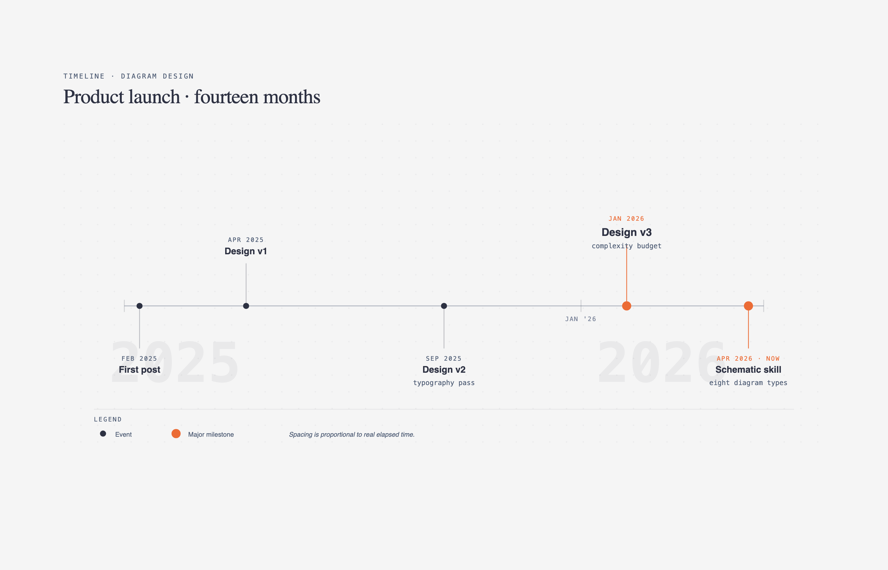

# 📅 时间线图

> 产品路线图、项目规划、历史事件的时间轴可视化。

**所属分类**: [技术图表](README.md)  
**Prompt 数量**: 5 条  
**难度等级**: ⭐⭐⭐ 高级

---

## Prompt 1: 产品路线图

> SaaS 产品的年度功能规划路线图

**Prompt:**

```text
A product roadmap timeline diagram for a SaaS platform spanning Q1-Q4 2026. Horizontal timeline with quarterly divisions and monthly markers. Four parallel swim lanes representing product areas: Core Platform, Integrations, AI/ML Features, and Developer Tools. Each feature shown as a colored bar spanning its development period with milestone diamonds at key dates (alpha, beta, GA). Q1: Authentication overhaul and REST API v3. Q2: Slack/Teams integration and AI-powered search. Q3: Custom workflows engine and GraphQL API. Q4: ML recommendations and SDK release. Dependencies shown as thin arrows between related items. Current date marker as vertical red dashed line. Modern gradient style with soft indigo-to-purple background, feature bars as rounded pill shapes with gradient fills, clean white typography, frosted glass lane dividers, professional product management aesthetic.
```

**示例效果：**



**参数说明：**

| 参数 | 推荐值 | 说明 |
|------|--------|------|
| 尺寸 | 1920×1080 | 超宽横版适合时间线 |
| 风格 | Modern Gradient | 渐变现代风 |
| 模型 | GPT-Image-2 | 推荐 |

**变体建议：**

- 改为三年战略路线图，按年划分阶段（Foundation → Growth → Scale）
- 添加竞品特性对比时间线（我们 vs 竞品的发布时间）
- 加入资源分配和团队容量标注

**标签**: `#technical-diagram` `#timeline` `#roadmap` `#product`

---

## Prompt 2: Sprint 迭代计划

> 敏捷开发 Sprint 的两周迭代时间规划

**Prompt:**

```text
A sprint planning timeline diagram showing a 2-week sprint (Sprint 23) day by day. Horizontal axis with 10 working days clearly marked (Mon-Fri x 2 weeks). Vertical lanes for team members: Frontend Dev, Backend Dev, QA Engineer, Designer. Task bars color-coded by type: features in blue, bugs in red, tech debt in yellow, spikes in purple. Show task dependencies with connecting arrows. Key ceremonies marked as diamonds: Sprint Planning (Day 1), Daily Standup (recurring), Mid-sprint Review (Day 5), Sprint Demo (Day 10), Retrospective (Day 10). Burndown mini-chart in corner showing ideal vs actual progress. Story points labeled on each task bar. Clean whiteboard style with off-white background, colorful task cards resembling physical sticky notes, handwritten day labels, Kanban-board-meets-Gantt aesthetic with warm friendly colors.
```

**示例效果：**


**参数说明：**

| 参数 | 推荐值 | 说明 |
|------|--------|------|
| 尺寸 | 1920×1080 | 超宽横版 |
| 风格 | Whiteboard Sketch | 白板手绘风 |
| 模型 | GPT-Image-2 | 推荐 |

**变体建议：**

- 改为 SAFe PI Planning 的多团队迭代规划
- 添加风险和阻塞标记（红色警告图标）
- 展示跨 Sprint 的 Epic 分解和延续

**标签**: `#technical-diagram` `#timeline` `#sprint` `#agile`

---

## Prompt 3: 公司技术发展史

> 科技公司的技术演进历史时间线

**Prompt:**

```text
A company technology evolution timeline spanning 2015-2026. Vertical timeline with year markers on the left, event descriptions branching to alternating left and right sides. Key milestones: 2015 - Monolithic PHP app launched; 2017 - Microservices migration begins (Java/Spring); 2018 - Kubernetes adoption, first 100 services; 2019 - Event-driven architecture with Kafka; 2020 - Cloud-native transformation (AWS); 2021 - GraphQL federation layer; 2022 - ML platform launch; 2023 - Edge computing expansion; 2024 - AI-first architecture pivot; 2025 - Multi-cloud strategy; 2026 - Autonomous operations with AIOps. Each milestone has a small icon representing the technology. Growth metrics shown as a rising line graph overlay (users: 10K to 50M). Corporate professional style with clean white background, navy and gold color scheme, elegant serif headings, timeline as a thick vertical bar with branching nodes, subtle company branding feel.
```

**示例效果：**


**参数说明：**

| 参数 | 推荐值 | 说明 |
|------|--------|------|
| 尺寸 | 1024×1536 | 竖版适合纵向时间线 |
| 风格 | Corporate Professional | 企业正式风 |
| 模型 | GPT-Image-2 | 推荐 |

**变体建议：**

- 改为某个开源项目的版本发布历史
- 添加技术栈变迁（旧技术淡出、新技术突出）
- 加入团队规模增长和关键人才加入节点

**标签**: `#technical-diagram` `#timeline` `#history` `#evolution`

---

## Prompt 4: 版本发布计划

> 软件产品的版本发布节奏和支持周期

**Prompt:**

```text
A software release schedule timeline showing version lifecycle for a platform (v3.x to v6.x) over 2024-2027. Horizontal timeline with quarterly markers. Each version shown as a horizontal bar with color-coded phases: Development (blue), Beta (yellow), GA/Active Support (green), Maintenance/Security-only (orange), End of Life (gray/dashed). Versions staggered: v3.x ending support, v4.x in maintenance, v5.x currently active, v6.x in development. LTS (Long Term Support) versions marked with a star badge and extended support bars. Release cadence annotations: major version every 12 months, minor every 3 months, patch as needed. Migration windows highlighted between versions. Dark theme with neon accents, deep space-black background, version bars as glowing colored strips, neon green for active, amber for maintenance, red pulse for EOL dates, futuristic software lifecycle dashboard aesthetic.
```

**示例效果：**


**参数说明：**

| 参数 | 推荐值 | 说明 |
|------|--------|------|
| 尺寸 | 1920×1080 | 超宽横版 |
| 风格 | Dark Neon Tech | 暗色科技感 |
| 模型 | GPT-Image-2 | 推荐 |

**变体建议：**

- 对比多个相关产品的同步发布计划（如 React + Next.js + Node.js）
- 添加 SemVer 版本号详细标注和 Breaking Changes 标记
- 增加安全漏洞修复的紧急发布时间点

**标签**: `#technical-diagram` `#timeline` `#release` `#versioning`

---

## Prompt 5: 系统迁移计划

> 大规模系统迁移的分阶段时间规划

**Prompt:**

```text
A system migration plan timeline showing a 6-month database migration from Oracle to PostgreSQL. Horizontal timeline divided into 6 monthly phases with weekly subdivisions. Parallel workstreams: Schema Migration, Data Migration, Application Refactoring, Testing and Validation, and Cutover Planning. Phase 1 (Month 1-2): Schema analysis, compatibility mapping, tool setup. Phase 2 (Month 2-3): Schema conversion, stored procedure rewrite, application ORM updates. Phase 3 (Month 3-4): Historical data migration (batch), continuous sync setup (CDC). Phase 4 (Month 4-5): Parallel running, shadow traffic testing, performance benchmarking. Phase 5 (Month 5-6): Staged cutover (read traffic first, then writes), rollback rehearsal. Phase 6: Final cutover weekend, decommission old system. Risk milestones marked in red. Go/No-Go decision gates as diamond checkpoints. Blueprint engineering style with navy background, precise white gridlines, cyan task bars, red critical path highlighted, engineering project management aesthetic with Gantt-chart precision.
```

**示例效果：**


**参数说明：**

| 参数 | 推荐值 | 说明 |
|------|--------|------|
| 尺寸 | 1920×1080 | 超宽横版 |
| 风格 | Blueprint Engineering | 工程蓝图风 |
| 模型 | GPT-Image-2 | 推荐 |

**变体建议：**

- 改为云迁移计划（On-premise → AWS/Azure），包含 6R 策略标注
- 添加回滚计划和灾难恢复时间点
- 加入团队培训和知识转移的并行轨道

**标签**: `#technical-diagram` `#timeline` `#migration` `#planning`

---

## 🔗 相关推荐

- [泳道图](swimlane.md) - 跨团队协作流程
- [状态机图](state-machine.md) - 状态转换逻辑
- [金字塔/漏斗图](pyramid.md) - 优先级分层
- [象限图](quadrant.md) - 优先级矩阵
- [树形图](tree-org.md) - 组织架构规划
