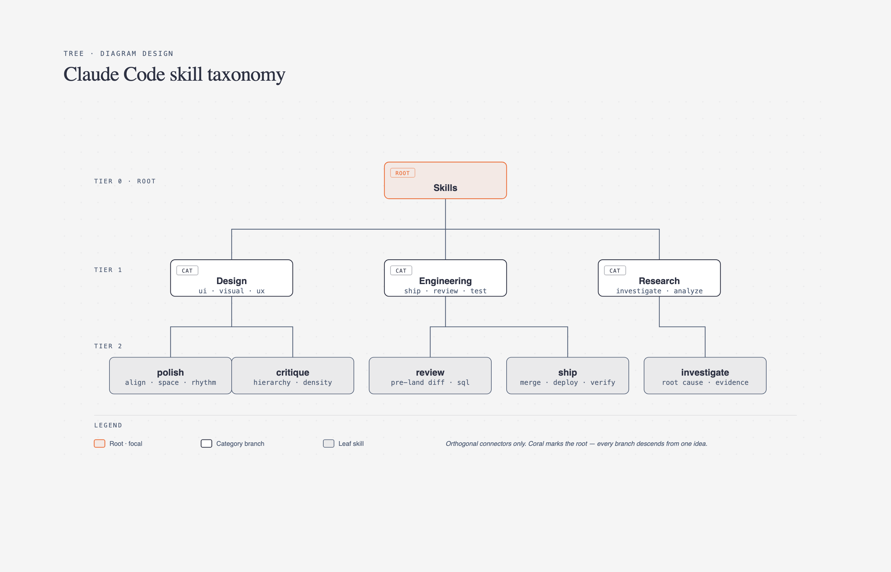

# 🌳 树形图 / 组织架构

> 公司架构、文件目录、分类树、思维导图。

**所属分类**: [技术图表](README.md)  
**Prompt 数量**: 5 条  
**难度等级**: ⭐⭐⭐ 高级

---

## Prompt 1: 科技公司组织架构

> 中型科技公司的工程团队组织结构

**Prompt:**

```text
An organizational chart for a mid-size tech company's engineering division. Root node: CTO (with name and avatar placeholder). Level 2: VP of Engineering, VP of Product, VP of Infrastructure. Level 3 under VP Engineering: Director of Frontend (3 teams: Web App, Mobile, Design System), Director of Backend (3 teams: Core Platform, Payments, Search), Director of Data (2 teams: Data Engineering, ML/AI). Level 3 under VP Infrastructure: Director of SRE (teams: Reliability, Performance), Director of Security (teams: AppSec, InfraSec), Director of Platform (teams: Developer Tools, Cloud Ops). Each node as a card with: role title, team size (number badge), and department color. Reporting lines as clean connecting lines. Span of control noted. Total headcount: 180 engineers. Dotted-line relationships for cross-functional guilds (Frontend Guild, Security Champions). Corporate professional style with white background, cards as clean rounded rectangles with colored left border indicating department, subtle shadows for depth, elegant hierarchy lines, professional HR documentation quality suitable for all-hands presentation.
```

**示例效果：**



**参数说明：**

| 参数 | 推荐值 | 说明 |
|------|--------|------|
| 尺寸 | 1536×1024 | 横版宽幅 |
| 风格 | Corporate Professional | 企业正式风 |
| 模型 | GPT-Image-2 | 推荐 |

**变体建议：**

- 改为矩阵式组织（功能线 + 产品线双维度汇报）
- 添加 Spotify 模型（Squads, Tribes, Chapters, Guilds）
- 展示远程/分布式团队的地理分布标注

**标签**: `#technical-diagram` `#tree-org` `#organization` `#company`

---

## Prompt 2: 项目文件系统结构

> 现代 Web 项目的目录树形结构

**Prompt:**

```text
A file system tree diagram showing a modern monorepo project structure (Next.js + API). Root: my-saas-app/. Level 1 directories: apps/ (frontend, api, admin), packages/ (ui, utils, config, types), infrastructure/ (terraform, docker, k8s), docs/, scripts/, .github/. Expanded view of apps/frontend/: src/ (app/, components/, hooks/, lib/, styles/), public/, tests/, next.config.js, package.json. Expanded packages/ui/: src/components/ (Button/, Modal/, Table/, Form/), src/tokens/ (colors.ts, spacing.ts), stories/, index.ts. Show file icons: folders as colored folder icons, .ts files as TypeScript icon, .json as gear, .md as document. Collapsed branches shown with [...] indicator. Package dependency arrows between packages/ui → apps/frontend. Git submodule indicator on infrastructure/. Dark theme with neon accents, VS Code sidebar aesthetic with dark background, file tree indentation with colored guides (like indent-rainbow), neon folder icons, syntax-highlighted file names by extension, developer IDE aesthetic that feels like home.
```

**示例效果：**


**参数说明：**

| 参数 | 推荐值 | 说明 |
|------|--------|------|
| 尺寸 | 1024×1536 | 竖版适合文件树 |
| 风格 | Dark Neon Tech | 暗色科技感 |
| 模型 | GPT-Image-2 | 推荐 |

**变体建议：**

- 改为 Python ML 项目结构（Cookiecutter Data Science 风格）
- 展示 Nx/Turborepo monorepo 的依赖图叠加
- 添加文件大小热力图标注（越大越亮）

**标签**: `#technical-diagram` `#tree-org` `#file-system` `#project-structure`

---

## Prompt 3: 技术决策树

> API 技术选型的决策树流程

**Prompt:**

```text
A decision tree diagram for choosing the right API technology. Root question: "What kind of API do you need?" Branch 1 (left): "Request-Response?" → "Complex queries with relationships?" → Yes: GraphQL → "Need offline/mobile optimization?" → Yes: GraphQL + Persisted Queries, No: Standard GraphQL. → No: REST → "Simple CRUD?" → Yes: REST with OpenAPI → "High performance needed?" → Yes: gRPC. Branch 2 (right): "Real-time/Streaming?" → "Bidirectional?" → Yes: WebSocket → "Many concurrent connections?" → Yes: WebSocket + Redis Pub/Sub, No: Simple WebSocket. → No: "Server-push only?" → Yes: Server-Sent Events (SSE). → "Event-driven?" → Yes: Webhooks + Message Queue. Each decision node as diamond shape, outcome nodes as rounded rectangles with technology recommendation and brief rationale. Leaf nodes color-coded by use case fit (green=best fit, yellow=consider). Clean whiteboard style with off-white background, decision diamonds in blue, technology outcomes in green boxes, clear left-to-right and top-to-bottom flow, educational diagram with friendly approachable design, annotations explaining trade-offs at key decision points.
```

**示例效果：**


**参数说明：**

| 参数 | 推荐值 | 说明 |
|------|--------|------|
| 尺寸 | 1536×1024 | 横版宽幅 |
| 风格 | Whiteboard Sketch | 白板教学风 |
| 模型 | GPT-Image-2 | 推荐 |

**变体建议：**

- 改为数据库选型决策树（SQL vs NoSQL vs Graph vs Time-series）
- 展示前端框架选型（项目规模、团队经验、性能需求维度）
- 添加云服务商选型决策（成本、合规、生态、地理位置）

**标签**: `#technical-diagram` `#tree-org` `#decision-tree` `#architecture`

---

## Prompt 4: 知识分类体系

> 软件工程知识体系的分类学树形图

**Prompt:**

```text
A taxonomy tree diagram showing Software Engineering Body of Knowledge (SWEBOK-inspired). Root: Software Engineering. Level 1 branches (8 major areas): Requirements, Design, Construction, Testing, Maintenance, Configuration Management, Quality, and Engineering Management. Level 2 expanded for Design: Architectural Design (patterns, styles, views), Detailed Design (classes, interfaces, algorithms), UI/UX Design (wireframes, prototyping, usability). Level 2 expanded for Testing: Unit Testing, Integration Testing, System Testing, Acceptance Testing, Performance Testing, Security Testing. Level 2 expanded for Construction: Coding Standards, Code Review, Refactoring, Build Systems, Debugging Techniques. Other Level 1 nodes shown collapsed with count badge (+5 sub-topics). Connection style: organic tree branches rather than rigid lines. Knowledge depth indicators (beginner → expert) on each node. Isometric 3D perspective with the tree growing upward like a real tree, trunk as root, main branches for Level 1, smaller branches for Level 2, leaves for Level 3, subtle nature metaphor with tech aesthetic, green-to-blue color palette, dimensional depth and shadow, creative knowledge visualization.
```

**示例效果：**


**参数说明：**

| 参数 | 推荐值 | 说明 |
|------|--------|------|
| 尺寸 | 1536×1024 | 横版宽幅 |
| 风格 | Isometric 3D | 等轴测立体 |
| 模型 | GPT-Image-2 | 推荐 |

**变体建议：**

- 改为云原生技术的 CNCF Landscape 分类树
- 展示数据科学技能树（像游戏技能树一样解锁）
- 添加学习路径推荐和预估时间标注

**标签**: `#technical-diagram` `#tree-org` `#taxonomy` `#knowledge`

---

## Prompt 5: 导航菜单结构

> SaaS 应用的信息架构和导航层级

**Prompt:**

```text
A tree diagram showing information architecture for a SaaS project management application's navigation structure. Root: App Shell. Level 1 (main navigation): Dashboard, Projects, Team, Reports, Settings. Level 2 under Projects: All Projects, My Projects, Archived, Templates. Level 2 under Team: Members, Roles and Permissions, Teams/Groups, Invitations. Level 2 under Reports: Overview Dashboard, Time Tracking, Burndown Charts, Custom Reports, Export. Level 2 under Settings: Profile, Organization, Billing, Integrations, API Keys, Notifications, Security. Level 3 under Integrations: Slack, GitHub, Jira, Calendar, Webhooks. Show navigation type annotations: persistent sidebar items (solid), contextual actions (dashed), modal overlays (dotted). Breadcrumb path example highlighted in yellow. Access control annotations (Admin only, Member, Guest) as badges. Blueprint engineering style with dark navy background, tree structure as precise architectural diagram, white lines with right-angle connections, nodes as clean labeled boxes, depth indicated by indentation and subtle size decrease, UX information architecture documentation quality, wireframe-meets-blueprint aesthetic.
```

**示例效果：**


**参数说明：**

| 参数 | 推荐值 | 说明 |
|------|--------|------|
| 尺寸 | 1536×1024 | 横版宽幅 |
| 风格 | Blueprint Engineering | 工程蓝图风 |
| 模型 | GPT-Image-2 | 推荐 |

**变体建议：**

- 添加用户流量热力图（哪些菜单项使用最多）
- 增加响应式设计变体（桌面端 vs 移动端导航折叠）
- 展示渐进式披露策略（根据用户角色显示不同菜单）

**标签**: `#technical-diagram` `#tree-org` `#navigation` `#information-architecture`

---

## 🔗 相关推荐

- [泳道图](swimlane.md) - 跨部门协作流程
- [金字塔图](pyramid.md) - 层级优先关系
- [维恩图](venn.md) - 角色职责交集
- [时间线图](timeline-diagram.md) - 项目时间规划
- [象限图](quadrant.md) - 优先级评估矩阵
