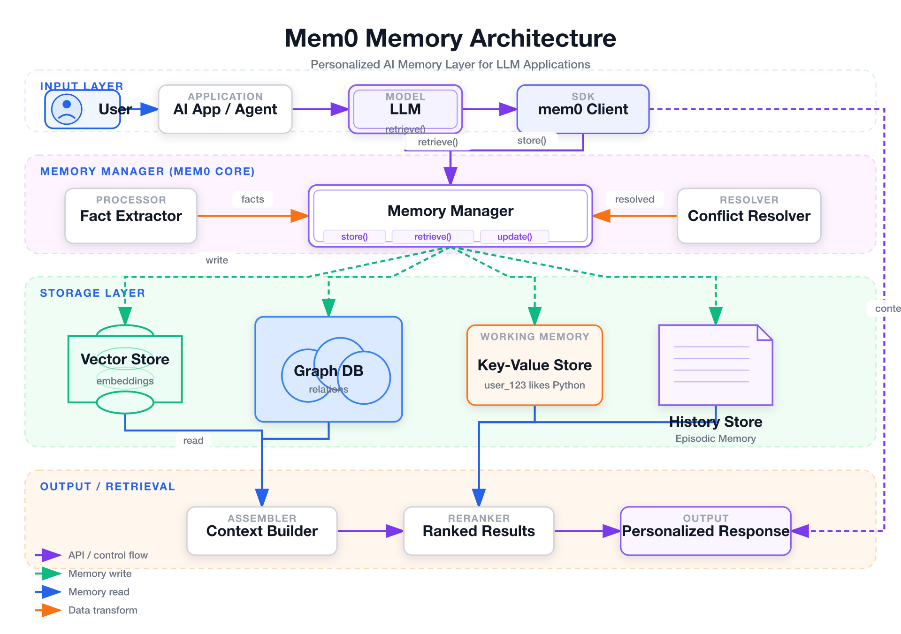

# 📐 UML 类图 / 组件图

> 面向对象设计、包图、组件依赖关系图。

**所属分类**: [技术图表](README.md)  
**Prompt 数量**: 5 条  
**难度等级**: ⭐⭐⭐ 高级

---

## Prompt 1: 设计模式 — 观察者模式

> 观察者/发布-订阅设计模式的 UML 类图

**Prompt:**

```text
A UML class diagram illustrating the Observer design pattern in a real-world event system. Classes: EventEmitter (abstract class with methods: +subscribe(event, handler), +unsubscribe(event, handler), +emit(event, data), -listeners: Map<string, Handler[]>), ConcreteEventBus (extends EventEmitter, +getInstance(): EventBus, -instance: EventBus), EventHandler (interface with method: +handle(event: Event): void), LoggingHandler (implements EventHandler, +handle(), -logLevel: string), NotificationHandler (implements EventHandler, +handle(), -channel: NotificationChannel), MetricsHandler (implements EventHandler, +handle(), -metricsClient: StatsD), Event (class with +type: string, +payload: any, +timestamp: Date, +source: string). Show inheritance with hollow triangle arrows, interface implementation with dashed arrows, composition with filled diamond (EventEmitter contains Handler[]), dependency arrows from handlers to Event. Proper UML notation: +public, -private, #protected, italics for abstract. Clean whiteboard style with light background, classes as crisp bordered boxes with colored headers (abstract=blue, interface=green, concrete=white), neat relationship lines with proper UML arrowheads, educational software design documentation aesthetic.
```

**示例效果：**



**参数说明：**

| 参数 | 推荐值 | 说明 |
|------|--------|------|
| 尺寸 | 1536×1024 | 横版宽幅 |
| 风格 | Whiteboard Sketch | 白板教学风 |
| 模型 | GPT-Image-2 | 推荐 |

**变体建议：**

- 改为策略模式（Strategy Pattern）展示算法族替换
- 展示装饰器模式（Decorator Pattern）的层层包装关系
- 对比观察者和中介者模式的结构差异

**标签**: `#technical-diagram` `#uml` `#design-pattern` `#observer`

---

## Prompt 2: 插件架构组件图

> 可扩展插件系统的 UML 组件图

**Prompt:**

```text
A UML component diagram showing a plugin-based architecture for an IDE or extensible application. Main components: Core Application (with sub-components: Plugin Manager, Extension API, Event Bus, Service Registry), Plugin SDK (provided interface: IPlugin, ICommand, IView, IService), and 4 example plugins: Git Plugin (requires: FileSystem API, provides: VersionControl), Linter Plugin (requires: AST Parser, provides: DiagnosticsProvider), Theme Plugin (requires: UI Framework, provides: ThemeProvider), Database Plugin (requires: Network, provides: QueryRunner). Show provided interfaces as lollipop notation (circle on stick), required interfaces as socket notation (half circle). Dependencies between plugins shown as dashed arrows. Package boundaries as tabbed rectangles grouping related components. Lifecycle annotations: load order numbers, lazy-loading markers. Dark theme with neon accents, charcoal background, components as dark cards with glowing colored borders (core=cyan, plugins=green, SDK=purple), interface connections as bright lines, modern IDE dark mode aesthetic, technical precision with visual appeal.
```

**示例效果：**


**参数说明：**

| 参数 | 推荐值 | 说明 |
|------|--------|------|
| 尺寸 | 1536×1024 | 横版宽幅 |
| 风格 | Dark Neon Tech | 暗色科技感 |
| 模型 | GPT-Image-2 | 推荐 |

**变体建议：**

- 添加插件沙箱和权限模型（capabilities-based security）
- 增加插件间通信的事件总线详细视图
- 加入热加载和版本兼容性检查机制

**标签**: `#technical-diagram` `#uml` `#plugin` `#architecture`

---

## Prompt 3: MVC 框架类图

> Web 框架的 MVC/MVVM 分层类图

**Prompt:**

```text
A UML class diagram showing MVC framework architecture for a web application. Model layer: BaseModel (abstract, +validate(), +serialize(), +save()), UserModel (extends BaseModel, -email: string, -passwordHash: string, +authenticate()), OrderModel (extends BaseModel, -items: OrderItem[], -total: Money, +calculateTotal()), Repository<T> (generic interface, +findById(id): T, +findAll(query): T[], +save(entity): T, +delete(id): void). View layer: ViewEngine (interface, +render(template, data): HTML), ReactView (implements ViewEngine), TemplateView (implements ViewEngine), Component (abstract, +props: Props, +state: State, +render()). Controller layer: BaseController (+request: Request, +response: Response, #validate(), #authorize()), UserController (extends BaseController, +login(), +register(), +profile()), OrderController (extends BaseController, +create(), +list(), +cancel()). Show clear layer separation with package boundaries (dashed rectangles labeled Model, View, Controller). Dependencies only flow downward: Controller → Model, Controller → View, View reads Model. Corporate professional style with white background, layer packages color-coded (Model=green, View=blue, Controller=orange), clean UML notation, enterprise Java/.NET documentation quality.
```

**示例效果：**


**参数说明：**

| 参数 | 推荐值 | 说明 |
|------|--------|------|
| 尺寸 | 1536×1024 | 横版宽幅 |
| 风格 | Corporate Professional | 企业正式风 |
| 模型 | GPT-Image-2 | 推荐 |

**变体建议：**

- 改为 MVVM 模式加入 ViewModel 和数据绑定
- 添加中间件/拦截器链的横切关注点
- 展示 Clean Architecture 的依赖倒置实现

**标签**: `#technical-diagram` `#uml` `#mvc` `#framework`

---

## Prompt 4: 事件驱动系统

> CQRS + Event Sourcing 的领域模型类图

**Prompt:**

```text
A UML class diagram showing CQRS and Event Sourcing architecture classes. Command side: Command (abstract, +commandId: UUID, +timestamp: DateTime), CreateOrderCommand (extends Command, +customerId, +items), CommandHandler<T> (interface, +handle(cmd: T): void), OrderCommandHandler (implements CommandHandler<CreateOrderCommand>). Event side: DomainEvent (abstract, +eventId: UUID, +aggregateId: UUID, +version: int, +occurredAt: DateTime), OrderCreatedEvent, OrderPaidEvent, OrderShippedEvent (all extend DomainEvent with specific fields). Aggregate: AggregateRoot (abstract, -uncommittedEvents: DomainEvent[], +apply(event), +loadFromHistory(events[]), #raise(event)), OrderAggregate (extends AggregateRoot, -status: OrderStatus, -items: OrderItem[]). Infrastructure: EventStore (interface, +append(aggregateId, events), +getEvents(aggregateId): Event[]), EventBus (interface, +publish(event), +subscribe(handler)). Read side: QueryHandler, ReadModel (denormalized projection). Show clear CQRS separation with a vertical divider line (Command | Query sides). Modern gradient style with soft purple-to-blue gradient background, class boxes as frosted glass cards, abstract classes in semi-transparent style, clear stereotypes <<interface>> <<abstract>>, elegant modern software architecture documentation.
```

**示例效果：**


**参数说明：**

| 参数 | 推荐值 | 说明 |
|------|--------|------|
| 尺寸 | 1536×1024 | 横版宽幅 |
| 风格 | Modern Gradient | 渐变现代风 |
| 模型 | GPT-Image-2 | 推荐 |

**变体建议：**

- 添加 Saga/Process Manager 的长事务协调类
- 增加事件版本化和 Upcaster 的演进策略
- 加入快照（Snapshot）优化的聚合加载

**标签**: `#technical-diagram` `#uml` `#cqrs` `#event-sourcing`

---

## Prompt 5: Repository 模式

> 仓储模式和工作单元的数据访问层设计

**Prompt:**

```text
A UML class diagram showing Repository pattern with Unit of Work for data access layer. Interfaces: IRepository<T> (generic, +getById(id): T, +find(spec: Specification<T>): T[], +add(entity: T), +remove(entity: T)), IUnitOfWork (+commit(): void, +rollback(): void, +registerNew(entity), +registerDirty(entity), +registerDeleted(entity)), ISpecification<T> (+isSatisfiedBy(entity: T): boolean, +and(other): ISpecification, +or(other): ISpecification). Concrete implementations: SqlRepository<T> (implements IRepository, -dbContext: DbContext, -mapper: IMapper), CachedRepository<T> (decorator pattern wrapping IRepository, -cache: ICache, -inner: IRepository), UnitOfWork (implements IUnitOfWork, -repositories: Map, -changeTracker: ChangeTracker). Domain entities: Entity (abstract, +id: UUID, +createdAt, +updatedAt), User (extends Entity), Order (extends Entity). Show decorator pattern for CachedRepository wrapping SqlRepository. Dependency injection arrows from controllers to interfaces. Blueprint engineering style with dark navy background, white precise lines, interfaces in cyan borders, concrete classes in white borders, dependency arrows clearly directed, pattern annotations as engineering notes, rigorous software engineering documentation.
```

**示例效果：**


**参数说明：**

| 参数 | 推荐值 | 说明 |
|------|--------|------|
| 尺寸 | 1536×1024 | 横版宽幅 |
| 风格 | Blueprint Engineering | 工程蓝图风 |
| 模型 | GPT-Image-2 | 推荐 |

**变体建议：**

- 添加 Specification 模式的组合查询示例
- 增加 Identity Map 和延迟加载（Lazy Loading）机制
- 展示跨聚合根的领域服务（Domain Service）协调

**标签**: `#technical-diagram` `#uml` `#repository` `#ddd`

---

## 🔗 相关推荐

- [ER 实体关系图](er-diagram.md) - 数据模型设计
- [系统架构图](architecture.md) - 整体架构设计
- [状态机图](state-machine.md) - 状态转换逻辑
- [时序图](sequence.md) - 对象交互时序
- [分层堆叠图](layer-stack.md) - 技术栈分层
