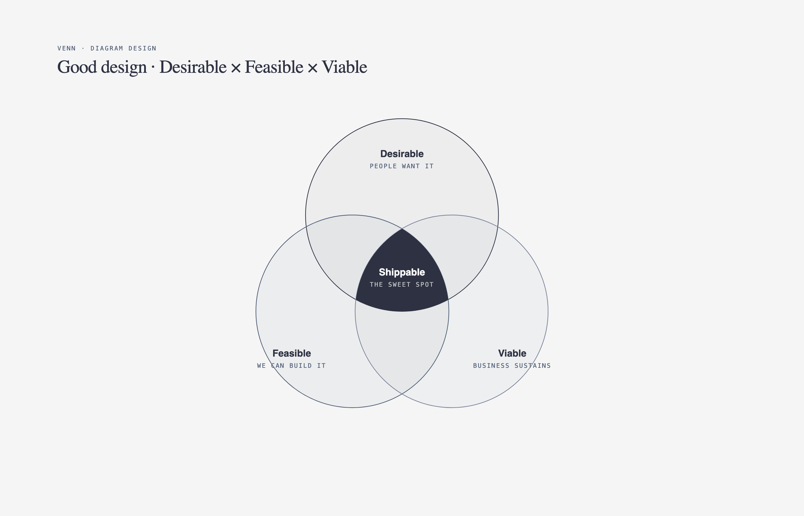

# ⭕ 维恩图

> 概念交集、技术栈对比、分类关系的韦恩图。

**所属分类**: [技术图表](README.md)  
**Prompt 数量**: 5 条  
**难度等级**: ⭐⭐⭐ 高级

---

## Prompt 1: DevOps 能力交集

> 开发、运维、安全三领域的 DevSecOps 交集

**Prompt:**

```text
A Venn diagram showing the intersection of Development, Operations, and Security (DevSecOps). Three large overlapping circles at 30% opacity: Development circle (blue) containing: coding, version control, code review, unit testing, feature development, CI/CD pipelines. Operations circle (green) containing: infrastructure management, monitoring, incident response, capacity planning, deployment automation. Security circle (red) containing: threat modeling, vulnerability scanning, penetration testing, compliance auditing, access control. Dev + Ops intersection: Infrastructure as Code, continuous deployment, SRE practices. Dev + Sec intersection: SAST/DAST, secure coding standards, dependency scanning. Ops + Sec intersection: runtime protection, network segmentation, audit logging. Center (all three): DevSecOps culture - shift-left security, automated compliance, security-as-code, shared responsibility. Center highlighted with golden glow. Modern gradient style with deep dark background, circles as luminous translucent orbs with soft glow, intersection areas brighter where overlapping, clean sans-serif labels, contemporary tech presentation slide aesthetic.
```

**示例效果：**



**参数说明：**

| 参数 | 推荐值 | 说明 |
|------|--------|------|
| 尺寸 | 1536×1024 | 横版宽幅 |
| 风格 | Modern Gradient | 渐变现代风 |
| 模型 | GPT-Image-2 | 推荐 |

**变体建议：**

- 改为 DevOps + DataOps + MLOps 的数据智能交集
- 添加 Platform Engineering 作为第四个圆形扩展
- 展示各交集领域的具体工具链映射

**标签**: `#technical-diagram` `#venn` `#devops` `#devsecops`

---

## Prompt 2: 全栈开发技能

> 前端、后端、基础设施的全栈工程师技能图

**Prompt:**

```text
A Venn diagram showing Full-Stack Developer skill domains. Three overlapping circles: Frontend (coral/orange) containing: HTML/CSS, JavaScript/TypeScript, React/Vue/Angular, responsive design, browser APIs, accessibility (a11y), performance optimization, state management. Backend (teal/green) containing: Node.js/Python/Go, REST/GraphQL APIs, authentication/authorization, business logic, message queues, caching strategies, server-side rendering. Infrastructure (purple) containing: Docker/Kubernetes, CI/CD pipelines, cloud platforms (AWS/GCP), monitoring/observability, database administration, networking, security hardening. Frontend + Backend intersection: API design, SSR/SSG, WebSocket, full-stack frameworks (Next.js, Nuxt). Backend + Infrastructure intersection: microservices deployment, database optimization, auto-scaling, serverless. Frontend + Infrastructure intersection: CDN configuration, edge computing, build optimization, static hosting. Center (T-shaped engineer): system design, architecture decisions, cross-functional leadership. Clean whiteboard style with off-white background, circles as soft watercolor washes, handwritten-style labels inside, skill items as small neat bullet points, friendly tech blog illustration aesthetic.
```

**示例效果：**


**参数说明：**

| 参数 | 推荐值 | 说明 |
|------|--------|------|
| 尺寸 | 1536×1024 | 横版宽幅 |
| 风格 | Whiteboard Sketch | 白板手绘风 |
| 模型 | GPT-Image-2 | 推荐 |

**变体建议：**

- 改为数据领域：Data Engineer + Data Scientist + ML Engineer
- 添加经验年限标注（Junior/Mid/Senior 对应不同技能深度）
- 展示市场需求热度（技能旁标注供需比）

**标签**: `#technical-diagram` `#venn` `#fullstack` `#skills`

---

## Prompt 3: 市场细分定位

> SaaS 产品的目标市场细分交集分析

**Prompt:**

```text
A Venn diagram showing market segment analysis for a developer tools SaaS product. Three overlapping circles representing target segments: Startups (orange) - traits: fast-moving, cost-sensitive, need quick setup, value developer experience, small teams (2-20 devs). Enterprise (blue) - traits: compliance requirements, SSO/SCAM needed, on-premise options, procurement process, dedicated support, 500+ devs. Open Source Community (green) - traits: transparency, extensibility, self-hosted option, community contributions, documentation quality. Startup + Enterprise overlap: Scale-ups (Series B-D companies growing from startup to enterprise needs). Startup + OSS overlap: Developer advocates, indie hackers who contribute and use free tier. Enterprise + OSS overlap: Companies using open-core model, need enterprise features on OSS base. Center sweet spot: Our ICP (Ideal Customer Profile) - growing tech companies (50-200 devs) wanting enterprise features with startup agility and open-source philosophy. Dollar signs indicating revenue potential in each segment. Corporate professional style with clean white background, circles in brand colors with elegant transparency, professional consulting presentation quality, data annotations with market size ($XM TAM), executive-ready visualization.
```

**示例效果：**


**参数说明：**

| 参数 | 推荐值 | 说明 |
|------|--------|------|
| 尺寸 | 1536×1024 | 横版宽幅 |
| 风格 | Corporate Professional | 企业正式风 |
| 模型 | GPT-Image-2 | 推荐 |

**变体建议：**

- 改为地理市场交集（北美 + 欧洲 + 亚太的需求差异）
- 添加竞品在各细分市场的定位对比
- 加入时间维度展示市场迁移趋势

**标签**: `#technical-diagram` `#venn` `#market` `#strategy`

---

## Prompt 4: 技术方案对比

> 数据库技术选型的能力对比维恩图

**Prompt:**

```text
A Venn diagram comparing three database technology categories. Three overlapping circles: Relational/SQL (blue) - PostgreSQL, MySQL: ACID transactions, complex joins, structured schemas, referential integrity, SQL standard, mature tooling. Document/NoSQL (green) - MongoDB, DynamoDB: flexible schemas, horizontal scaling, denormalized data, developer agility, JSON-native, eventual consistency options. Graph (purple) - Neo4j, Neptune: relationship traversal, pattern matching, connected data, social networks, knowledge graphs, recommendation engines. SQL + Document overlap: PostgreSQL JSONB (relational with document flexibility), CockroachDB (distributed SQL). SQL + Graph overlap: recursive CTEs for graph queries, AGE extension for PostgreSQL. Document + Graph overlap: ArangoDB (multi-model), document stores with graph features. Center (all three): multi-model databases, polyglot persistence strategy, choosing the right tool for each use case. Decision criteria annotations around the outside: data structure, query patterns, scale requirements, consistency needs. Dark theme with neon accents, deep black background, circles as glowing neon rings (blue, green, purple) with translucent fills, database logos as small icons within circles, tech comparison infographic aesthetic with high contrast.
```

**示例效果：**


**参数说明：**

| 参数 | 推荐值 | 说明 |
|------|--------|------|
| 尺寸 | 1536×1024 | 横版宽幅 |
| 风格 | Dark Neon Tech | 暗色科技感 |
| 模型 | GPT-Image-2 | 推荐 |

**变体建议：**

- 改为消息队列对比（Kafka vs RabbitMQ vs Redis Streams）
- 比较容器运行时（Docker vs containerd vs Podman）
- 对比前端框架（React vs Vue vs Svelte）的设计哲学

**标签**: `#technical-diagram` `#venn` `#comparison` `#database`

---

## Prompt 5: 角色职责重叠

> 产品、设计、工程三个角色的职责交集

**Prompt:**

```text
A Venn diagram showing role overlap between Product Manager, UX Designer, and Software Engineer. Three overlapping circles: Product Manager (amber/gold) containing: market research, roadmap prioritization, stakeholder management, success metrics (KPIs), go-to-market strategy, competitive analysis, user interviews, business model. UX Designer (pink/magenta) containing: user research, wireframing, prototyping, usability testing, visual design, design systems, information architecture, interaction patterns. Software Engineer (cyan/teal) containing: system architecture, code implementation, performance optimization, technical debt management, code review, testing strategy, deployment, debugging. PM + Design overlap: user story definition, acceptance criteria, customer journey mapping. PM + Engineering overlap: technical feasibility assessment, sprint planning, backlog grooming. Design + Engineering overlap: design system implementation, accessibility engineering, frontend development, animation/interaction coding. Center (product trio): collaborative discovery, design sprints, trade-off decisions, holistic product thinking. Hand-drawn sketch style with cream paper background, circles as overlapping watercolor blobs, role titles in playful handwriting, items as doodle-style bullet lists, collaborative workshop whiteboard aesthetic with sticky note accents.
```

**示例效果：**


**参数说明：**

| 参数 | 推荐值 | 说明 |
|------|--------|------|
| 尺寸 | 1536×1024 | 横版宽幅 |
| 风格 | Hand-drawn Sketch | 手绘草图风 |
| 模型 | GPT-Image-2 | 推荐 |

**变体建议：**

- 改为 SRE + DevOps + Platform Engineer 的角色边界
- 添加团队规模影响（小团队一人多角色 vs 大团队专精）
- 展示角色演进路径和晋升方向

**标签**: `#technical-diagram` `#venn` `#roles` `#collaboration`

---

## 🔗 相关推荐

- [象限图](quadrant.md) - 二维分析矩阵
- [金字塔图](pyramid.md) - 层级关系图
- [泳道图](swimlane.md) - 角色协作流程
- [树形图](tree-org.md) - 组织架构图
- [分层堆叠图](layer-stack.md) - 技术栈分层
